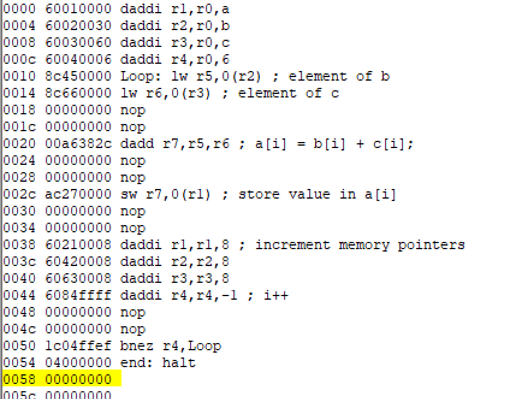

## Course Project 1 Exploring ILP on MIPS64

> 秦君豪 10204804421
>
> 汪鼎尊 10204804422

#### 1）Load ex1.s into the memory of MIPS64 and disable the forwarding logic, the delay slot and the Branch target buffer from the Configure menu in the main toolbar. Before running the program, try to predict where stalls occur, how many clock cycles they will take, and for what kind of hazards they occur. Then compare your prediction with the simulation results.


- **36个RAW停顿**：这是因为有6次迭代，每次迭代有2个`lw`指令和1个`dadd`指令，每个都会导致2个时钟周期停顿。
- **5个分支停顿**：这可能是因为循环中的分支指令，在每次迭代时都会评估是否跳转。


举个例子可以看出`dadd`由于对r6寄存器的依赖，需要lw的写回完成，停顿了两个时间周期。


#### 2)

根据（1）的结果可知执行的指令总数为59条，循环迭代的指令数据量为50条，

根据渐进CPI的公式可以知道

$ CPI_{asymptotic} = (50+30)/30 = 2.67$


#### 3)Enable the forwarding logic and execute the code again. Compute the CPI again. Justify the
remaining stalls and comment why some of them occur after ID stage rather than after IF.

采用转发机制后结果为：


此时CPI为

$ CPI_{asymptotic} = (50+10)/10 = 6$


Branches are resolved in the ID stage.因为控制冒险通常在ID阶段之后发生，因为只有在译码指令之后，处理器才能知道这是一个分支指令以及分支的条件。


#### 4）Disable the forwarding logic and assume that the MIPS hardware cannot detect hazards. Modify the source code by inserting NOPs where appropriate without reordering the code(NOP stuffing technique). Check with the simulator that no stall occurs, and check whether the CPI has changed. Do we have better performance?



此时渐进CPI为 

$ CPI = 116/107=$1.08


#### 5)Reschedule the instructions (code moving technique) in order to reduce stalls without modifying the program semantics. Recompute the normal and asymptotic CPI values. (Check
the final result to see if the result is the same after moving the instructions. Please do not
change the instructions.)

指令重排后：

```
.data
a: .space 48
b: .word 10,11,12,13,0,1
c: .word 1,2,3,4,5,6
.text
;initialize registers
daddi r1,r0,a
daddi r2,r0,b
daddi r3,r0,c
daddi r4,r0,6
Loop: lw r5,0(r2) ; element of b
daddi r2,r2,8
lw r6,0(r3) ; element of c
daddi r3,r3,8
dadd r7,r5,r6 ; a[i] = b[i] + c[i];
sw r7,0(r1) ; store value in a[i]
daddi r1,r1,8 ; increment memory pointers
daddi r4,r4,-1 ; i++
bnez r4,Loop
end: halt
```

此时：stall和cycle数量为


$CPI = \frac{98}{59} = 1.66$  $CPI_{asymptotic}=(10+5)/5=3$


#### 6)

结合后：


可以发现RAW的stall次数变成了6次，只存在于分支判断时的raw停顿。

**启用“分支目标缓冲器”**：这是一个用于减少分支指令造成的停顿的硬件机制。它通过预测分支跳转目标来提高分支处理的效率。CPI会


分别产生一开始进入迭代的 两次跳转停顿以及最后一次迭代由于错误判断产生的两次分支停顿，CPI有所改善，但可以看到提升不大（猜测到由于迭代次数较少）

`将迭代次数增加到12次可以看到CPI有明显改善`


#### 7）A well‐known compiler optimization is known as “loop unrolling”. Basically, loop unrolling is
the explicit repetition of the loop code a number of times. In this way we obtain a longer
loop body that is executed less times. Consider the original code of ex1.s. Unroll the loop
twice without any code moving, i.e. just repeat the first four loop instructions and make the
necessary changes therein. Calculate the CPI for the case without forwarding. Is there any
improvement?

循环展开两次后的代码：

```
.data
a: .space 48
b: .word 10,11,12,13,0,1
c: .word 1,2,3,4,5,6
.text
;initialize registers
daddi r1,r0,a
daddi r2,r0,b
daddi r3,r0,c
daddi r4,r0,6
Loop: lw r5,0(r2) ; element of b
lw r6,0(r3) ; element of c
dadd r7,r5,r6 ; a[i] = b[i] + c[i];
sw r7,0(r1) ; store value in a[i]

lw r5,8(r2)
lw r6,8(r3)
dadd r7,r5,r6
sw r7,8(r1)

daddi r1,r1,16 ; increment memory pointers
daddi r2,r2,16
daddi r3,r3,16
daddi r4,r4,-2 ; i+2
bnez r4,Loop
end: halt
```


执行周期总数从104个减少到了80个，表明程序整体上执行得更快了。

而由于周期数量和执行指令数量同时减少，CPI略有提高


#### 8）Apply code rescheduling to the solution of the previous question and calculate both the CPI
and the asymptotic CPI values with and without forwarding. Is there any improvement?

对（7）代码重排后的代码为

```
.data
a: .space 48
b: .word 10,11,12,13,0,1
c: .word 1,2,3,4,5,6
.text
;initialize registers
daddi r1,r0,a
daddi r2,r0,b
daddi r3,r0,c
daddi r4,r0,6
Loop: lw r5,0(r2) ; element of b
daddi r2,r2,16
lw r6,0(r3) ; element of c
daddi r3,r3,16
dadd r7,r5,r6 ; a[i] = b[i] + c[i];
sw r7,0(r1) ; store value in a[i]

lw r5,-8(r2)
lw r6,-8(r3)
daddi r1,r1,16 ; increment memory pointers
dadd r7,r5,r6
sw r7,-8(r1)
daddi r4,r4,-2 ; i++
bnez r4,Loop
end: halt
```


**Without forwarding：**


$CPI = \frac{77}{44} = 1.68$  $CPI_{asymptotic}=(13+8)/13=1.61$


**With forwarding：**

$CPI = \frac{53}{44} = 1.205$  $CPI_{asymptotic}=(13+1)/13=1.076$


#### 9）Suppose that the add operation in the original code is a floating‐point calculation and the loop is
iterated for 12 times. Modify your assembly code please answer the following questions: At
least how many times do you need to unroll the loop to minimize stalls without forwarding and set
Configure‐>Architecture‐>FP Addition Latency to 4. What is the average latency of iterations for
the original loop? What is the code size? Please show us your code.

由于浮点加法的延迟是四个周期，为了尽可能填充这些延迟周期，展开循环四次。

展开循环四次后的代码：

```
.data
a: .space 96
b: .double 10.1,11.1,12.1,13.1,0.1,1.1,1.1,0.1,13.1,12.1,11.1,10.1
c: .double 1.2,2.2,3.2,4.2,5.2,6.2,6.2,5.2,4.2,3.2,2.2,1.2
.text
;initialize registers
daddi r1,r0,a
daddi r2,r0,b
daddi r3,r0,c
daddi r4,r0,3
Loop: lw r5,0(r2) ; element of b
lw r6,0(r3) ; element of c
dadd r7,r5,r6 ; a[i] = b[i] + c[i];
sw r7,0(r1) ; store value in a[i]

lw r5,8(r2) ; element of b
lw r6,8(r3) ; element of c
dadd r7,r5,r6 ; a[i] = b[i] + c[i];
sw r7,8(r1) ; store value in a[i]

lw r5,16(r2) ; element of b
lw r6,16(r3) ; element of c
dadd r7,r5,r6 ; a[i] = b[i] + c[i];
sw r7,16(r1) ; store value in a[i]

lw r5,24(r2) ; element of b
lw r6,24(r3) ; element of c
dadd r7,r5,r6 ; a[i] = b[i] + c[i];
sw r7,24(r1) ; store value in a[i]

daddi r1,r1,32 ; increment memory pointers
daddi r2,r2,32
daddi r3,r3,32
daddi r4,r4,-1 ; i++
bnez r4,Loop
end: halt
```


原始循环即不展开循环的情况下，平均迭代延迟为6


