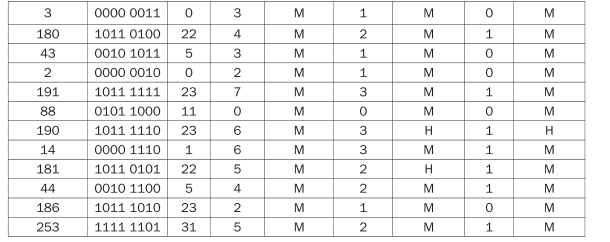
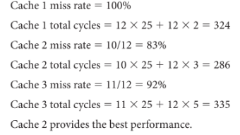

## HW7

> 秦君豪 10204804421计算机系统结构

#### 5.2.1

| Word Address | Binary Address | Tag  | index | Hit/Miss |
| :----------: | :------------: | :--: | ----- | -------- |
|      3       |   0000 0011    |  0   | 3     | MISS     |
|     180      |   1011 0100    |  11  | 4     | MISS     |
|      43      |   0010 1011    |  2   | 11    | MISS     |
|      2       |   0000 0010    |  0   | 2     | MISS     |
|     191      |   1011 1111    |  11  | 15    | MISS     |
|      88      |   0101 1000    |  5   | 8     | MISS     |
|     190      |   1011 1110    |  11  | 14    | MISS     |
|      14      |   0000 1110    |  0   | 14    | MISS     |
|     181      |   1011 0101    |  11  | 5     | MISS     |
|      44      |   0010 1100    |  2   | 12    | MISS     |
|     186      |   1011 1010    |  11  | 10    | MISS     |
|     253      |   1111 1101    |  15  | 13    | MISS     |

#### 5.2.2

| Word Address | Binary Address | Tag  | index | Hit/Miss |
| :----------: | :------------: | :--: | ----- | -------- |
|      3       |   0000 0011    |  0   | 1     | MISS     |
|     180      |   1011 0100    |  11  | 2     | MISS     |
|      43      |   0010 1011    |  2   | 5     | MISS     |
|      2       |   0000 0010    |  0   | 1     | Hit      |
|     191      |   1011 1111    |  11  | 7     | MISS     |
|      88      |   0101 1000    |  5   | 4     | MISS     |
|     190      |   1011 1110    |  11  | 7     | Hit      |
|      14      |   0000 1110    |  0   | 7     | MISS     |
|     181      |   1011 0101    |  11  | 2     | MISS     |
|      44      |   0010 1100    |  2   | 6     | MISS     |
|     186      |   1011 1010    |  11  | 5     | MISS     |
|     253      |   1111 1101    |  15  | 6     | MISS     |

#### 5.2.3

#### 5.2.4

totalsize = datasize + (validbitsize + tagsize) x blocks

 totalsize = 41984

 datasize = blocks x blocksize x wordsize

 wordsize = 4 

tagsize = 32 - log2(blocks) - log2(blocksize) - log2(wordsize) 

validbitsize = 1

增加从2字的块到16字的块将会将标签大小从17位减少到14位。

为了确定块的数量，我们解这个不等式：

41984 <= 64 x blocks + 15 x blocks

解这个不等式得到531个块，并且四舍五入到下一个2的幂次，给我们一个1024块的缓存。

#### 5.2.5

相关联缓存（Associative caches）被设计用来减少冲突未命中的比率。因此，一连串带有相同12位索引字段但不同标签字段的读请求会产生很多未命中。对于上面描述的缓存，序列0, 32768, 0, 32768, 0, 32768, ...，将会在每次访问时都未命中，而一个使用最近最少使用（LRU）替换策略的2路组关联缓存，即使总容量显著更小，也会在首两次访问后每次都命中。

#### 5.2.6

使用这个函数来索引缓存是可能的，但必须包括更多的标签位来识别缓存中的地址。

#### 5.3

###### (5.3.1) 

8

###### (5.3.2 )

32

###### (5.3.3) 

1+(22/8/32) = 1.086

###### (5.3.4) 

3

###### (5.3.5) 

0.25

###### (5.3.6） 

<Index, tag, data>
<000001,0001, mem[1024]>

<000001,0011, mem[16]>

<001011,0000, mem[176]>

<001000,0010, mem[2176]>

<001110,0000, mem[224]>

<001010,0000,mem[160]>
