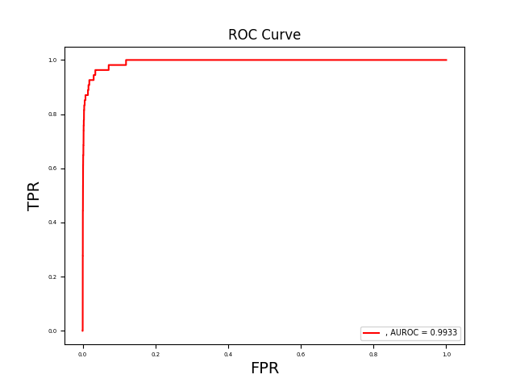

## 生物信息学作业1—数据不平衡

> 秦君豪 10204804421




```python
# -*- coding: utf-8 -*-
# @File    : evaluate_CRISPR_Net.py
# @Software: PyCharm
import os
import pickle as pkl
import encode_data
import tensorflow as tf
import keras.backend as K
from keras.models import Model, model_from_json
import keras
import numpy as np
from keras.layers import Input, Dense, Reshape, Conv2D, Flatten, LSTM, BatchNormalization, Bidirectional, GRU
from keras import layers
from keras.layers import Input
import matplotlib.pylab as plt
from sklearn import metrics
from sklearn.utils import class_weight
from numpy.random import seed
seed(1)
from tensorflow import set_random_seed
set_random_seed(1)
from imblearn.under_sampling import RandomUnderSampler
from collections import Counter


def focal_loss(gamma = 2., alpha = .25):
    def focal_loss_fixed(y_true, y_pred):
        pt_1 = tf.where(tf.equal(y_true, 1), y_pred, tf.ones_like(y_pred))
        pt_0 = tf.where(tf.equal(y_true, 0), y_pred, tf.zeros_like(y_pred))
        return -K.sum(alpha * K.pow(1. - pt_1, gamma) * K.log(K.epsilon() + pt_1))\
            - K.sum((1 - alpha) * K.pow( pt_0, gamma) * K.log(1. - pt_0 + K.epsilon()))
    return focal_loss_fixed


def conv2d_bn(x,
              filters,
              kernel_size,
              strides=1,
              padding='same',
              activation='relu',
              use_bias=True,
              name=None, trainable=True):
    """Utility function to apply conv + BN.
    # Arguments
        x: input tensor.
        filters: filters in `Conv2D`.
        kernel_size: kernel size as in `Conv2D`.
        strides: strides in `Conv2D`.
        padding: padding mode in `Conv2D`.
        activation: activation in `Conv2D`.
        use_bias: whether to use a bias in `Conv2D`.
        name: name of the ops; will become `name + '_ac'` for the activation
            and `name + '_bn'` for the batch norm layer.
    # Returns
        Output tensor after applying `Conv2D` and `BatchNormalization`.
    """
    x = layers.Conv2D(filters,
                      kernel_size,
                      strides=strides,
                      padding=padding,
                      use_bias=use_bias,
                      name=name, trainable=trainable)(x)

    # x = layers.BatchNormalization(axis=-1,scale=True)(x)
    if activation is not None:
        ac_name = None if name is None else name + '_ac'
        x = layers.Activation(activation, name=ac_name)(x)
    return x

def CRISPR_Net_model():
    inputs = Input(shape=(1, 24, 7), name='main_input')
    branch_0 = conv2d_bn(inputs, 10, (1, 1))
    branch_1 = conv2d_bn(inputs, 10, (1, 2))
    branch_2 = conv2d_bn(inputs, 10, (1, 3))
    branch_3 = conv2d_bn(inputs, 10, (1, 5))
    branches = [inputs, branch_0, branch_1, branch_2, branch_3]
    # branches = [branch_0, branch_1, branch_2, branch_3]
    mixed = layers.Concatenate(axis=-1)(branches)
    mixed = Reshape((24, 47))(mixed)
    blstm_out = Bidirectional(LSTM(15, return_sequences=True, input_shape=(24, 47), name="LSTM_out"))(mixed)
    # inputs_rs = Reshape((24, 7))(inputs)
    # blstm_out = layers.Concatenate(axis=-1)([mixed, blstm_out])
    blstm_out = Flatten()(blstm_out)
    x = Dense(80, activation='relu')(blstm_out)
    x = Dense(20, activation='relu')(x)
    x = keras.layers.Dropout(rate=0.35)(x)
    prediction = Dense(1, activation='sigmoid', name='main_output')(x)
    model = Model(inputs, prediction)
    print(model.summary())
    return model

def load_traininig_data():
    if not os.path.exists("./tmp_code"):
        os.mkdir("./tmp_code")
    train_code_file = "./tmp_code/CRISPR_Net_training_code.pkl"
    if os.path.exists(train_code_file):
        print("Loading Dataset I-1, II-1, II-2, and II-4 ...")
        X, y = pkl.load(open(train_code_file, "rb"))
    else:
        dataset_II1_code, dataset_II1_labels = encode_data.load_elevation_CD33_dataset()
        dataset_II2_code, dataset_II2_labels = encode_data.load_elevation_hmg_dataset()
        dataset_II4_code, dataset_II4_labels = encode_data.load_elevation_guideseq_data()
        dataset_I1_code, dataset_I1_labels = encode_data.load_CIRCLE_data()
        X =  np.concatenate([dataset_I1_code, dataset_II4_code, dataset_II2_code, dataset_II1_code], axis=0)
        y  = np.concatenate([dataset_I1_labels, dataset_II4_labels, dataset_II2_labels, dataset_II1_labels], axis=0)
        pkl.dump([X, y], open("./tmp_code/CRISPR_Net_training_code.pkl", "wb"))
    X = X.reshape((len(X), 1, 24, 7))
    return X, y

def load_elevation_data():
    if not os.path.exists("./tmp_code"):
        os.mkdir("./tmp_code")
    train_code_file = "./tmp_code/elevation_training_code.pkl"
    if os.path.exists(train_code_file):
        print("Loading Dataset I-1, II-1, II-2, and II-4 ...")
        X, y = pkl.load(open(train_code_file, "rb"))
    else:
        dataset_II1_code, dataset_II1_labels = encode_data.load_elevation_CD33_dataset()
        dataset_II2_code, dataset_II2_labels = encode_data.load_elevation_hmg_dataset()
        dataset_II4_code, dataset_II4_labels = encode_data.load_elevation_guideseq_data()
        X =  np.concatenate([dataset_II4_code, dataset_II2_code, dataset_II1_code], axis=0)
        y  = np.concatenate([dataset_II4_labels, dataset_II2_labels, dataset_II1_labels], axis=0)
        pkl.dump([X, y], open("./tmp_code/elevation_training_code.pkl", "wb"))
    X = X.reshape((len(X), 1, 24, 7))
    return X, y

def load_CIRCLESeq_data():
    if not os.path.exists("./tmp_code"):
        os.mkdir("./tmp_code")
    train_code_file = "./tmp_code/CIRCLE_seq_code.pkl"
    if os.path.exists(train_code_file):
        print("Loading CIRCLE-Seq data (Dataset I-1) ...")
        X, y = pkl.load(open(train_code_file, "rb"))
    else:
        X, y = encode_data.load_CIRCLE_data()
        pkl.dump([X, y], open("./tmp_code/CIRCLE_seq_code.pkl", "wb"))
    X = X.reshape((len(X), 1, 24, 7))
    return X, y

def load_SITESeq_data():
    if not os.path.exists("./tmp_code"):
        os.mkdir("./tmp_code")
    train_code_file = "./tmp_code/SITE_seq_code.pkl"
    if os.path.exists(train_code_file):
        print("Loading CIRCLE-Seq data (Dataset I-1) ...")
        X, y = pkl.load(open(train_code_file, "rb"))
    else:
        X, y = encode_data.load_siteseq_data()
        pkl.dump([X, y], open("./tmp_code/SITE_seq_code.pkl", "wb"))
    X = X.reshape((len(X), 1, 24, 7))
    return X, y

def load_testing_data(ds_type = 'listgarten'):
    if not os.path.exists("./tmp_code"):
        os.mkdir("./tmp_code")
    test_code_file1 = "./tmp_code/testing_code_listgarten.pkl"
    test_code_file2 = "./tmp_code/testing_code_Kleinstiver.pkl"
    if os.path.exists(test_code_file1):
        X_test1, y_test1 = pkl.load(open(test_code_file1, "rb"))
    else:
        X_test1, y_test1 = encode_data.load_22sgRNA_data()
        pkl.dump([X_test1, y_test1], open("./tmp_code/testing_code_listgarten.pkl", "wb"))

    if os.path.exists(test_code_file2):
        X_test2, y_test2 = pkl.load(open(test_code_file2, "rb"))
    else:
        X_test2, y_test2 = encode_data.load_Kleinstiver_data()
        pkl.dump([X_test2, y_test2], open("./tmp_code/testing_code_Kleinstiver.pkl", "wb"))

    if ds_type == "listgarten":
        print("Loading Listgarten testing dataset (Dataset II-6) ...")
        X_test1 = X_test1.reshape((len(X_test1), 1, 24, 7))
        return X_test1, y_test1
    else:
        print("Loading Kleinstiver testing dataset (Dataset II-5) ...")
        X_test2 = X_test2.reshape((len(X_test2), 1, 24, 7))
        return X_test2, y_test2

def CRISPR_Net_training():
    X_train, y_train = load_traininig_data()
    # 在该部分加入随机欠采样处理代码
    print("Before undersampling: ", Counter(y_train))
    undersample = RandomUnderSampler(sampling_strategy='majority')
    X_reshape = X_train.reshape(X_train.shape[0], -1)
    X_resampled, y_train = undersample.fit_resample(X_reshape, y_train)
    X_train = (X_resampled.reshape(X_resampled.shape[0], X_train.shape[1], X_train.shape[2], X_train.shape[3]))
    print("After oversampling: ", Counter(y_train))


    model = CRISPR_Net_model()
    adam_opt = keras.optimizers.Adam(lr=0.0001)
    #在以下部分修改损失函数
    model.compile(loss=focal_loss(gamma=2,alpha=0.25), optimizer=adam_opt)
    #在以下部分调整类别权重
    weights = class_weight.compute_class_weight('balanced',
                                                np.unique(y_train),
                                                y_train)

    model.fit(X_train, y_train, batch_size=10000, epochs=100, shuffle=True,class_weight=weights)
    # SAVE Model
    model_jason = model.to_json()
    model_path = "./saved_models"
    if os.path.isdir(model_path):
        pass
    else:
        os.mkdir(model_path)
    with open(model_path + "/CRISPR_Net_structure.json", "w") as jason_file:
        jason_file.write(model_jason)
    model.save_weights(model_path + "/CRISPR_Net_weights.h5")
    print("Saved model to disk!")

def CRISPR_Net_testing(weights_file, ds='Kleinstiver'):
    X_test, y_test = load_testing_data(ds_type=ds)
    print(len(y_test[y_test > 0]), len(y_test))
    json_file = open("./saved_models/CRISPR_Net_structure.json", 'r')
    loaded_model_json = json_file.read()
    json_file.close()
    loaded_model = model_from_json(loaded_model_json)
    loaded_model.load_weights(weights_file)
    print("Loaded model from disk!")
    y_pred = loaded_model.predict(X_test).flatten()
    print("Testing results on " + ds + " dataset: ")

    #在以下部分加入绘制ROC和PR曲线，并打印AUROC和AUPR值的代码

    #绘制ROC曲线
    fpr, tpr, threshold = metrics.roc_curve(y_test, y_pred)
    roc_auc = metrics.roc_auc_score(y_test, y_pred)
    print("AUROC: ", roc_auc)
    plt.title('ROC Curve')  # 标题
    plt.xlabel('FPR', fontsize=14)  # x轴标签
    plt.ylabel('TPR', fontsize=14)  # y轴标签
    plt.plot(fpr, tpr, label=', AUROC = %0.4f' % roc_auc, c='r')  # 划线
    plt.legend(loc='lower right', fontsize=7)
    plt.tick_params(labelsize=5)
    plt.show()

    #绘制PR曲线
    prc, rec, _ = metrics.precision_recall_curve(y_test, y_pred)
    prc[[rec == 0]] = 1.0
    prc_auc = metrics.auc(rec, prc)
    print("AUPR: ", prc_auc)
    plt.title('P-R Curve')  # 标题
    plt.xlabel('Recalls', fontsize=14)  # x轴标签
    plt.ylabel('Precisions', fontsize=14)  # y轴标签
    plt.plot(rec, prc, label=', AUPR = %0.4f' % prc_auc, c='b')  # 画线
    plt.legend(loc='lower right', fontsize=7)
    plt.tick_params(labelsize=5)
    plt.show()

    return 0


# CRISPR_Net_training()
weight_file = "./saved_models/CRISPR_Net_weights.h5"
CRISPR_Net_testing(weight_file)


```


