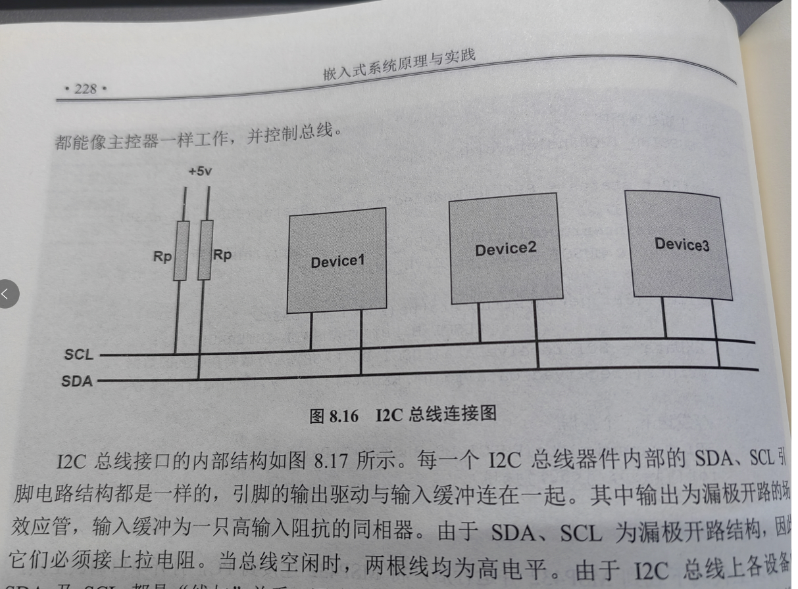

## 嵌入式HW 7

> 秦君豪 10204804421

#### 1、什么是串行通信、并行通信？

数字通信分为串行通信、并行通信。

所谓串行通信指的是数据是一位一位地由端口发送或接收，而并行通信指的是数据的各个数据位在多条数据线上同时被传输。

#### 2、什么是同步通信、异步通信？

在同步通信中，数据传输是按照一个固定的时间顺序进行的，即发送方和接收方必须同时参与数据的发送和接收。

在异步通信中，数据传输不依赖于一个严格的时间顺序。发送方和接收方不需要同时进行数据交换。

#### 3、什么是全双工、半双工、单工通信？

**单工通信（Simplex Communication）**：

- 在单工通信模式中，数据只能在一个固定的方向上流动，即只有一个发送方和一个接收方。
- 发送方只能发送数据，接收方只能接收数据，不能反向传输。

**全双工通信（Full-Duplex Communication）**：

- 在全双工通信模式中，数据可以同时在两个方向上流动。
- 通信双方可以同时发送和接收信息。

**半双工：**

- 在半双工通信中，数据可以在两个方向上流动，但不可以同时进行。
- 通信双方都可以发送和接收信息，但不能同时进行。一方发送时，另一方只能接收，反之亦然。

#### 4、简述UART的帧格式

UART（异步）是一种广泛使用的硬件通信协议

**起始位（Start Bit）**：每个UART帧的开始是一个起始位，用于通知接收器一帧数据的开始。

**数据位（Data Bits）**：包含实际要传输的数据。

**校验位（Parity Bit）：**如果使用奇校验，校验位将设置为使数据位中“1”的总数为奇数；如果使用偶校验，则使“1”的总数为偶数。

**停止位（Stop Bit(s)）**：停止位标志着一帧数据的结束。

**空闲位（Idle State）**：在发送帧之间，UART线路保持在空闲状态，即高电平（逻辑“1”）。

#### 7、简述I2C总线结构（画图说明）与主要特征

主要特征：

1. **两线通信**：I2C使用两根线进行数据传输，它们分别是：
   - SDA（串行数据线）：用于数据传输。
   - SCL（串行时钟线）：用于提供时钟信号，同步数据传输。
2. **多主多从结构**：I2C支持多个主设备和多个从设备在同一总线上通信。
   - 主设备：控制总线，发起通信，提供SCL时钟信号。
   - 从设备：响应主设备的请求，接收或发送数据。
3. **7位或10位地址空间**：I2C设备通过7位或10位的地址来识别，允许多个设备共享同一总线。
4. **同步通信**：数据传输是同步进行的，由主设备提供的SCL时钟信号控制。
5. **支持多速率**：I2C总线支持多种速度级别，例如标准模式（100kbps）、快速模式（400kbps）和高速模式（3.4Mbps）。
6. **开漏（或开集电极）输出**：I2C线路通常使用开漏（或开集电极）输出，需要外部上拉电阻来提供高电平。

#### 11、简述USB的枚举过程

1. **主机分配地址**：
   - 连接后，主机为设备分配一个唯一的地址。最初，所有设备都被分配默认地址（通常为0），然后主机通过默认地址发送配置命令给设备，为其指派一个唯一的地址。
2. **获取设备描述符**：
   - 主机请求设备的描述符，包括设备类型、所支持的USB版本、所需电源量、制造商和产品识别信息等。这些信息帮助主机了解如何与设备通信。
3. **请求配置描述符**：
   - 主机继续请求设备的配置描述符，了解设备的配置选项。这可能包括不同的操作模式或所需资源的详细信息。
4. **选择配置**：
   - 根据配置描述符的信息，主机选择合适的配置，并发送命令给设备以激活该配置。
5. **加载驱动程序（如果必要）**：
   - 一旦设备配置完成，主机检查是否需要加载特定的驱动程序来支持设备。如果需要，驱动程序将被加载并初始化。
6. **设备就绪**：
   - 一旦完成所有这些步骤，设备就被认为已经枚举成功并且准备好进行通信和操作。

#### 12、请说明USB集中数据传输类型的特点，并分别列举一个应用实例。

1. **控制传输（Control Transfers）**：
   - 特点：用于设备配置、命令和状态控制。它们通常用于小量数据传输，例如设置请求或设备配置命令。
   - 应用实例：USB设备的枚举过程中发送和接收设备描述符。
2. **批量传输（Bulk Transfers）**：
   - 特点：用于大量数据传输，如文件传输。它们提供高吞吐量，但不保证实时性，因此可能会有延迟。
   - 应用实例：USB硬盘驱动器或闪存驱动器中的文件传输。
3. **中断传输（Interrupt Transfers）**：
   - 特点：用于小量数据的及时传输。它们提供低延迟，用于周期性检查设备状态，如键盘和鼠标输入。
   - 应用实例：USB键盘和鼠标的按键或移动事件。
4. **等时传输（Isochronous Transfers）**：
   - 特点：用于实时数据传输，如音频或视频流。这种类型的传输可以保证一定的数据传输速率，但不保证完全无误。
   - 应用实例：USB音频接口的音频流或网络摄像头的视频流。