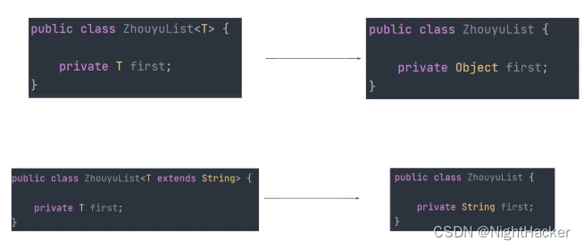

> JDK1.5之后引入泛型擦除的概念。

[TOC]

####  实际编译后的结果

在被类型擦除后，其中的泛型参数会被替换为它的第一个==上界== ，没有上界，就用顶层父类object代替

（为了向下兼容低版本的代码，但是泛型信息在字节码依旧存在，可以使用==反射==机制恢复泛型信息）




#### 验证例子

两个类型相同，表面泛型都被擦出了，都是Arraylist。

```java
List<String> list1 = new Arraylist<>();
List<Integer> list2 = new Arraylist<>();
System.out.println(list1.getclass());
System.out.println(list2.getclass().equals(list1.class));
Output:
-- class java.util.ArrayList
-- true   
```


#### 注意点：

- 泛型参数只支持引用类型，不支持基本类型，因为泛型参数最终会被擦除为具体类型，而object不能存储基本类型的值。
- 只能对原始类型进行检测，无法判断带泛型的类型

```java
if(obj instanceof T){}//报错
```

- 无法实例化泛型参数，由于不知道是否有无参构造，同时不能实例化泛型数组


#### 获取泛型信息的办法

