#### Mybatis

> 持久层框架（dao数据访问层  ），用于简化Jdbc（Java Database Connectivity）的开发

###### 配置项：

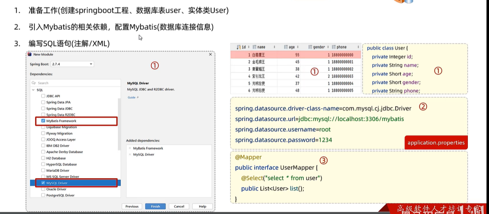

我们只需要定义Mapper接口，不需要定义实现类的（在运行时,会自动生成该接口的实现类对象(代理对象), 并且将该对象交给IOC容器管理）

MySQL Driver和MyBatis Framework

创建数据库实体类的时候推荐使用包装类型。否则使用int封装结果集如果返回null会报错

```
public class User {

    private Integer id;
    private String name;
    private Short age;
    private Short gender;
    private String phone;
```

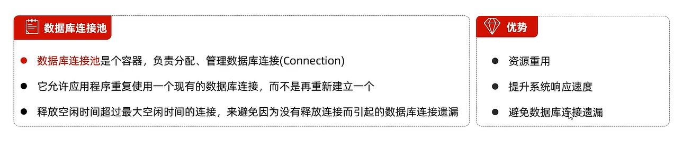

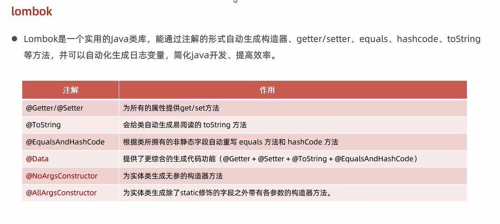

Mybatis基础操作：

```java
    @Delete("delete from emp where id = #{id}")
    public void delete(Integer id);
```

properties配置：

```java
#配置mybatis的日志, 指定输出到控制台
mybatis.configuration.log-impl=org.apache.ibatis.logging.stdout.StdOutImpl

#开启mybatis的驼峰命名自动映射开关 a_column ------> aCloumn
mybatis.configuration.map-underscore-to-camel-case=true

```

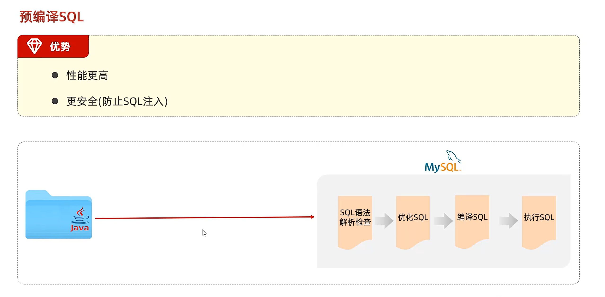

 

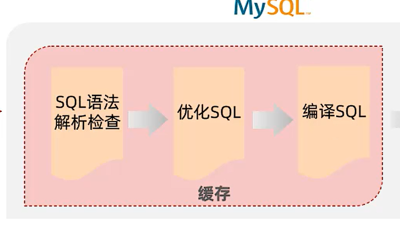

为了提高效率吧，会将优化编译的sql语句缓存起来，下次再执行sql，会优先调用缓存。

因此使用参数占位符会更好。


要注意两种占位符的区别：

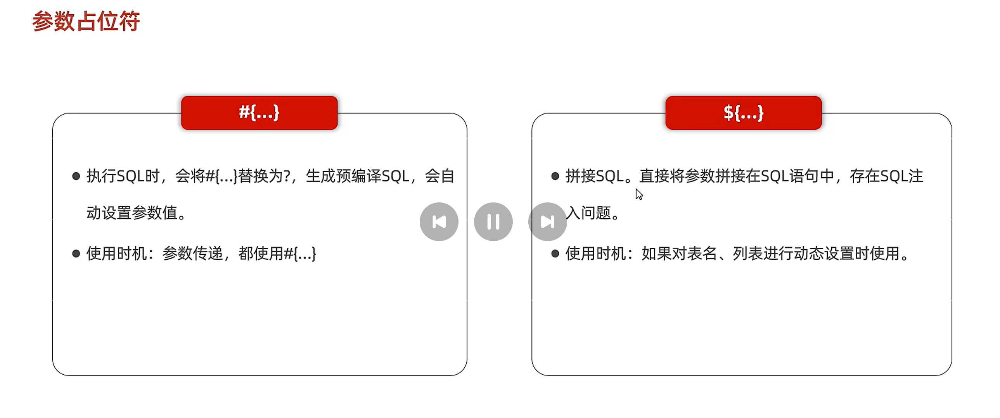

新增一行表项后的主键返回：

- 描述：在数据添加成功后，需要获取数据库数据的主键：

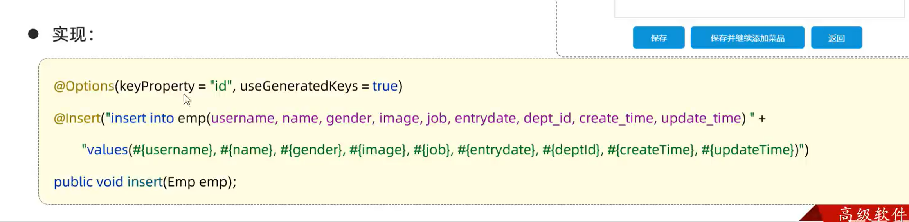

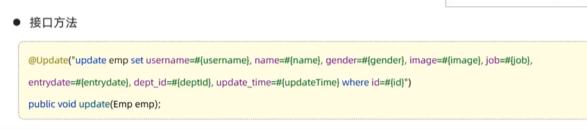

（根据员工id修改员工信息）


当查询返回时的字段名和类的字段名不同时：

###### 方案一

```java
//方案一: 给字段起别名, 让别名与实体类属性一致
@Select("select id, username, password, name, gender, image, job, entrydate, " +
        "dept_id deptId, create_time createTime, update_time updateTime from emp where id = #{id}")
public Emp getById(Integer id);
```

###### 方案二

```java
//方案二: 通过@Results, @Result注解手动映射封装
@Results({
    @Result(column = "dept_id", property = "deptId"),
    @Result(column = "create_time", property = "createTime"),
    @Result(column = "update_time", property = "updateTime")
})
@Select("select * from emp where id = #{id}")
public Emp getById(Integer id);
```

方案三

开启mybatis的驼峰命名自动映射开关 --- a_cloumn ------> aColumn

```
mybatis.configuration.map-underscore-to-camel-case=true
```

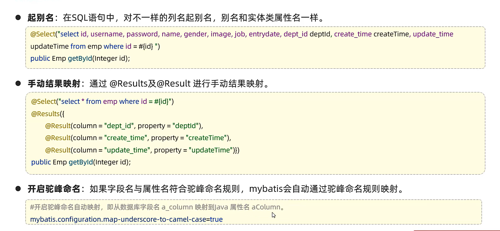


#### 条件查询

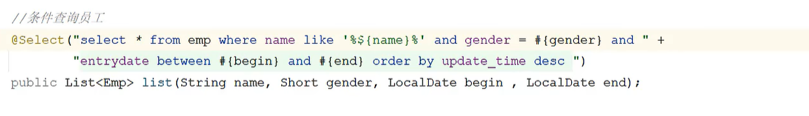

#占位符不能出现在引号字符串里面，$占位符是字符串拼接符。会存在数据注入、效率地的问题

解决办法：——concat 字符串拼接函数

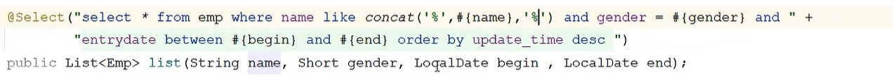


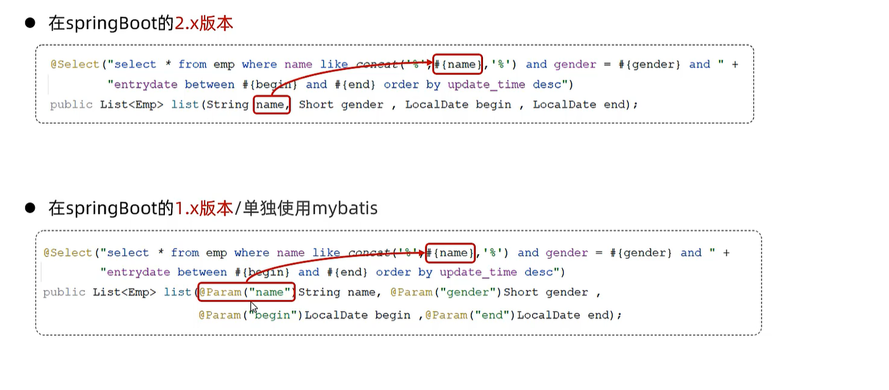

方法的形参名称在编译的时候没有被保留              


### XML映射文件

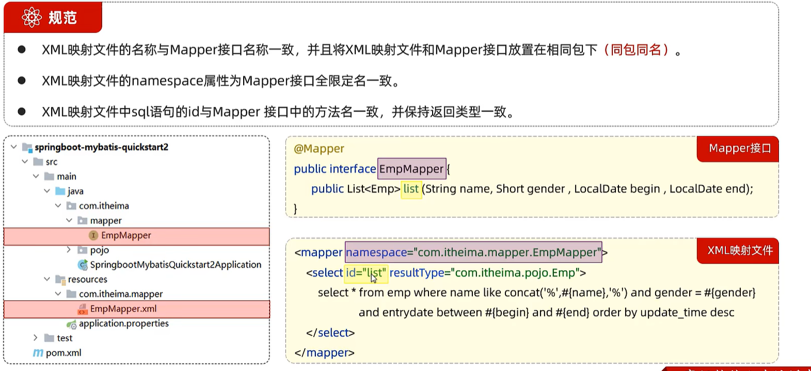

resultType 是单条记录所封装的类型

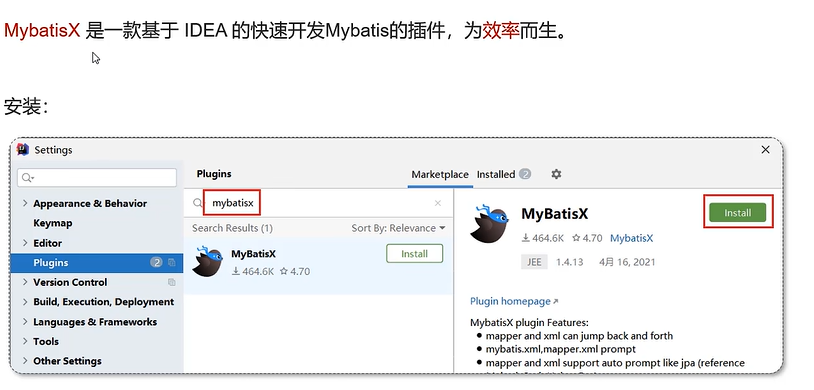

###### `使用比较复杂的sql语句，最好还是使用xml映射，如果是比较简单的增删改查的操作，可以用注解比较简洁。`

- ## Mybatis 动态sql

随着用户的输入或外部条件的变化而变化的SQL语句，我们成为`动态SQL`

示例：

```xml
    <!--resultType: 单条记录封装的类型-->
    <select id="list" resultType="com.itheima.pojo.Emp">
        <include refid="commonSelect"/>
        <where>
            <if test="name != null">
                name like concat('%', #{name}, '%')
            </if>
            <if test="gender != null">
                and gender = #{gender}
            </if>
            <if test="begin != null and end != null">
                and entrydate between #{begin} and #{end}
            </if>
        </where>
        order by update_time desc
    </select>
```

- <where>:where元素只会在子元素有内容的情况下才插入where子句/而且会自动去除子句的开头的AND或者OR

update中的<set>标签可以自动去除额外的逗号，动态地在行首插入SET关键字

```xml
    <update id="update2">
        update emp
        <set>
            <if test="username != null">username = #{username},</if>
            <if test="name != null">name = #{name},</if>
            <if test="gender != null">gender = #{gender},</if>
            <if test="image != null">image = #{image},</if>
            <if test="job != null">job = #{job},</if>
            <if test="entrydate != null">entrydate = #{entrydate},</if>
            <if test="deptId != null">dept_id = #{deptId},</if>
            <if test="updateTime != null">update_time = #{updateTime}</if>
        </set>
        where id = #{id}
    </update>
```

- <foreach>：

