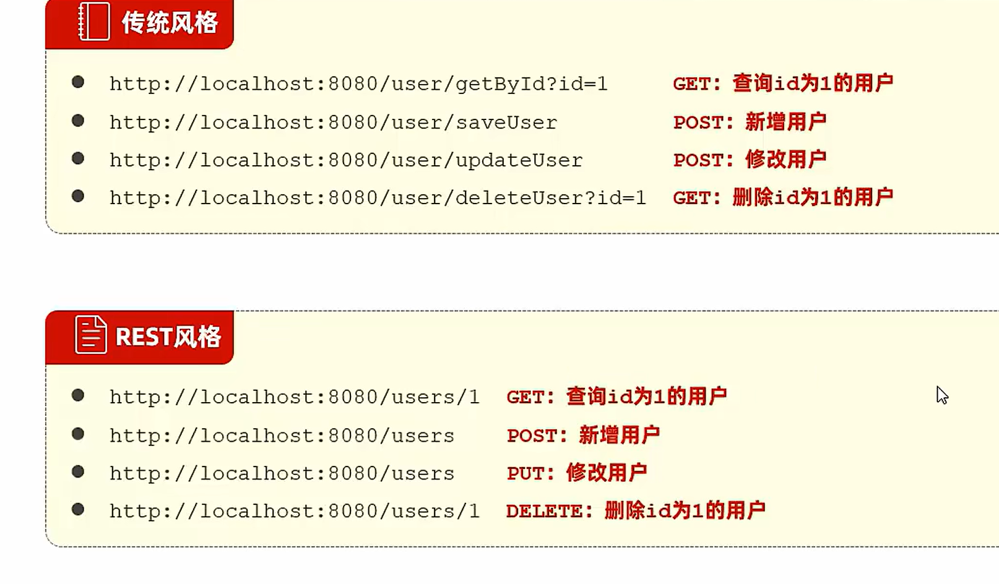
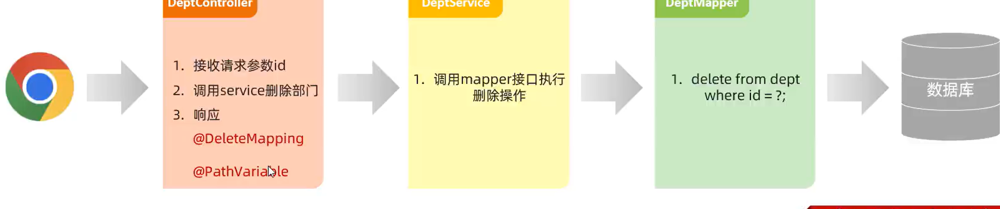

## Day 10


#### 开发规范-Restful

表述性状态转换，是一种软件架构风格



#### 开发流程


------

## 部门管理

在开发过程中应该减少sout的使用，使用日志来进行代替

```java
private static Logger log = LoggerFactory.getLogger(DeptController.class);
```

ResponseBody注解会将类和list转换为json返回

通过对@Slf4j的注解，可以直接调用Log


##### 指定请求方式的注解：

@GetMapping ——指定Get方法


#### 删除部门


