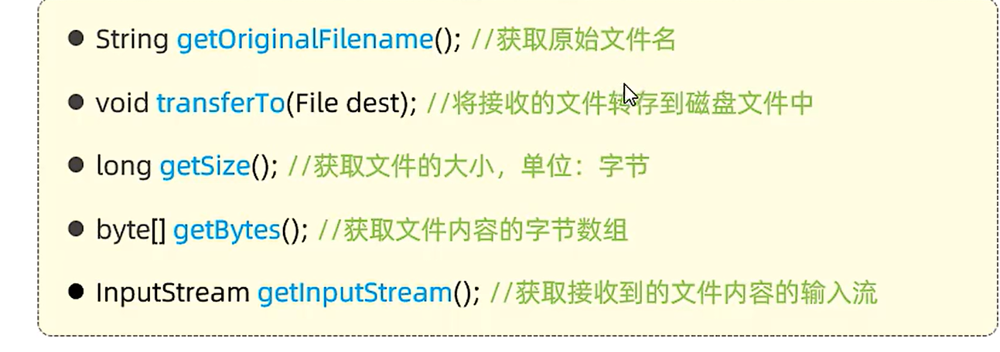

## Day 10


#### 开发规范-Restful

表述性状态转换，是一种软件架构风格


#### 开发流程


------

## 部门管理

在开发过程中应该减少sout的使用，使用日志来进行代替

```java
private static Logger log = LoggerFactory.getLogger(DeptController.class);
```

ResponseBody注解会将类和list转换为json返回

RequestBody将请求的Json转化为实体类给后端

通过对@Slf4j的注解，可以直接调用Log


##### 指定请求方式的注解：

@GetMapping ——指定Get方法

@PathVariable Integer id——指定路径参数id

#### 删除部门


#### xmL映射文件：

mybatis xml 约束：

```
<?xml version="1.0" encoding="UTF-8" ?>
<!DOCTYPE mapper
  PUBLIC "-//mybatis.org//DTD Mapper 3.0//EN"
  "http://mybatis.org/dtd/mybatis-3-mapper.dtd">
```

<where>标签会自动清除多余的and或者or，通过判断自动增加where

resources定义文件夹目录要用"/"


#### 批量删除：

<foreach>从左到右，分别是==集合，元素，间隔符，开始，结尾==

```
    <!--批量删除员工 (1, 2, 3)-->
    <delete id="delete">
        delete
        from emp
        where id in
        <foreach collection="ids" item="id" separator="," open="(" close=")">
            #{id}
        </foreach>
    </delete>
```


#### 文件接收API：

MultipartFile 方法形参的名称要和表单名称对应，否则用RequestParam注解




#### Value:


HTTP请求是不包含状态的


 
