## Day 5 SpringBootWeb请求响应

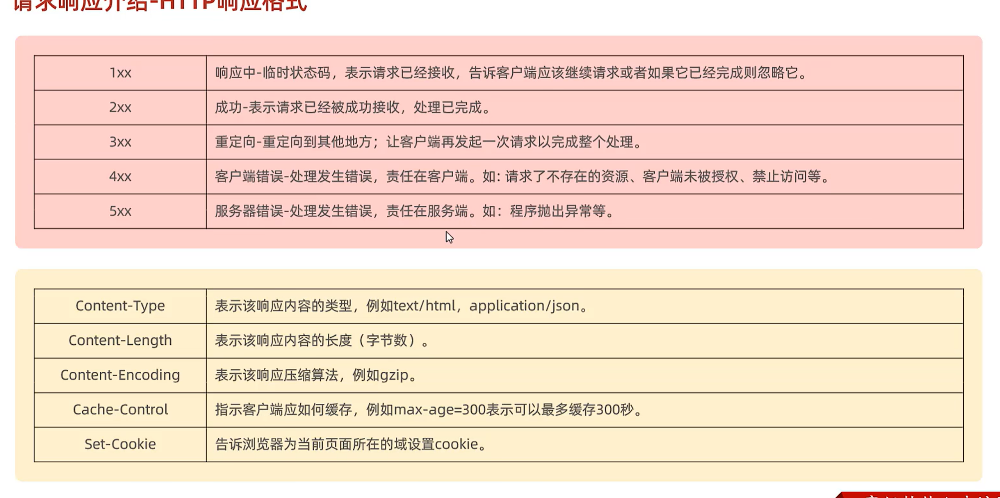

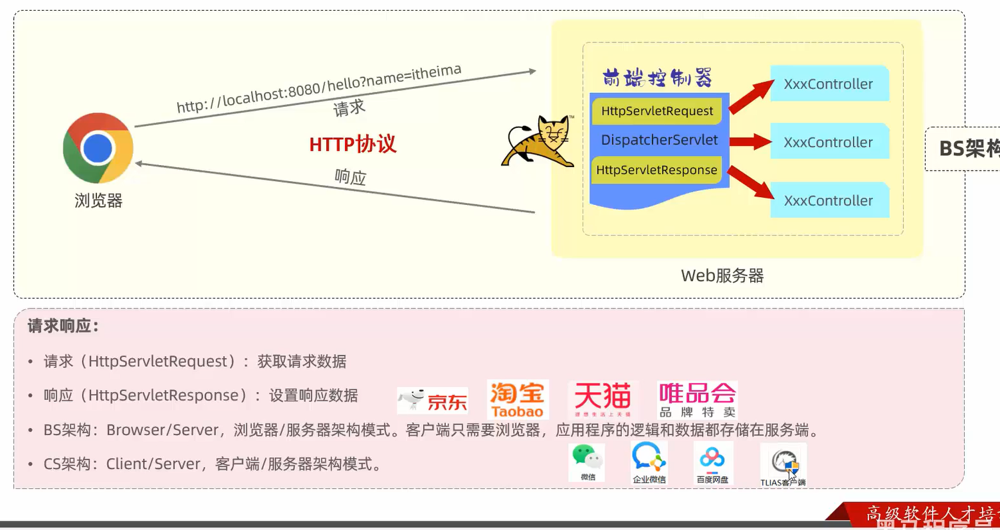


#### 路径参数:

一些常见参数形式的响应控制器：

```Java
    @RequestMapping("/simpleParam")
    public String simpleParam(@RequestParam(name = "name", required = false) String username, Integer age){
        System.out.println(username+ ":" + age);
        return "OK";
    }


    //2. 实体参数
    @RequestMapping("/simplePojo")
    public String simplePojo(User user){
        System.out.println(user);
        return "OK";
    }

    @RequestMapping("/complexPojo")
    public String complexPojo(User user){
        System.out.println(user);
        return "OK";
    }

    //3. 数组集合参数
    @RequestMapping("/arrayParam")
    public String arrayParam(String[] hobby){
        System.out.println(Arrays.toString(hobby));
        return "OK";
    }

    @RequestMapping("/listParam")
    public String listParam(@RequestParam List<String> hobby){
        System.out.println(hobby);
        return "OK";
    }

    //4. 日期时间参数
    @RequestMapping("/dateParam")
    public String dateParam(@DateTimeFormat(pattern = "yyyy-MM-dd HH:mm:ss") LocalDateTime updateTime){
        System.out.println(updateTime);
        return "OK";
    }

    //5. json参数
    @RequestMapping("/jsonParam")
    public String jsonParam(@RequestBody User user){
        System.out.println(user);
        return "OK";
    }

    //6. 路径参数
    @RequestMapping("/path/{id}")
    public String pathParam(@PathVariable Integer id){
        System.out.println(id);
        return "OK";
    }

    @RequestMapping("/path/{id}/{name}")
    public String pathParam2(@PathVariable Integer id , @PathVariable String name){
        System.out.println(id);
        System.out.println(name);
        return "OK";
    }
```

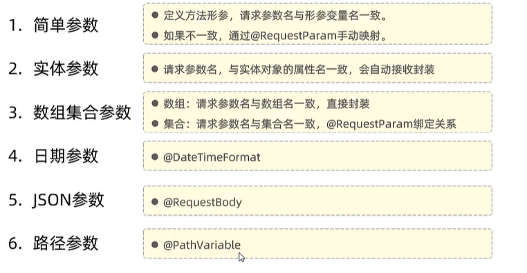


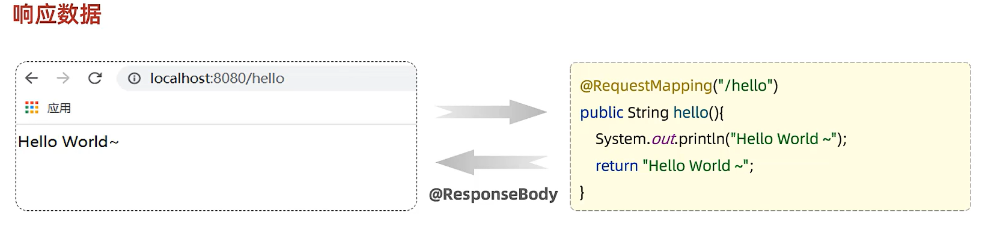

@**ResponseBody**

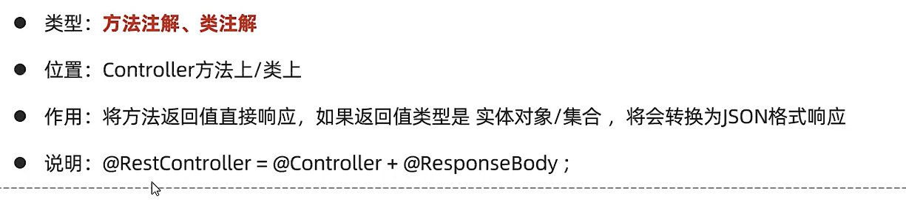

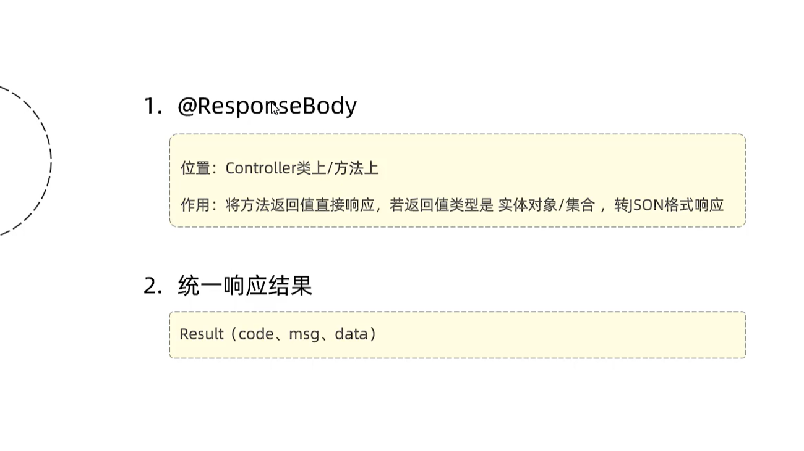


**返回渲染的页面:**

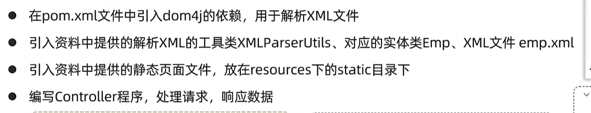

```
直接使用 empList.forEach()：

这是直接对集合进行遍历，每个元素依次执行指定的操作。
它是对原始集合的迭代，更为直接和简洁。
不涉及流的创建和处理，性能上稍好于流操作，尤其是在处理较小的数据集时。
使用 empList.stream().forEach()：

这首先将集合转换为流，然后对流中的每个元素执行操作。
提供了更多的灵活性，可以方便地进行更复杂的操作，比如过滤、映射、归约等。
适用于更复杂的数据处理场景，尤其是当涉及到需要链式操作的时候。
```

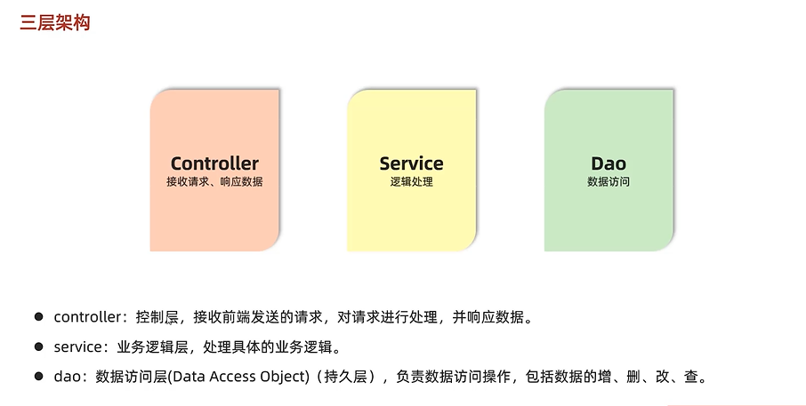

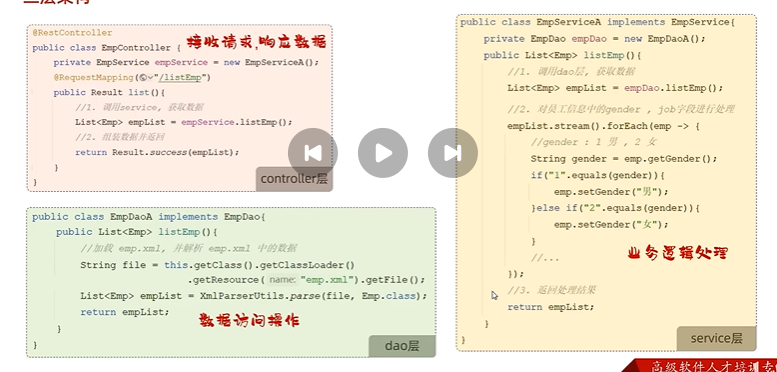

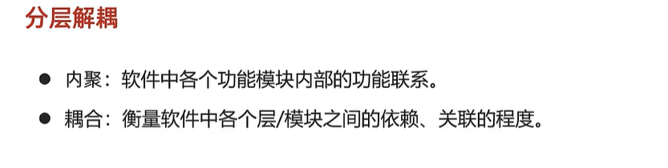

###### 软件设计原则：高内聚低耦合

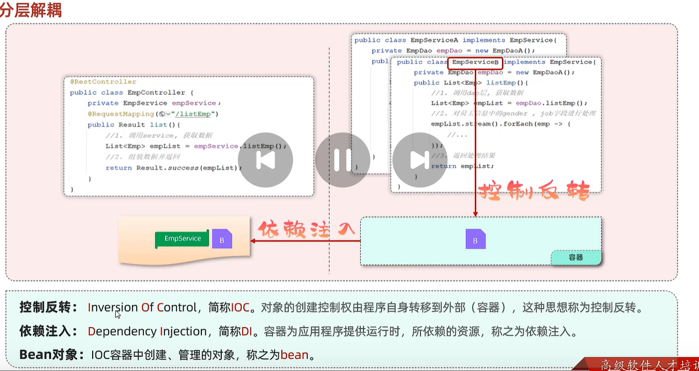

###### @Component:将当前类交给IOC容器管理、成为IOC容器中的bean

###### @Autowired：运行时IOC容器会提供该类型的bean对象，并交给该变量


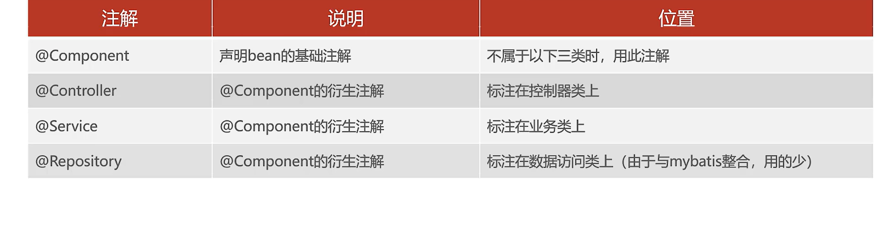

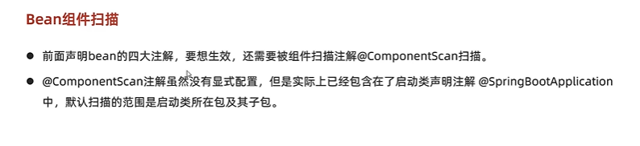

@ComponentScan({"dao","com.package"})//扫描覆盖两个包

@Autowired：默认按照类型自动装配

如果存在多个同一类型的bean，可以用以下几种方案来解决

- @Primary
- @Qualifier
- @Resource

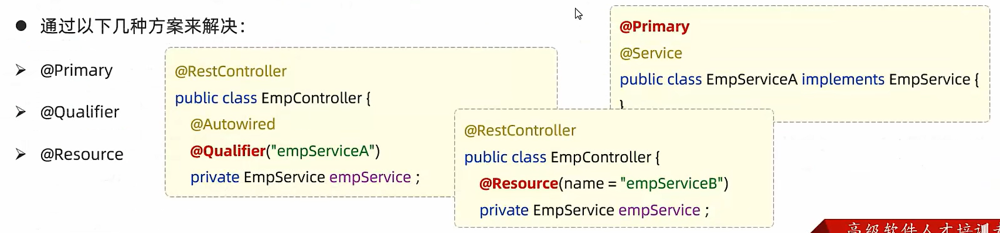

#### 分页查询的插件PageHelper

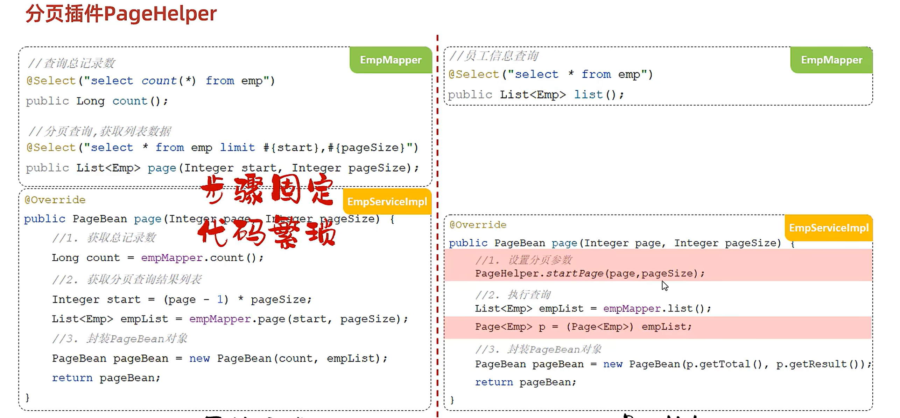

#### 条件分页查询

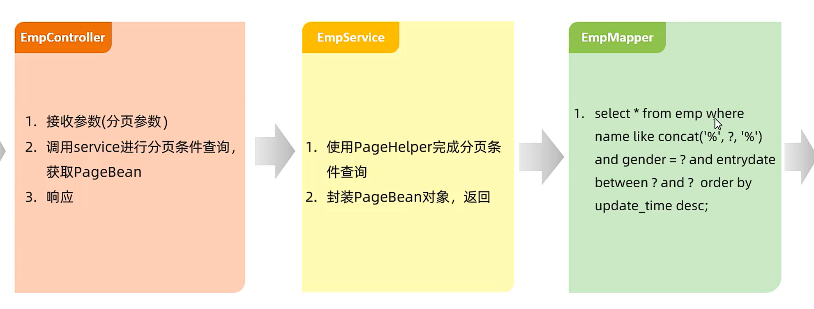
