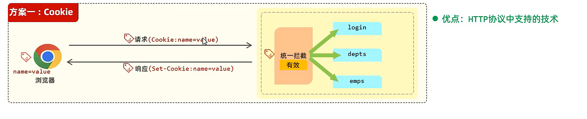
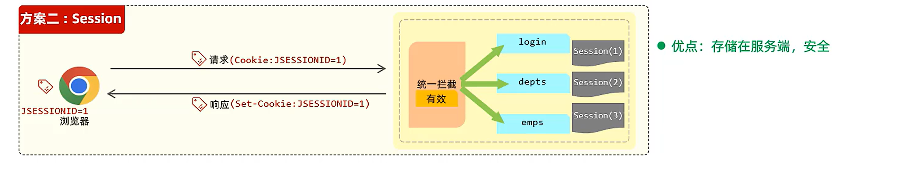

### 会话技术

会话跟踪：一种维护浏览器状态的方法，服务器需要识别多次请求是否来自于同一浏览器，以便在同一次会话的多次请求间共享数据  

- 客户端会话跟踪技术：Cookie

为什么Cookie不能跨域：因为如果你访问 `example.com`（前端网站），这个网站不能为 `anotherdomain.com` （后端服务器）设置 Cookie。Cookie 通常只能被设置和访问由其所属域名创建的网页

- 令牌技术

- 服务端会话跟踪技术：Session（基于Cookie）

  

同一个项目会被负载均衡，因此不适用服务器集群环境下

