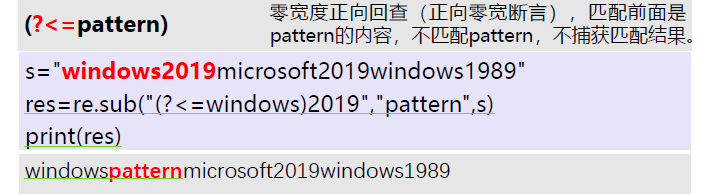
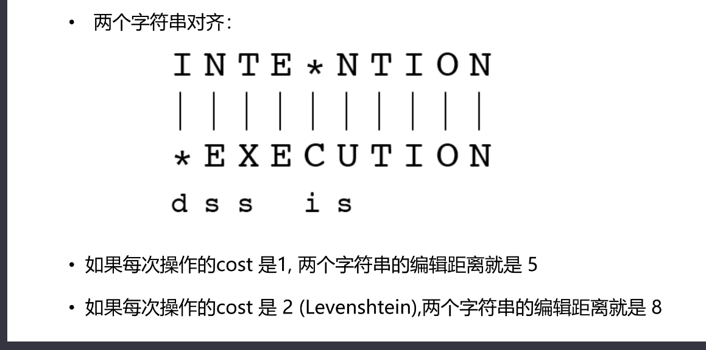
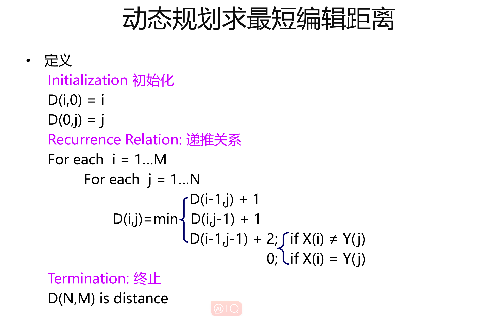
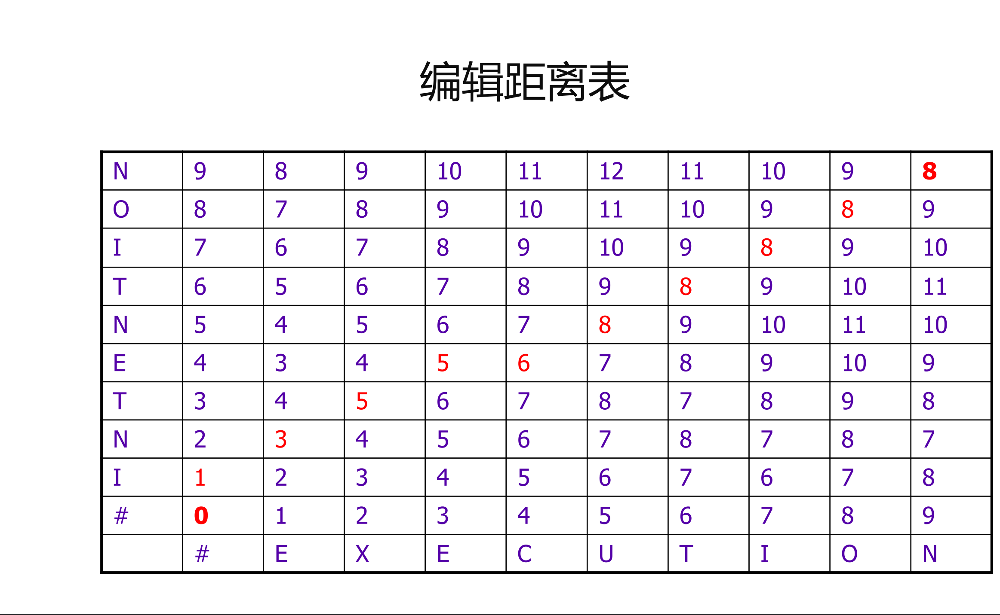
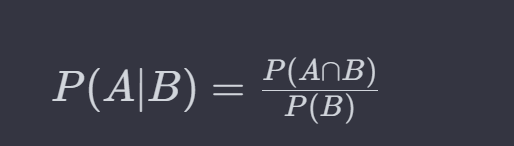
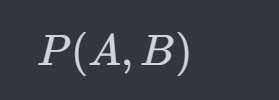
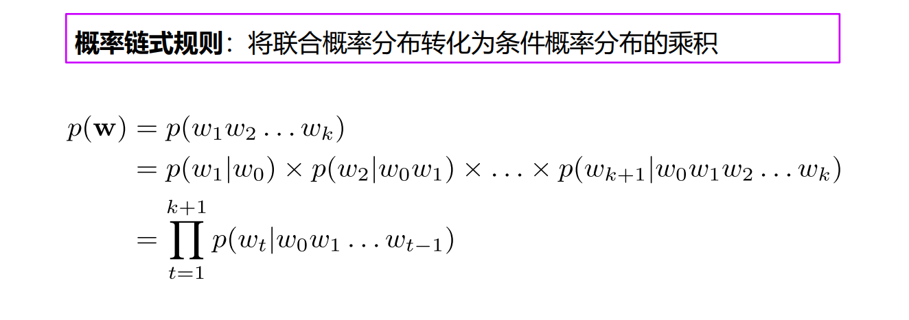
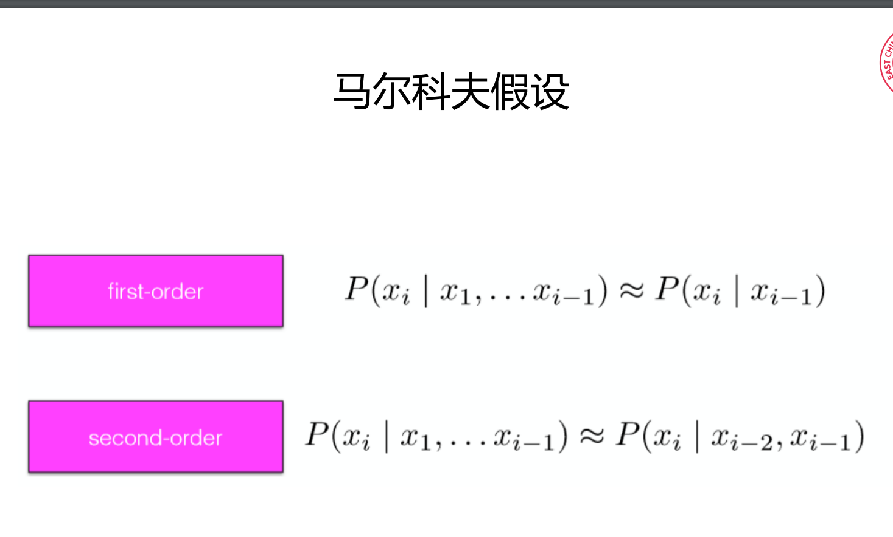
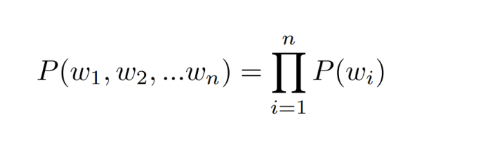
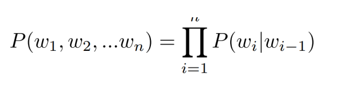

## 复习提纲

#### 第一张概述：

- 什么是自然语言处理
- 自然语言处理的主要任务有哪些
- 什么是理解
- 自然语言处理存在的难点？
- 大模型存在的问题有哪些？（歧义、常识、推理不擅长）


## 第二章

- #### 会写正则表达式（写一段程序，match，替换）


- #### 给定字符串会写程序返回查询或者修改结果




- #### 会写正向、逆向和双向匹配程序

```python
def forward_max_match(text, dictionary, max_word_length):
    words = []
    index = 0
    while index < len(text):
        word = None
        for i in range(max_word_length, 0, -1):
            if text[index:index+i] in dictionary:
                word = text[index:index+i]
                words.append(word)
                index += i
                break
        if not word:
            words.append(text[index])
            index += 1
    return words
```

```python
def backward_max_match(text, dictionary, max_word_length):
    words = []
    index = len(text)
    while index > 0:
        word = None
        for i in range(max_word_length, 0, -1):
            if text[index-i:index] in dictionary and index-i >= 0:
                word = text[index-i:index]
                words.insert(0, word)
                index -= i
                break
        if not word:
            words.insert(0, text[index-1])
            index -= 1
    return words

```


- #### 什么是文本标记化？（文本处理tokenize，词和句）

  -  含义：将字符序列识别出标记单元便捷，转换为有意义的标记（token）单元 和类型的过程

  

- #### 什么是词干提取？什么是词形还原？有什么不同？（提取部分词，回归变化）

```
•词干提取（stemming）是抽取词的词干或词根形式（不一定能够表达完整语义），
方法较为简单，例如，leave—leav
•词形还原（lemmatization），是把一个词汇还原为一般形式（能表达完整语义），
例如，leave—leaf 方法较为复杂，需要词性标注标签
```


- #### 最短编辑距离算法（动态规划算法，给你两个string，口算出来距离）

两个字符串之间的最短编辑距离，是指从一个字符串转换为另一个字符串 的最少编辑操作的次数



levenshtein举例是将替换的操作的cost改为2






#### 第三章

- #### 随机变量，条件概率，联合概率（有范围概率的变量）

随机变量:某个变量取值落在某个范围的概率（随机变量值是集合）是一定的，此种变量称为随机变量

条件概率: 在给定另一个事件发生的条件下，一个事件发生的概率。


联合概率：联合概率是指两个（或多个）事件同时发生的概率。


- #### 独立性假设（假设独立计算联合概率）


- #### 极大似然估计（一个变量和标签的联合概率，选较大）

我们观察到的数据（X），确定最有可能的下一个数字


- #### 概率链式法则

定义：将联合概率分布转化为条件概率分布的乘积0




- #### 什么是语言模型？（计算词序列的概率，联合概率通过链式法则..）

  - 给定语言序列，计算**该序列出现的概率**
  - 判断一个语言序列是否为正常语句
  - 已知若干个词，生成下一个词

  计算一个句子或一系列单词序列出现的概率

- #### 什么是马尔可夫假设（一阶二阶）




- #### 如何计算语言模型


- #### 写出句子的n元文法（会写公式）




- #### n的选取策略（太大和太小出现什么问题，）


。


- #### 什么是困惑度，如何计算困惑度？（自然语言评估指标，计算公式）
- #### 自然语言处理中N-Gram模型的Smoothing算法有哪些？
- #### Laplace平滑（ADD-ONE,add-α）和回退插值法的主要思想是什么


#### 第四章

- 文本分类的方法（有监督）
- 机器学习文本分类的流程（PPT有）
- 最大似然估计分类与情感分类
- 词序列的概率计算和表示
- 贝叶斯分类器（引入了先验概率,给你几句话用贝叶斯分类器去进行平滑）
- 拉普拉斯平滑
- 计算一句话计算情感是正向还是负向的概率
- 根据混淆矩阵，计算精确率、准确率和召回率
- 宏平均微平均计算方法


#### 第五章

- 生成模型和判别模型（逻辑回归，生成类方法要探索联合概率，隐含）
- 逻辑函数和逻辑回归函数表达（基于线性回归）
- 判别式分类器的主要过程
- 特征如何表示
- 概率计算
- 损失函数
- 计算loss的范围（构造loss function，求偏导。步长迭代优化）
- 参数优化，梯度，梯度下降的算法过程，参数更新
- 为什么需要正则化
- 逻辑回归多分类函数（神经网络的最后一层，词表的分类）
- Softmax的参数量（根据类别，PPT）


#### 第六章

- One hot编码的不足？（每个词用词表大小的维度去维护，不存在相似和相关性，如何用低维稠密的矩阵去表达）
- 什么是分布式假设？（我要假设这个词的语义跟上下文及其相关的）
- 建立词项-文档/上下文矩阵（用文档表示词，也可以反之。）
- 如何计算TFIDF（在每个文档当中挑出来关键词）
- 如何计算PMI和PPMI
- 计算词语之间的余弦相似度


#### 第七章

- 什么是词嵌入
- 什么是生成模型
- 什么是判别模型
- 什么是词的类比
- Word2vec模型的CROW和Skip-gram的区别
- Word2Vec的模型原理
- 模型参数量，损失函数


#### 第八章

- 马尔可夫链计算
- 隐马尔可夫模型的五个元素
- 隐马尔可夫模型解决的三个问题
- 隐马尔可夫模型的两个假设
- 如何计算联合概率
- 参数量
- 任务优化的目标函数
- 动态规划计算序列概率算法
- 维特比算法的实现过程以及每个节点更新伪代码


#### 第九章

- 最大熵马尔可夫模型的概率计算函数
- 最大熵马尔可夫模型和隐马尔可夫模型的不同
- BeamSearch
- 隐马尔可夫模型与CRF模型的不同
- 条件随机场P（S|0）
- 条件随机场通常采用的特征函数
- 条件随机场解码方法


#### 第十、十一章：

- 深度学习NLP的优势
- 前馈神经网络计算和参数矩阵形状
- 如何构造输入向量
- 激活函数有哪些
- 神经语言模型W和U的维度
- RNN适合的任务
- RNN初始化，输入层，隐藏层和输出层的函数计算
- RNN的优缺点