## 复习提纲

#### 第一张概述：

- 什么是自然语言处理
- 自然语言处理的主要任务有哪些
- 什么是理解
- 自然语言处理存在的难点？
- 大模型存在的问题有哪些？（歧义、常识、推理不擅长）


## 第二章

- #### 会写正则表达式（写一段程序，match，替换）


- #### 给定字符串会写程序返回查询或者修改结果


- #### 会写正向、逆向和双向匹配程序

```python
def forward_max_match(text, dictionary, max_word_length):
    words = []
    index = 0
    while index < len(text):
        word = None
        for i in range(max_word_length, 0, -1):
            if text[index:index+i] in dictionary:
                word = text[index:index+i]
                words.append(word)
                index += i
                break
        if not word:
            words.append(text[index])
            index += 1
    return words
```

```python
def backward_max_match(text, dictionary, max_word_length):
    words = []
    index = len(text)
    while index > 0:
        word = None
        for i in range(max_word_length, 0, -1):
            if text[index-i:index] in dictionary and index-i >= 0:
                word = text[index-i:index]
                words.insert(0, word)
                index -= i
                break
        if not word:
            words.insert(0, text[index-1])
            index -= 1
    return words

```


- #### 什么是文本标记化？（文本处理tokenize，词和句）

  -  含义：将字符序列识别出标记单元便捷，转换为有意义的标记（token）单元 和类型的过程

  

- #### 什么是词干提取？什么是词形还原？有什么不同？（提取部分词，回归变化）

```
•词干提取（stemming）是抽取词的词干或词根形式（不一定能够表达完整语义），
方法较为简单，例如，leave—leav
•词形还原（lemmatization），是把一个词汇还原为一般形式（能表达完整语义），
例如，leave—leaf 方法较为复杂，需要词性标注标签
```


- #### 最短编辑距离算法（动态规划算法，给你两个string，口算出来距离）

两个字符串之间的最短编辑距离，是指从一个字符串转换为另一个字符串 的最少编辑操作的次数


levenshtein举例是将替换的操作的cost改为2


#### 第三章

- #### 随机变量，条件概率，联合概率（有范围概率的变量）

随机变量:某个变量取值落在某个范围的概率（随机变量值是集合）是一定的，此种变量称为随机变量

条件概率: 在给定另一个事件发生的条件下，一个事件发生的概率。


联合概率：联合概率是指两个（或多个）事件同时发生的概率。


- #### 独立性假设（假设独立计算联合概率）


- #### 极大似然估计（一个变量和标签的联合概率，选较大）

我们观察到的数据（X），确定最有可能的下一个数字


- #### 概率链式法则

定义：将联合概率分布转化为条件概率分布的乘积0


- #### 什么是语言模型？（计算词序列的概率，联合概率通过链式法则..）

  - 给定语言序列，计算**该序列出现的概率**
  - 判断一个语言序列是否为正常语句
  - 已知若干个词，生成下一个词

  计算一个句子或一系列单词序列出现的概率

- #### 什么是马尔可夫假设（一阶二阶）


- #### 如何计算语言模型


- #### 写出句子的n元文法（会写公式）


- #### n的选取策略（太大和太小出现什么问题，）

  - 更大的n：对下一个词出现的约束信息更多，具有更大的辨别力； 

  - 更小的n：在训练语料库中出现的次数更多，具有更可靠的统计信息。
  - 理论上，n越大越好，经验上，trigram用的最多，尽管如此，原则上，能用 bigram解决，绝不使用trigram。
  -  𝑛 >= 4时数据稀疏和计算代价又变得显著起来（随着n增加组合数量会呈指数级增长），实际工程中几乎不使用。 
  -  深度学习带了一种递归神经网络语言模型（RNN Language Model），理论上 可以记忆无限个单词，可以看作“无穷元语法”（∞ −gram）。


- #### 什么是困惑度，如何计算困惑度？（自然语言评估指标，计算公式）

​	评估语言模型预测下一个词的性能，困惑度表示模型对测试数据的不确定性或惊讶程度：困惑度越低，表示模型对数据的预测越准确

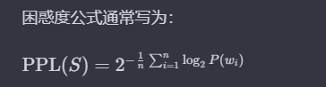

​	

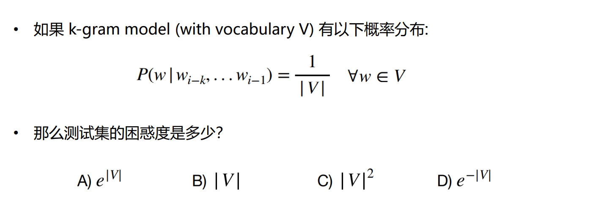

- #### 自然语言处理中N-Gram模型的Smoothing算法有哪些？

并非所有的n元语法都会在训练数据中都出现过。调整最大似然估计的概率值，使零概率增值，使非零概率下调，“劫富济贫”， 消除零概率，改进模型的整体正确率。


- #### Laplace平滑（ADD-ONE,add-α）和回退插值法的主要思想是什么

Laplace：每一种情况出现的次数加1或者一个极小值α到所有计数并重新规范化

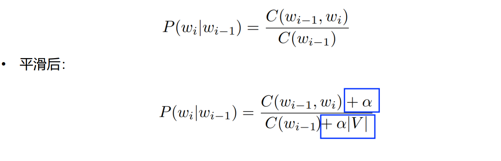

回退插值法：

用低阶语法估计高阶语法，即

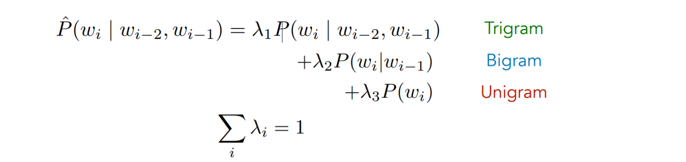

#### 第四章  文本分类

- #### 文本分类的方法（有监督）

监督学习的方法，基于规则的方法（有提前预定的范围组）


- #### 机器学习文本分类的流程（PPT有）

训练集进行一些包括文本预处理、特征提取、文本表示的特征工程后进入分类器


- #### 最大似然估计分类与情感分类

文本提取（特征选择）

构建特征表示（构建计算情感函数）


对数似然：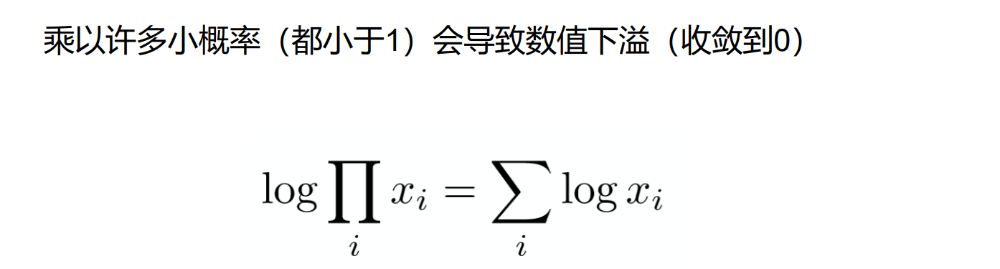


- #### 词序列的概率计算和表示


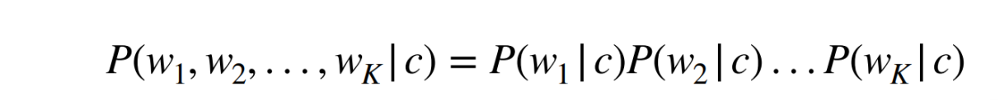


- #### 贝叶斯分类器（引入了先验概率,给你几句话用贝叶斯分类器去进行平滑）

选择最高后验概率的类别

计算先验条件概率时，进行加一处理

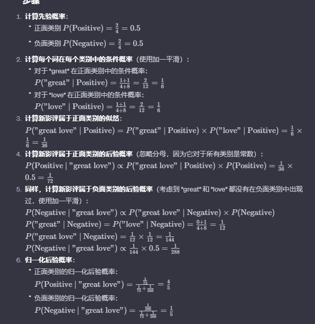


- #### 拉普拉斯平滑

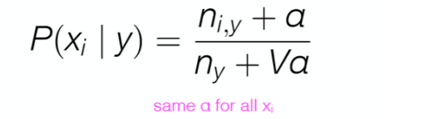


- #### 计算一句话计算情感是正向还是负向的概率


- #### 根据混淆矩阵，计算精确率、准确率和召回率

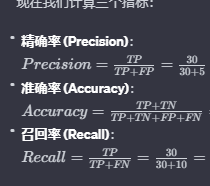


- #### 宏平均微平均计算方法

宏平均就是先算概率再取平均

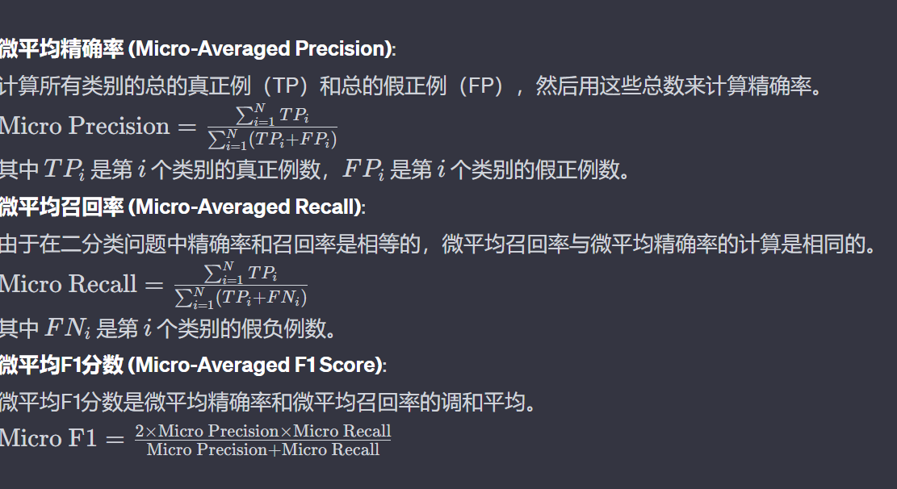


#### 第五章

- #### 生成模型和判别模型（逻辑回归，生成类方法要探索联合概率，隐含）

生成类方法要探索联合概率

判别模型关注于学习输入数据 *X* 和标签 *Y* 之间的条件概率分布 P*(*Y|X)

生成模型的目标是理解数据是如何生成的，可以用来生成新数据。判别模型则是为了找到不同类别之间的最佳分割边界。


- #### 逻辑函数和逻辑回归函数表达（基于线性回归）

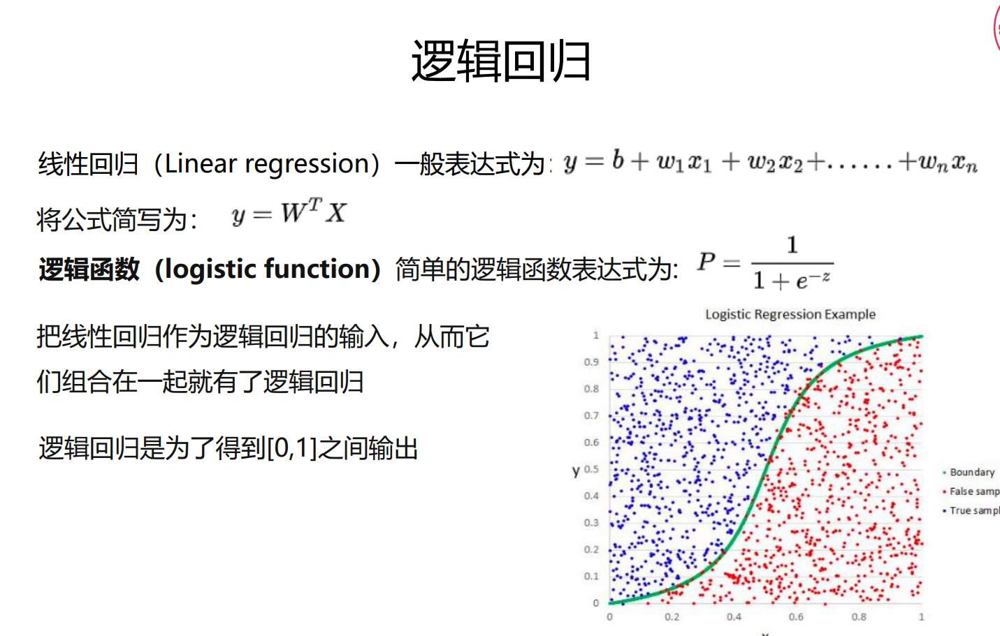


- #### 判别式分类器的主要过程

输入带有标签和数据的测试集

从原始数据中进行特征工程的提取

选择模型来进行模型训练计算预测标签

利用损失函数进行评估及后续优化

- #### 特征如何表示

将原始数据转换为模型能够处理的数据格式。

BoW模型（词袋模型）：将文本转化为只是词频的向量

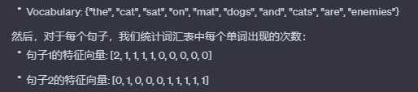


- #### 概率计算


- #### 损失函数

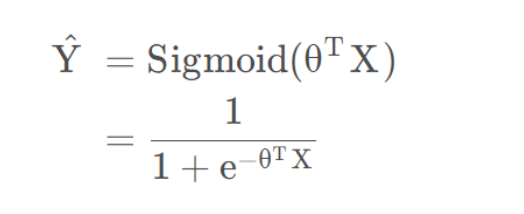


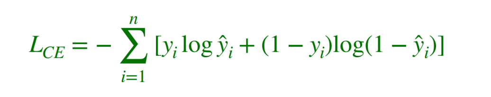

- #### 计算loss的范围（构造loss function，求偏导。步长迭代优化）

0 to 无穷


- #### 参数优化，梯度，梯度下降的算法过程，参数更新


- #### 为什么需要正则化

避免过拟合


- #### 逻辑回归多分类函数（神经网络的最后一层，词表的分类）


- #### Softmax的参数量（根据类别，PPT）

具体来说，Softmax 层的参数量为：

​		每个类别有一个权重向量，向量的维度与输入特征的数量相同，因此有 *K*×*N* 个权重。

​		每个类别有一个偏置项，因此有 *K* 个偏置。


#### 第六章 词的词义表示

- #### One hot编码的不足？（每个词用词表大小的维度去维护，不存在相似和相关性，如何用低维稠密的矩阵去表达）

​		产生大量的系数矩阵、单词之间的关系没有得到体现。


- #### 什么是分布式假设？（我要假设这个词的语义跟上下文及其相关的）

​	出现在相似语境中的单词往往具有相似的含义


- #### 建立词项-文档/上下文矩阵（用文档表示词，也可以反之。）

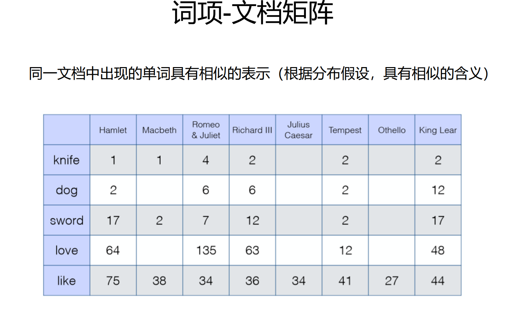

向量大小：vector size = |V|（两个词的词向量相似，则词义相似）


**使用较小的上下文，而不是使用整个文档**

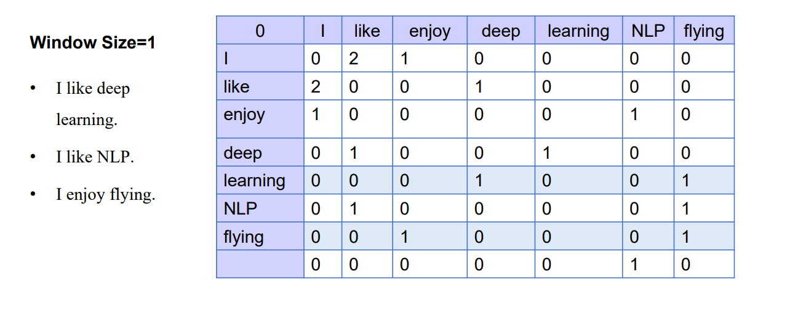


- #### 如何计算TFIDF（在每个文档当中挑出来关键词）

采用TF-IDF代替词频

 TF：词频，即一个词在文档中出现的次数。 

 IDF：逆文档频率，与一个词的常见程度成反比，一个词在多少文档中出现。 出现的文档越少，值越大。

词频TF (tft,d) = 词语t 出现在文档d中的次数

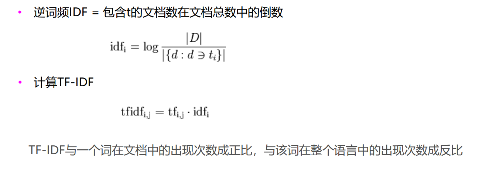


- #### 如何计算PMI和PPMI

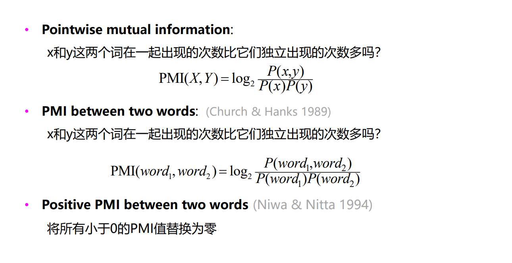

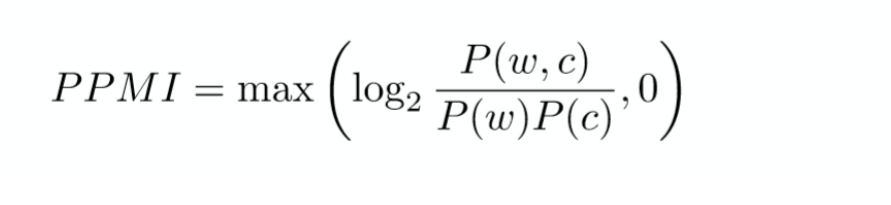


- #### 计算词语之间的余弦相似度

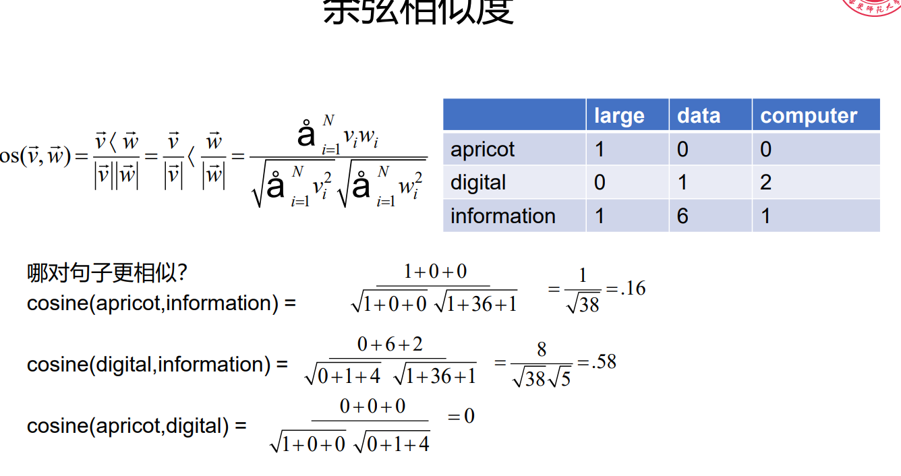


#### 第七章  词嵌入

- #### 什么是词嵌入

将单词表示为低维（50-300 维）和密集（实值）的向量

基本特性：相似的词有相似的向量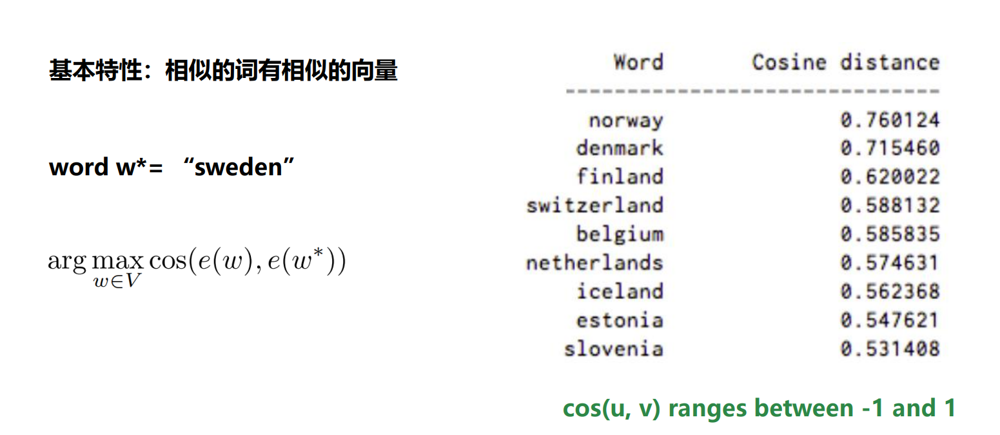

上图表明寻找与sweden最相似的单词，通过余弦相似度

- #### 词的语义

，词的语义是指词在向量空间中的嵌入，这个嵌入捕捉了大量关于该词语义的信息。

- #### 什么是词的类比

通过词向量的关系。。。

- #### Word2vec模型的CROW和Skip-gram的区别

CBOW模型的目标是根据上下文词的向量预测中心词。也就是说，它利用周围单词的上下文来预测当前单词。

Skip-gram模型的目标是使用中心词的向量来预测其上下文。这意味着它从当前单词预测周围的上下文单词

- #### Word2Vec的模型原理


Skip-gram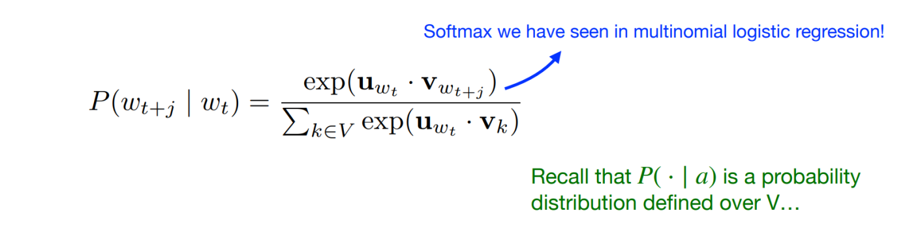


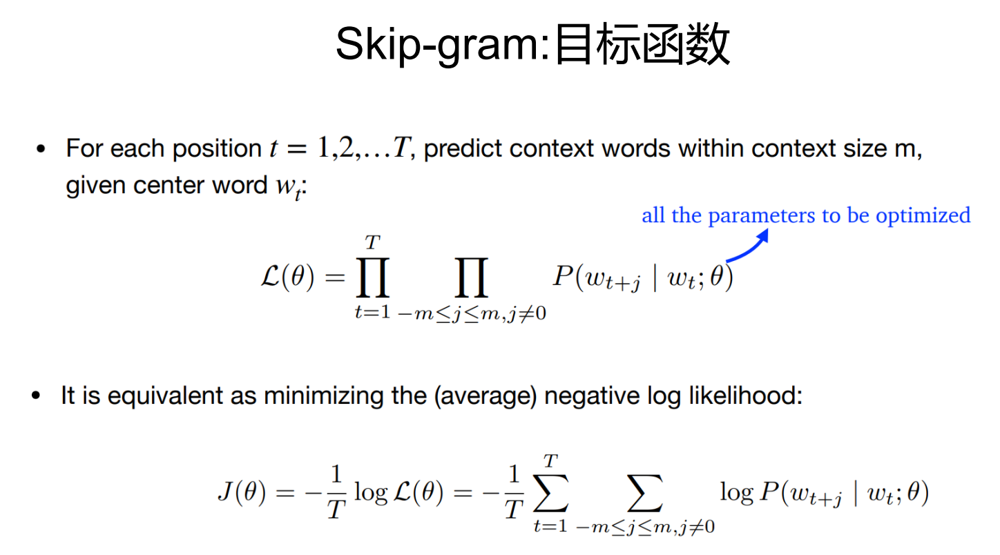

Word2Vec是一种用于生成词嵌入的模型，它能够将单词从词汇表映射到向量空间中，使得在向量空间中具有相似上下文的单词彼此接近。


- #### 模型参数量，损失函数

每个词有两个不同的向量表示：一个用作中心词（或目标词）时的向量，另一个用作上下文词时的向量。

所以参数量为2×d|V|

Skip-gram模型:损失函数是最大化给定中心词预测上下文词的概率的负对数似然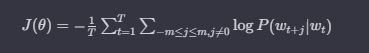

CBOW模型: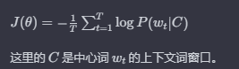


## 第八章 序列建模

英语有大于40种词性标注

为句子中的每个词标注词性 

消歧任务：每个词可能有不同的意义/功能

- #### 马尔可夫链计算


  离散的一阶马尔可夫链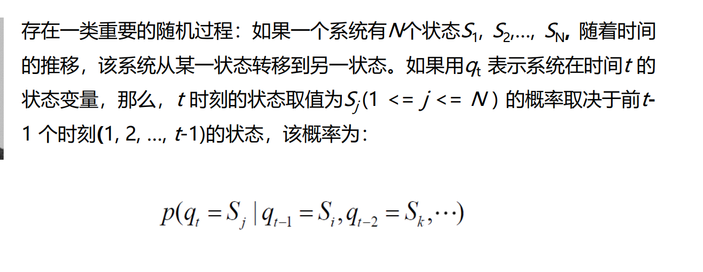


- #### 隐马尔可夫模型的五个元素

1. 状态集合
2. 观察集合
3. 状态转移概率分布
4. 观察概率分布
5. 初始状态概率分布

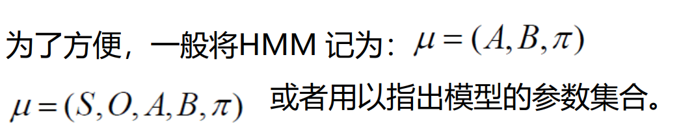

其中

S为状态集合

O为观测集合

A为状态转移概率矩阵

B为观测概率矩阵

π为初始状态概率向量


- #### 隐马尔可夫模型解决的三个问题

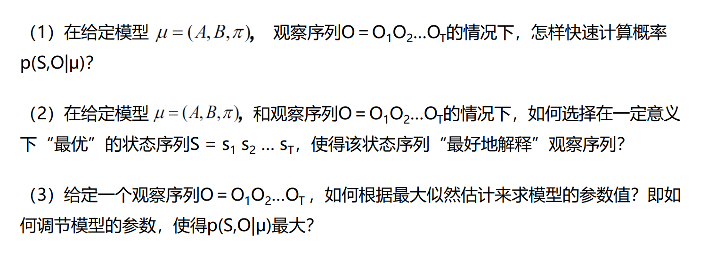

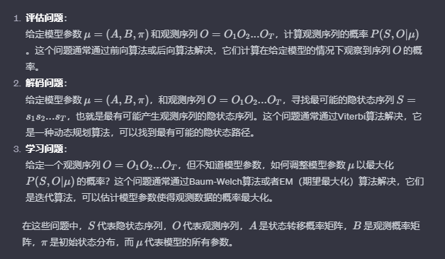

解答

（1）利用序列似然估计进行计算概率

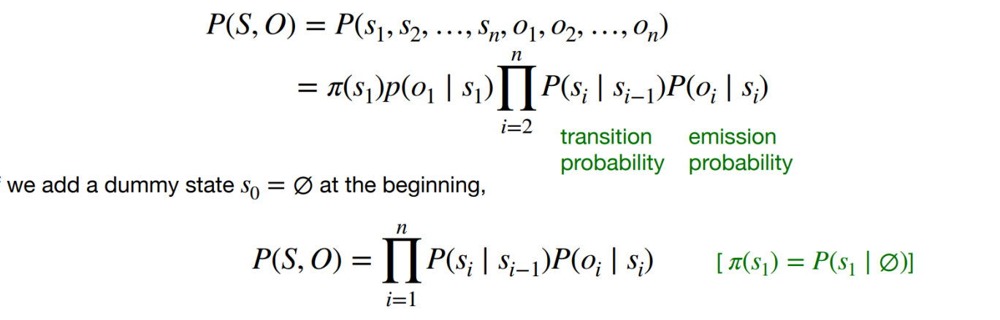


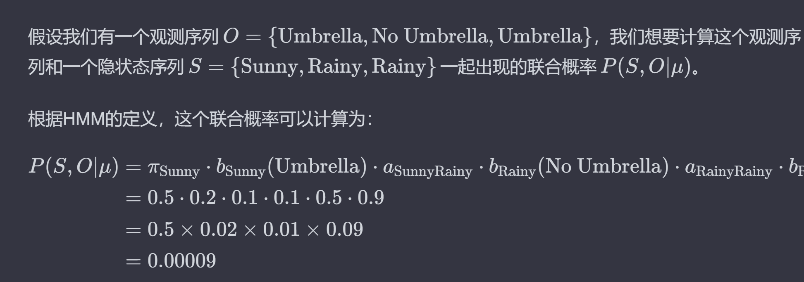

（2）维特比算法

动态规划的思想，提前去除不合理的路径


（3）beam search


- #### 隐马尔可夫模型的两个假设

##### 马尔科夫假设：

模型中任意状态只依赖于前一个状态*P*($S_t$*∣*S**t*−1,*S**t*−2,...,*S*1)=*P*(*S**t*∣*S**t−1)

##### 观测独立性假设：

任何时刻的观测值仅仅依赖于该时刻的状态，


- #### 如何计算联合概率


- #### 参数量


- #### 任务优化的目标函数


- #### 动态规划计算序列概率算法


- #### 维特比算法的实现过程以及每个节点更新伪代码

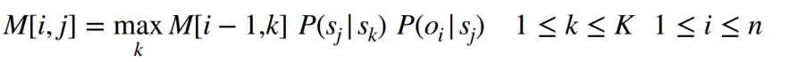

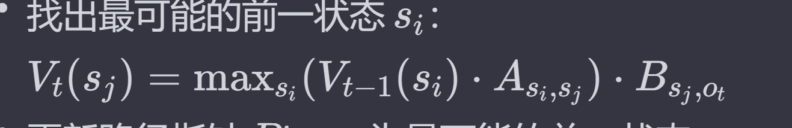

#### 第九章

- #### 最大熵马尔可夫模型的概率计算函数

  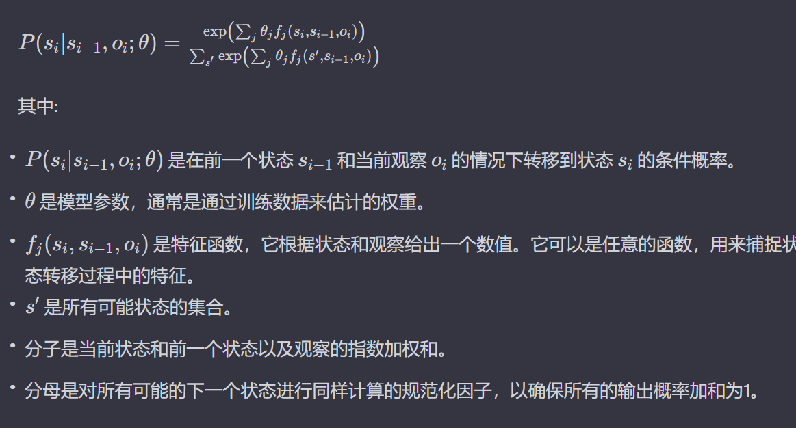

- #### 最大熵马尔可夫模型和隐马尔可夫模型的不同


- #### BeamSearch

- #### 隐马尔可夫模型与CRF模型的不同

- #### 条件随机场P（S|0）

- #### 条件随机场通常采用的特征函数

- #### 条件随机场解码方法


#### 第十、十一章：

- #### 深度学习NLP的优势


- #### 前馈神经网络计算和参数矩阵形状

  参数矩阵的尺寸是由前一层的节点数（或特征数）和当前层的节点数决定的

- #### 如何构造输入向量

- #### 激活函数有哪些

- #### 神经语言模型W和U的维度

- #### RNN适合的任务

文本分类和序列标签。不适用于文本生成

- #### RNN初始化，输入层，隐藏层和输出层的函数计算

- #### RNN的优缺点