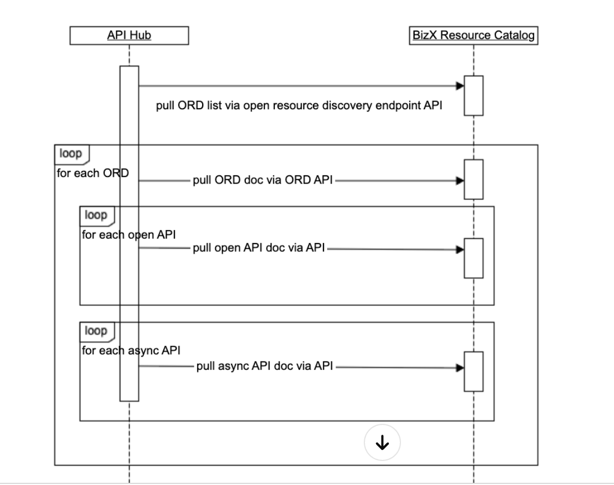

#### ORD Reference App:https://ord-reference-application.cfapps.sap.hana.ondemand.com/

我理解下来，ORD（Open Resource Discovery）是SAP公司推出的一个标准，用于描述和发现多种互联网服务资源，如API、事件和其他服务。ORD的主要目的是提供一种标准化的方法来帮助系统和服务自动发现和集成，特别是在使用SAP云平台和其生态系统中的服务时。

 

#### advantages：

- ORD文档可以比仅API文档表达更多信息，例如实体类型（ODM）、功能、集成等。
- ORD 聚合器可以使用 ORD 提供者的相同端点，并且 UCL 聚合器可以支持基于租户的 API 规范。
- 自动化发布 API 文档成为可能。

在这个框架中，资源目录服务作为ORD提供者的角色是至关重要的。它负责整合API Hub和UCL，以确保每个支柱只需要知道如何与资源目录服务交互，而不是直接处理ORD配置或资源规范。这样，每个支柱可以在自己的GIT仓库中管理API规范，而资源目录服务和ORD集成管道则负责其他集成相关的部分。

1. **从API Hub拉取ORD列表**：
   - 这一步是整个过程的开始，ORD聚合器会联系API Hub，使用open resource discovery endpoint API获取可用的ORD列表。
2. **循环遍历每个ORD**：
   - 聚合器进入一个循环，对于API Hub返回的每一个ORD条目，它都会通过ORD API拉取具体的ORD文档。
3. **针对每个open API拉取文档**：
   - 在获取了ORD文档之后，聚合器会进一步拉取每个公开API的文档。这一步可能涉及到查看API的定义、参数、响应格式等详细信息。
4. **针对每个异步API拉取文档**：
   - 最后，聚合器同样会为每个异步API拉取文档。异步API通常指的是那些不会立即返回结果，而是在将来某个时刻完成操作的API。

https://ord-reference-application.cfapps.sap.hana.ondemand.com/open-resource-discovery/v1/documents/1

- `openResourceDiscovery` 和 `policyLevel` 定义了文档的版本和使用的政策级别。
- `describedSystemInstance` 提供了服务实例的基本URL。
- `products` 列表了产品的信息。
- `packages` 包括API资源和事件资源的集合，分别对应API和事件的模块。
- `consumptionBundles` 是资源的集合，通常被打包在一起供消费者使用。
- `apiResources` 描述了可用的API资源，包括它们的版本、更新时间、可见性、状态、以及如何通过API协议访问这些资源。
- `eventResources` 描述了事件资源，提供了关于如何通过异步消息协议访问这些资源的信息。
- `entityTypes` 描述了数据实体的类型和模型。
- `tombstones` 则用于标记已被移除的资源，以便客户端知道哪些资源已经不再