# BioInfo

## 01绪论 

##### 人类基因组计划 (HGP)

> 中国承担其中1%（人类3号染色体短臂上一个约30Mb区域的测序），2000年开始绘制出97%的基因组

第三大科学计划，**“达尔文以后意义最为重大的生物学发现”**，标志人类探索生命奥秘的进程与生命技术发展进入崭新时期。
目标为完成23对染色体中DNA碱基序列测定序组

##### 生物信息学当前的主要研究任务：

`平台建设、 基因组序列分析、蛋白质结构预测、蛋白质功能预测、基因表达谱数据分析、疾病基因的预测、生物信息学与药物设计、生物医学图像的处理、互联网+医疗的数据分析`


## 02方法

- 实验永远起着决定作用
- 有助于揭示基因组信息结构的复杂性、遗传语言的根本规
  律
- 计算/理论生物学的发展离不开实验生物学的贡献
- 实验生物学日益依赖计算/理论生物学的指导

## 03 基因组序列分析

#### 相关背景

###### DNA结构

DNA分子的一级结构：A, C, G, T四种核苷酸的线性多聚体；
DNA分子由两条互相平行的脱氧核苷酸长链盘绕而成；
DNA分子中的脱氧核糖和磷酸交替连接，排在外侧，碱基排列在内侧；
两条链上的碱基通过氢键想结合，形成碱基对

于腺膘呤(A)总是与胸腺嘧啶(T)配对、鸟膘呤(G)总是与胞嘧啶©配对，这说明两条链的碱基顺序是彼此互补的

##### 中心法则

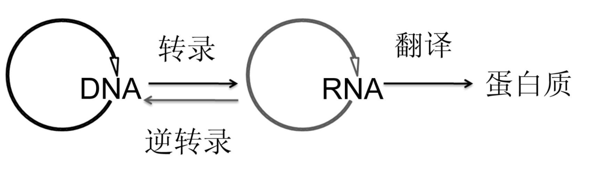

#### 常用的检验指标:

1. 混淆矩阵

   横轴是模型预测的类别数量统计，纵轴是数据真实标签的数量统计。
   对角线，表示模型预测和数据标签一致的数目，所以对角线之和除以测试集总数就是准确率。


2. ROC曲线

   X轴：1-Sp（FPR）

   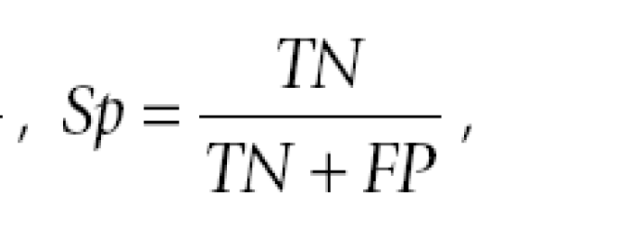

​		Y轴：Sn

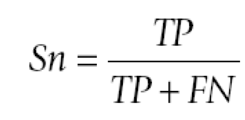

​	ROC的面积越大，表明其预测能力越强.当AUC(曲线下面积)为0.5时，表示模型没有类别分离能力，与随机分类效果差不多。


3. PR曲线

   X轴：Precision

   Y轴：Recall

   比较两个分类器好坏时，显然是查得又准又全的比较好。PR曲线越往坐标（1，1）的位置靠近越好

##### 性能检验

自一致性检验 (Self-consistency): 将训练数据当成测试数据。
反映当前预测工具对目前已知的数据的预测能力.但不能反应稳定性

**泛化。性能**：

某一训练集上训练过以后的分类器适应该训练集以外的数据的性能，也称为可扩展性

**k-折交叉验证**

```
1. 将全部训练集 S分成 k个不相交的子集，假设 S中的训练样例个
	数为 m，那么每一个子 集有 m/k 个训练样例，，相应的子集称作
	{s1,s2,…,sk}。
 2.每次从分好的子集中里面，拿出一个作为测试集，其它k-1个作
	为训练集。
 3.根据训练训练出模型或者假设函数。
 4. 把这个模型放到测试集上，得到分类率。
 5.计算k次求得的分类率的平均值，作为该模型或者假设函数的真
	实分类率
```

**留一法**（Leave One Out）

一种特殊的[交叉验证](https://so.csdn.net/so/search?q=交叉验证&spm=1001.2101.3001.7020)，它令n等于训练集个数，即每次只抽取一个作为测试样本


#### 原核细胞基因结构：

1. 非编码区 不编码蛋白质，可调控遗传信息表达（调控序列）
2. 编码区 编码蛋白质 （编码序列）

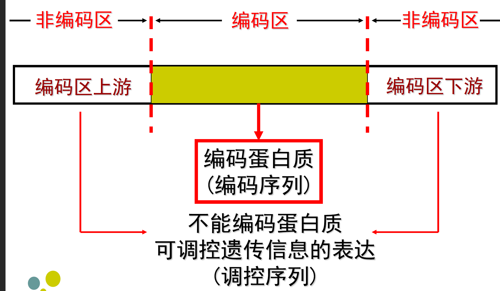

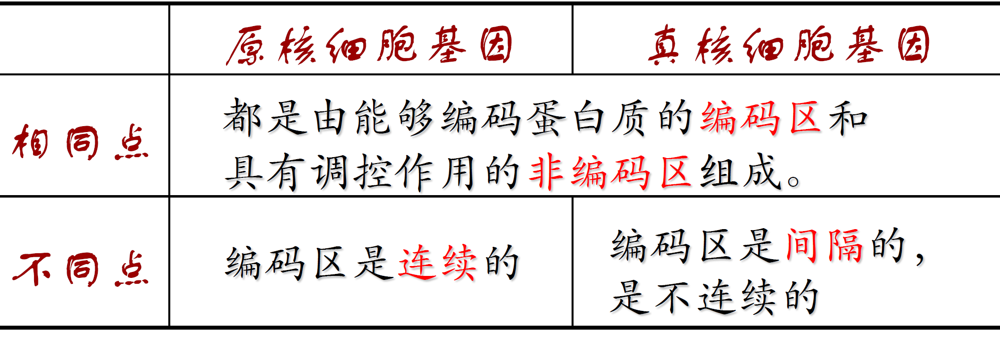

**基因功能注释**主要包括预测基因中的功能域、功能分类和所在的生物学通路，普遍采用==序列相似性比对==的方
法。

**基因预测的难点？**

1. 剪接位点难预测——==Splice site(剪接位点)：外显子-内含子交界处周围的序列==
2. 编码区、非编码区长度比例下降，导致外显子预测很难
3. 可能有多个外显子


## 04 基因结构预测方法

基因结构：ORF(Open Reading Frame)

> 在DNA链上，由蛋白质合成的起始密码开始，到终止密码子为止的一个连续编码序列。
>
> ORF是潜在的蛋白质编码区

###### 结构基因的区域：

外显子、内含子、前导区、调节区


##### 预测效果的评估：

分三个层次：`编码核苷酸`、`外显子结构`、`蛋白质产物`。


##### 机器学习预测的一般流程


##### 功能位点：选取的是对基因表达水平或蛋白活性具有重要影响的功能图变


#### 密码子的偏好性

> 由于密码子的简并性，每个氨基酸至少对应1种密码子，最多有6种对应的密码子。

目标：识别编码区域查找有效蛋白质（氨基酸序列）信号

不同种属间使用同义密码的频率有很大差异

**模型：**

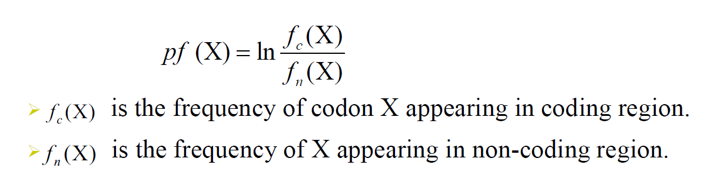

衡量DNA编码潜能：

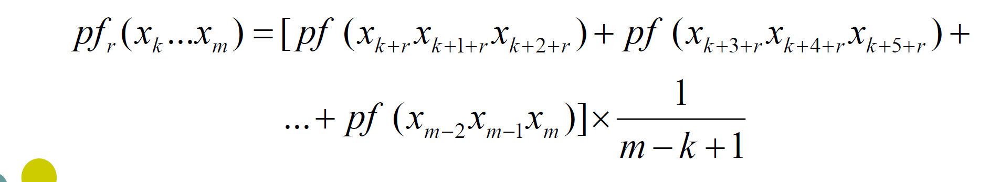


> GC含量是在DNA4种碱基中，鸟嘌呤和胞嘧啶所占的比率称为GC含量。
> GC含量愈高，DNA的密度也愈高，同时热及碱不易使之变性，因此这
> 一特性可进行DNA的分离或测定。


##### 外显子的长度分布

- 人类基因组外显子长度的概率分布要比内含子的概率分布要紧凑得多

- 外显子长度的单位为氨基酸，内含子长度的单位为核苷酸


##### 外显子模型


#### 基因结构预测

> 目标：发现正确的基因结构

流程图：

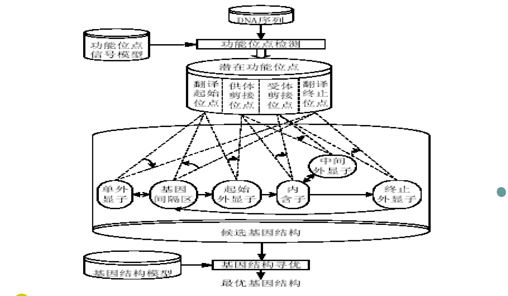

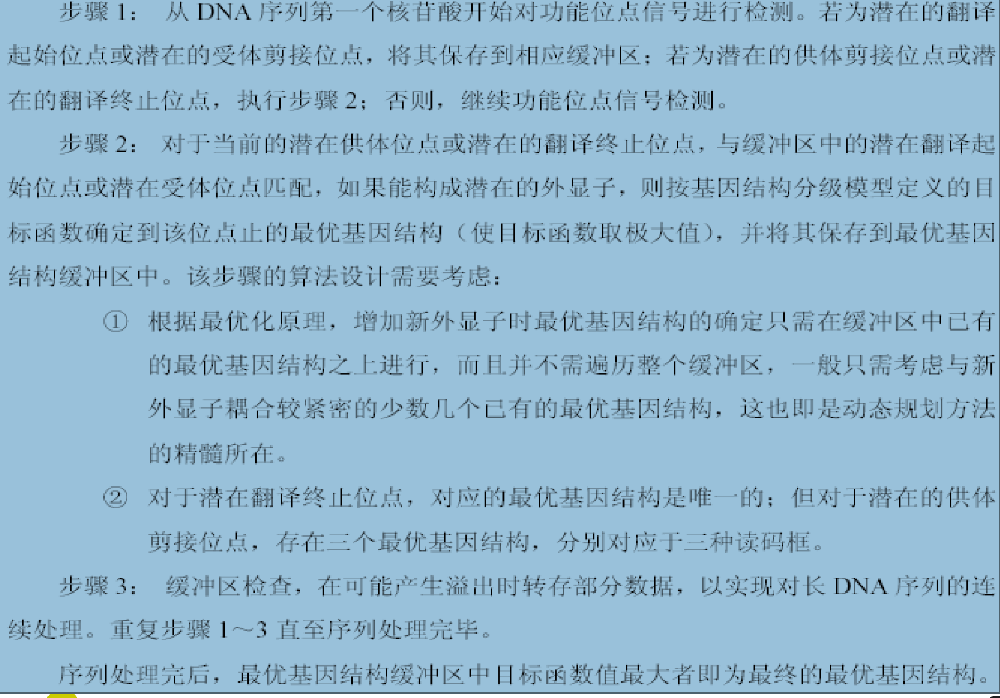

#### 基因结构预测工具

GENSCAN最好用

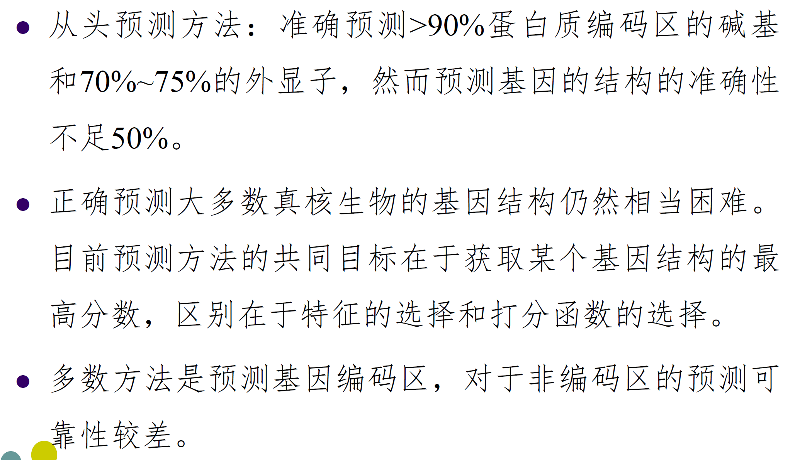


## 第五章 基因表达数据分析

基因芯片工作原理：使用已知的核酸序列作为探针与互补的靶核苷酸序列杂交，通过随后的信号检测进行定性与定量的分析。

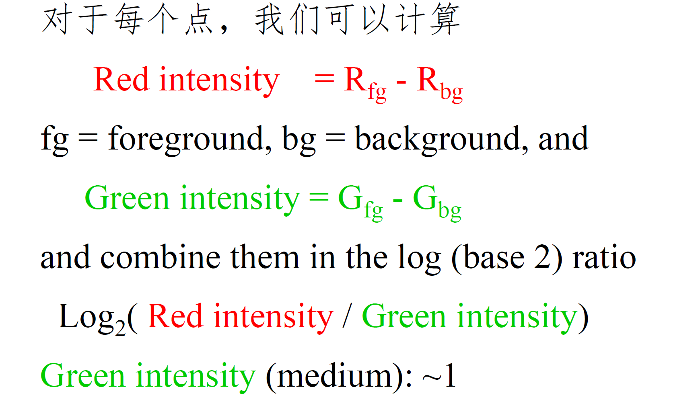

