# BioInfo

## 01绪论 

##### 人类基因组计划 (HGP)

> 中国承担其中1%（人类3号染色体短臂上一个约30Mb区域的测序），2000年开始绘制出97%的基因组

第三大科学计划，**“达尔文以后意义最为重大的生物学发现”**，标志人类探索生命奥秘的进程与生命技术发展进入崭新时期。
目标为完成23对染色体中DNA碱基序列测定序组

##### 生物信息学当前的主要研究任务：

`平台建设、 基因组序列分析、蛋白质结构预测、蛋白质功能预测、基因表达谱数据分析、疾病基因的预测、生物信息学与药物设计、生物医学图像的处理、互联网+医疗的数据分析`


## 02方法

- 实验永远起着决定作用
- 有助于揭示基因组信息结构的复杂性、遗传语言的根本规
  律
- 计算/理论生物学的发展离不开实验生物学的贡献
- 实验生物学日益依赖计算/理论生物学的指导

## 03 基因组序列分析

#### 相关背景

###### DNA结构

DNA分子的一级结构：A, C, G, T四种核苷酸的线性多聚体；
DNA分子由两条互相平行的脱氧核苷酸长链盘绕而成；
DNA分子中的脱氧核糖和磷酸交替连接，排在外侧，碱基排列在内侧；
两条链上的碱基通过氢键想结合，形成碱基对

于腺膘呤(A)总是与胸腺嘧啶(T)配对、鸟膘呤(G)总是与胞嘧啶©配对，这说明两条链的碱基顺序是彼此互补的

##### 中心法则


#### 常用的检验指标:

1. 混淆矩阵

   横轴是模型预测的类别数量统计，纵轴是数据真实标签的数量统计。
   对角线，表示模型预测和数据标签一致的数目，所以对角线之和除以测试集总数就是准确率。


2. ROC曲线

   X轴：1-Sp（FPR）

   

​		Y轴：Sn


​	ROC的面积越大，表明其预测能力越强.当AUC(曲线下面积)为0.5时，表示模型没有类别分离能力，与随机分类效果差不多。


3. PR曲线

   X轴：Precision

   Y轴：Recall

   比较两个分类器好坏时，显然是查得又准又全的比较好。PR曲线越往坐标（1，1）的位置靠近越好

##### 性能检验

自一致性检验 (Self-consistency): 将训练数据当成测试数据。
反映当前预测工具对目前已知的数据的预测能力.但不能反应稳定性

**泛化。性能**：

某一训练集上训练过以后的分类器适应该训练集以外的数据的性能，也称为可扩展性

**k-折交叉验证**

```
1. 将全部训练集 S分成 k个不相交的子集，假设 S中的训练样例个
	数为 m，那么每一个子 集有 m/k 个训练样例，，相应的子集称作
	{s1,s2,…,sk}。
 2.每次从分好的子集中里面，拿出一个作为测试集，其它k-1个作
	为训练集。
 3.根据训练训练出模型或者假设函数。
 4. 把这个模型放到测试集上，得到分类率。
 5.计算k次求得的分类率的平均值，作为该模型或者假设函数的真
	实分类率
```

**留一法**（Leave One Out）

一种特殊的[交叉验证](https://so.csdn.net/so/search?q=交叉验证&spm=1001.2101.3001.7020)，它令n等于训练集个数，即每次只抽取一个作为测试样本


#### 原核细胞基因结构：

1. 非编码区 不编码蛋白质，可调控遗传信息表达（调控序列）
2. 编码区 编码蛋白质 （编码序列）


**基因功能注释**主要包括预测基因中的功能域、功能分类和所在的生物学通路，普遍采用==序列相似性比对==的方
法。

**基因预测的难点？**

1. 剪接位点难预测——==Splice site(剪接位点)：外显子-内含子交界处周围的序列==
2. 编码区、非编码区长度比例下降，导致外显子预测很难
3. 可能有多个外显子


## 04 基因结构预测方法

基因结构：ORF(Open Reading Frame)

> 在DNA链上，由蛋白质合成的起始密码开始，到终止密码子为止的一个连续编码序列。
>
> ORF是潜在的蛋白质编码区

###### 结构基因的区域：

外显子、内含子、前导区、调节区


##### 预测效果的评估：

分三个层次：`编码核苷酸`、`外显子结构`、`蛋白质产物`。


##### 机器学习预测的一般流程


##### 功能位点：选取的是对基因表达水平或蛋白活性具有重要影响的功能图变


#### 密码子的偏好性

> 由于密码子的简并性，每个氨基酸至少对应1种密码子，最多有6种对应的密码子。

目标：识别编码区域查找有效蛋白质（氨基酸序列）信号

不同种属间使用同义密码的频率有很大差异

**模型：**


衡量DNA编码潜能：


> GC含量是在DNA4种碱基中，鸟嘌呤和胞嘧啶所占的比率称为GC含量。
> GC含量愈高，DNA的密度也愈高，同时热及碱不易使之变性，因此这
> 一特性可进行DNA的分离或测定。


##### 外显子的长度分布

- 人类基因组外显子长度的概率分布要比内含子的概率分布要紧凑得多

- 外显子长度的单位为氨基酸，内含子长度的单位为核苷酸


##### 外显子模型


#### 基因结构预测

> 目标：发现正确的基因结构

流程图：


#### 基因结构预测工具

GENSCAN最好用


## 第五章 基因表达数据分析

基因芯片工作原理：使用已知的核酸序列作为探针与互补的靶核苷酸序列杂交，通过随后的信号检测进行定性与定量的分析。


基因表达数据一般为矩阵形式，分析的基因发生的改变，基因间互相关系以及基因活动产生的影响等

##### 基因表达数据一般在3个层次上加以分析

- 单基因水平，分析基因在两种实验条件下的差异
- 分析功能相似的基因及基因之间的相互作用、共调控等
- 基于基因网络及蛋白质网络的研究


#### ！重点—数据预处理

- 数据质量的含义
  - 正确性
  - 一致性
  - 完整性
  - 可靠性

- 数据预处理

  - 数据清洗：丢弃重复数据、补全缺失数据、异常值处理。
  - 常见方法：数据清洗、数据转换、特征选择、数据降噪和数据增强
  - 形式：
    - 数据清理
    - 数据集成
    - 数据变换
    - 数据归约

- 图像分析预处理

  1、栅格化：确定点的位置

  2、图像分割：将点从背景中分离出来。

  3、抽提亮度：各个像素亮度的平均值或中位数

  4、背景校正：局部或全局

  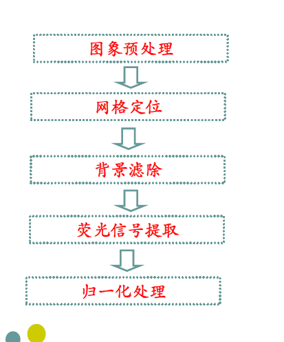

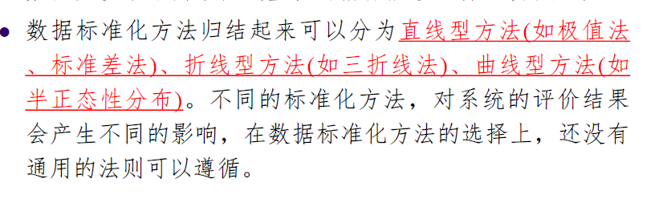

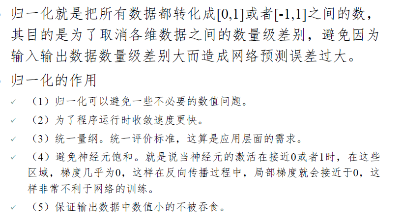


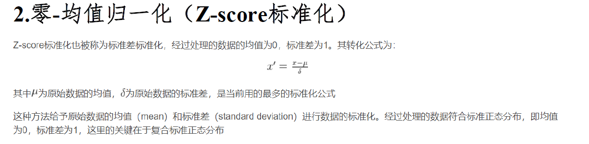


- 对数转换 目的：使得数据服从正态分布，简化非正态分布的计算
- 数据补缺 方法：
  - 简单补缺方法
  - K近邻方法

- ###### 数据清洗

  - 缺失值处理：若变量的缺失率较高，覆盖率较低，可以直接删除，缺失率较低且重要性较低，，可以用（最大值，众值、均值）填充
  - 离群值处理：常常删除
  - 不一致数据处理:分析前进行清理

- ##### 标准化：

  - 片内标准化:去除系统误差
  - 片间表转化：不同列之间发的标准化没事的在同一量纲比较


#### 差异表达基因的分析方法

##### 倍数法：

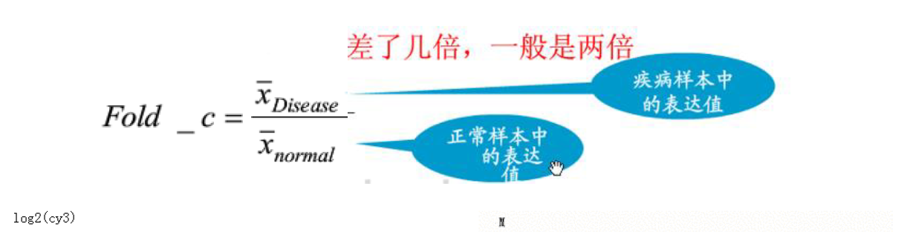


##### FDR：

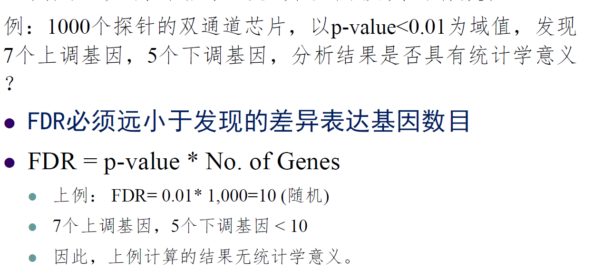

好的聚类分析方法：高类内相似度，低类间相似度

层次聚类对异常值不敏感


分类与聚类区别在分类事先知道类别数和各类的典型特征，而聚类则事先不知道。

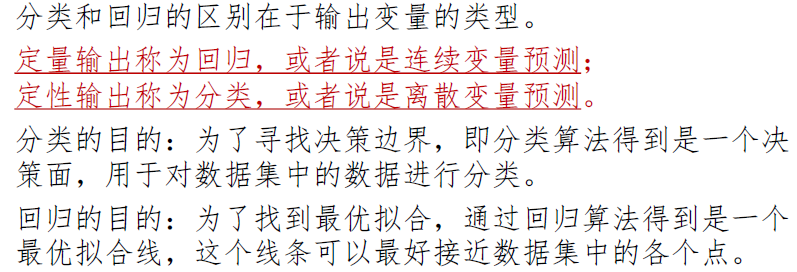

#### ！决策树

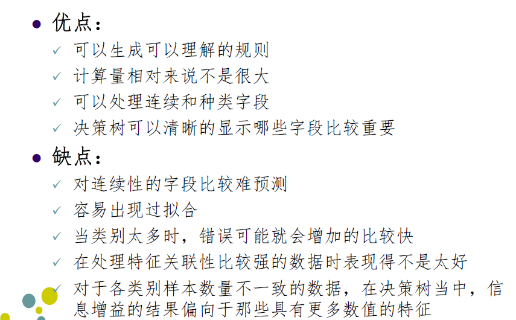


### 第七章 序列比对方法

序列比对：为确定两个或多个序列之间的相似性以至于同源性，而将它们按照一定的规律排列。

- 原因

用于研究由共同祖先进化而来的序列，通过序列比对可以发现生物序列中的功能、结构和进化的信息。

- 打分函数或者编辑距离

  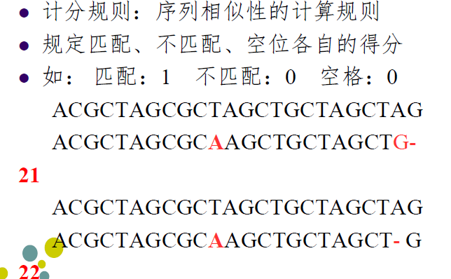


-  序列比对工具

  NCBI的BLAST

  EBI-PSA双序列比对工具

  EBI-MSA多序列比对工具

##### 

- Blast搜寻参数结果

  - p值表示比对结果得到的分数值的可信度。一般来说，p值越接近0，则比对结果的可信度越大
  - 期望值E描述的是搜索某一特定资料库时，随机出现的匹配序列数目。例如，E值为1可以解释为当
    前搜索中，由随机产生的相同分值的匹配的可能性为1。

  E的值越小，说明结果越有意义


### 8 蛋白质结构预测（同源建模要考）


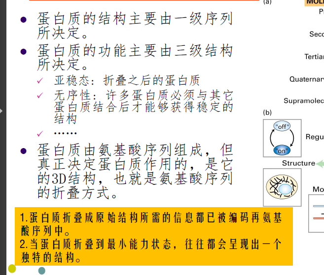

功能由蛋白质的机构所决定。

目标：判定该结构属于-helix, b-sheet，Coil三类中的哪一类？

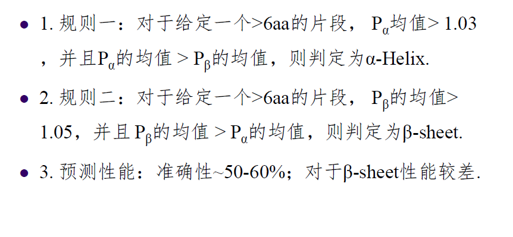


基本过程：

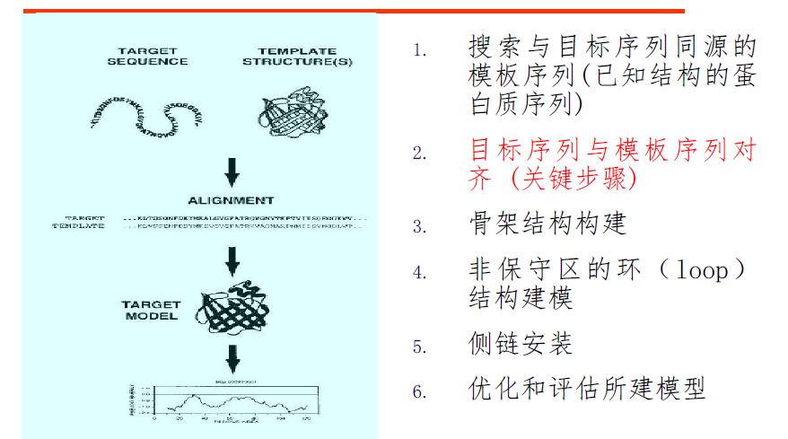


==序列-结构最佳对齐方式，能量最小化==

折叠识别方法只能预测蛋白质的骨架结构


### Alphafold2（要考的）

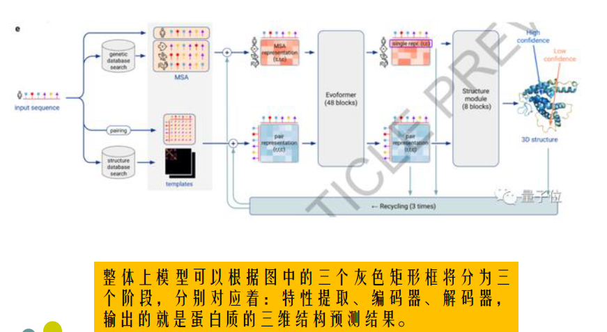

真正决定蛋白质作用的是他的3D结构，即氨基酸序列的折叠方式

借鉴了最新的Transformer结构，使用注意力机制处理氨基酸序列，来预测蛋白质的氨基酸残基之间的距离和角度，利用多序列比对将蛋白质结构和生物信息整合到深度学习算法中，构建蛋白质的三维结构模型。

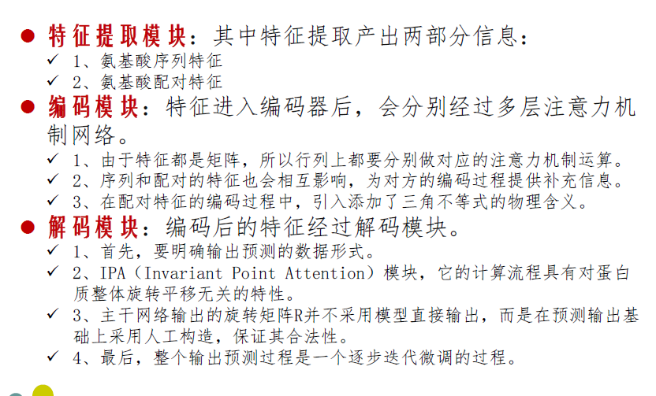

缺点：仍需通过实验得到蛋白质侧链的高分辨率信息。


## 10 药物设计

早期药物设计的思想：即药物在体内与特定的靶标作用，并引起靶标分子的结构和功能的变化.

##### 靶点识别

（1）利用机器学习方法对靶标家族进行分类，发现新的基因成员，可以帮助了解已知药物的作用机理。

（2）开发复杂致病基因预测方法为药靶识别提供线索。

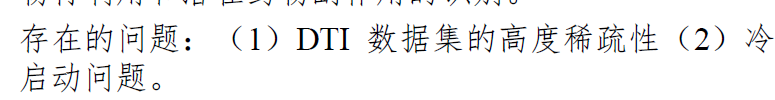

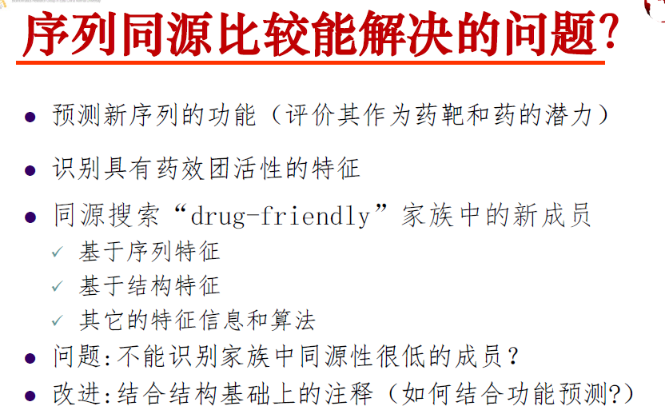

###### 先导化合物：

> 简称先导物，是通过各种途径和手段得到的具有某种生物活性和化学结构的化合物，用于进一步的结构改造和修饰，是现代新药研究的出发点。

优化：提高与靶点的匹配性与生物利用度

分子对接：寻找配体与受体结合在受体活性位点处的低能构象的过程


## 11 蛋白质功能预测

中心法则：（转录过程）DNA→RNA→蛋白质


###### 特征选择方法：

- Filter（过滤）：设置阈值选择特征（信息增益）
- Wrapper（包装法）：根据目标函数选择若干特征（粒子群）
- Embedded（嵌入法）：利用机器学习模型训练获得特征权重系数选择特征（岭回归）


##### 预训练

假设有训练集A，对网络进行与训练，学会的网络参数可以用到下一个任务中进行迭代优化，提前学习一个些基础通用的他特征


## 12生物网络分析的一般方法

##### 小世界网络：

> 具有较短平均路径长度又具有较高的聚类系数的网络


##### 中心度：

> 该点与图中所有其它点的捷径距离之和。


##### 介数：


不同的存在形式或信息来源均可被称之为一种模态。由两种或两种以上模态组成的数据称之为==多模态数据==

多模态数据是指对于同一个描述对象，通过不同领域或视角获取到的数据，并且把描述这些数据的每一个领域或视角叫做一个模态。

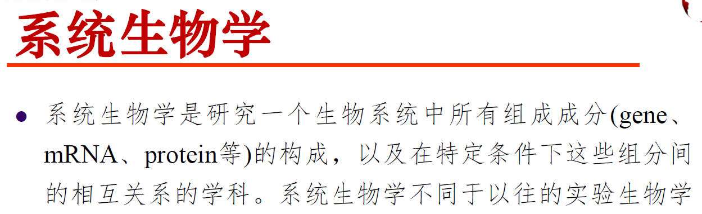


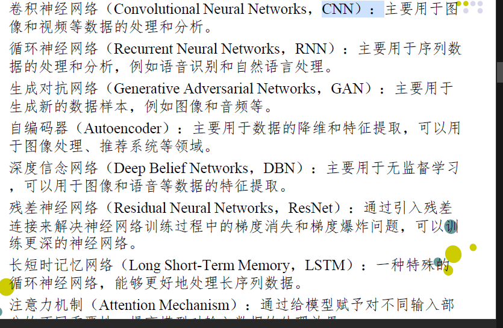

卷积神经网络：深度学习算法，适合处理具有网格结构的数据

在特征选择中，深度学习的一大优点就是可以自主地学习和提取数据中的特征，相比传统的机器学习算法。
