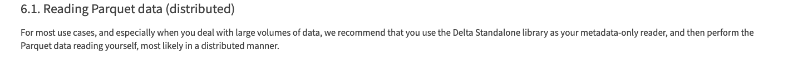

### Delta-standalone（DSW）

> The Delta Standalone library is a ==single-node== Java library that can be used to read from and write to Delta tables.
>

- 幂等写入可以通过`OptimisticTransaction.txnVersion(appId)`检查同一应用程序提交的版本增加来实现。

- 每次提交都必须指定`Operation`事务正在执行的操作。
- `OptimisticTransaction.commit(actions, operation, engineInfo)`用于提交对表的更改。具有原子性，以及事务回滚

- `DeltaLog.startTransaction()`写入功能，乐观并发控制多个writer，参考[Delta Transaction Log Protocol](https://github.com/delta-io/delta/blob/master/PROTOCOL.md)

- `OptimisticTransaction.markFilesAsRead(readPredicates)`用于读取事务期间的所有元数据（ 检测并发更新并确定是否可以解决此事务与先前提交的事务之间的逻辑冲突。也是跟踪事务期间读取的文件来帮助管理并发更新

  > 当更新table时，通过传递一个readpredicate的expression参数过滤，来标记事务读取的文件

- `Snapshot.scan(predicate)`，根据`predicate`文件元数据中的任何分区列来过滤文件。当读取快照中的文件并实例化 a `DeltaLog`（由于内部利用率）时，此 API 显着减少了内存占用。支持分区修剪

[Delta Lake Connector for Presto](https://www.youtube.com/watch?v=JrXGkqpl7xk)：在delta connector 中利用delta standalone 读取delta log，no need for mainfest 文件

> 具体源码https://github.com/search?q=repo%3Aprestodb%2Fpresto%20io.delta.standalone&type=code

[Delta Standalone design document 2021](https://docs.google.com/document/d/1MJhmW_H7doGWY2oty-I78vciziPzBy_nzuuB-Wv5XQ8/edit?pli=1#heading=h.j2yecuf2q7j4)（Logstores，幂等写入）

> OptimisticTransaction::txnVersion 

、

hi，tiger.我最近看完delta-standalone，现在我感觉下来，我们可以应用于

1.读取delta事务日志以及元数据，Delta Standalone中包含了内存优化的迭代器允许高效的查询事务日志元数据

2.另外delta-standalone引入一个Expression框架，可以用于元数据查询中的分区修剪

其次，官方提供一些乐观事务控制的api来控制读写操作冲突和事务逻辑检测，但官方更推荐在分布处理大量数据时，将它仅用于metadata-only reader。

具体案例我看到facebook中的[Delta Lake Connector for Presto](https://www.youtube.com/watch?v=JrXGkqpl7xk)里有用delta-standalone的迭代器去迭代获取delta事务日志的元数据

