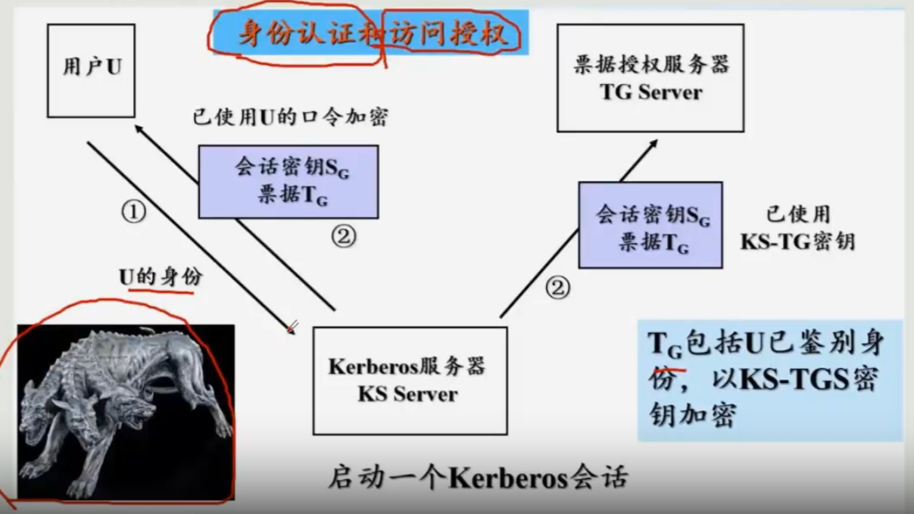
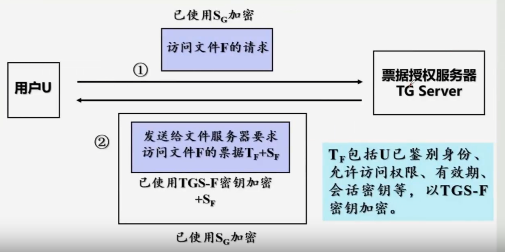

# Kerberos系统

###### 主要：实现用户身份认证和访问授权

## 原理图

用户首先会去kerberos服务器进行身份认证，身份认证通过后会发放给用户鉴别票据。随后用户可以访问票据授权服务器获得服务票据，用户通过服务票据请求到对应的服务器。

`票据不能被修改，被伪造`

Kerberos服务器与票据授权服务器之间有一个鉴别密钥（对称密钥）

票据授权服务器和其他服务器都有一个唯一密钥

## 运行机制

发回用户的包含票据$T_G$和对话密钥$S_{G}$(使用用户的口令进行加密)

$S_F$是会话密钥 ，$T_F$被和文件服务器的密钥加密

