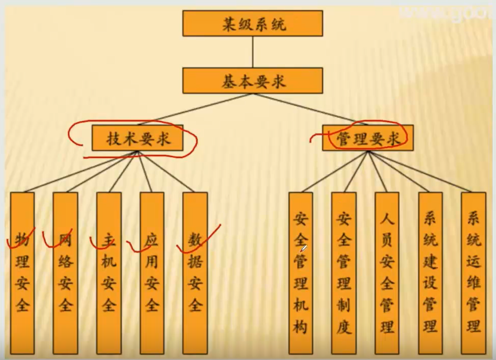
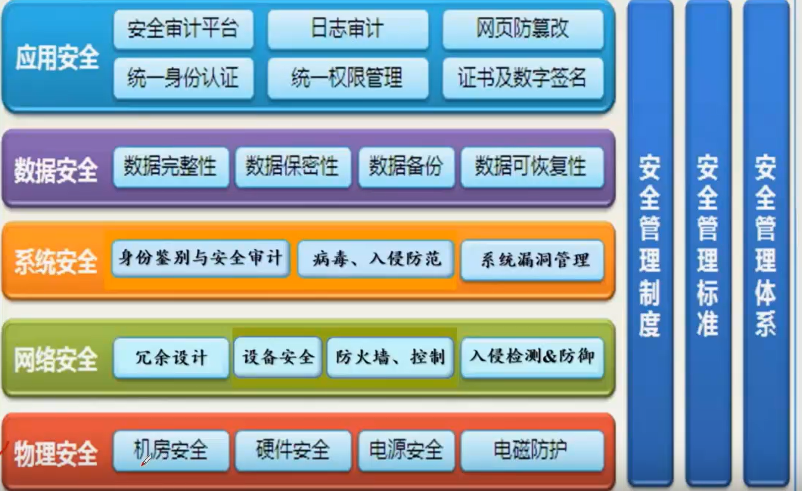

# 信息安全保障体系

信息安全的技术要求可以从应用安全、数据安全、系统安全、网络安全和物理安全这几个方面。

**系统安全需求**

系统漏洞管理：及时发现，避免黑客入侵

系统安全保护：避免病毒

身份鉴别和安全审计：对用户进行....，对系统操作进行审计，系统内安全的重要事件

**系统安全控制部署**

- lou'dong

- 网络入侵防御系统(IPS)和网路入侵检测系统（IDS）

防火墙和IPS是串行的部署

