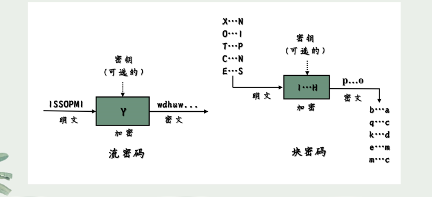
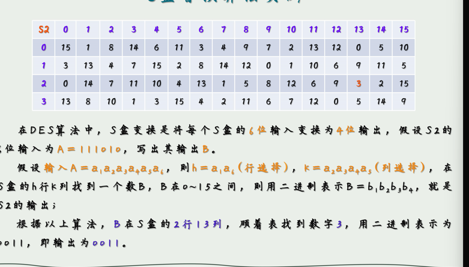
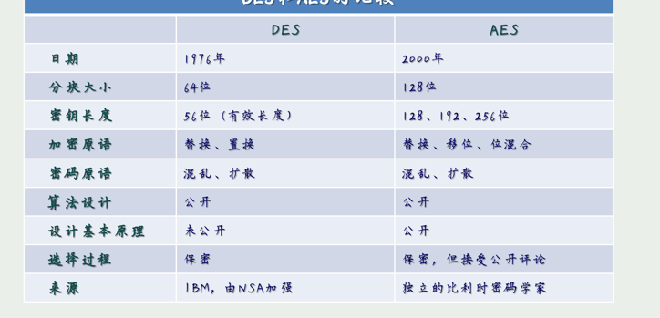
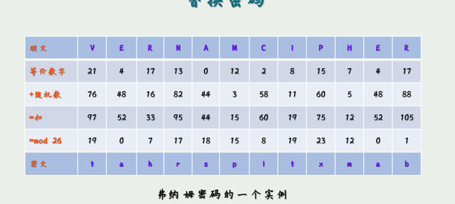
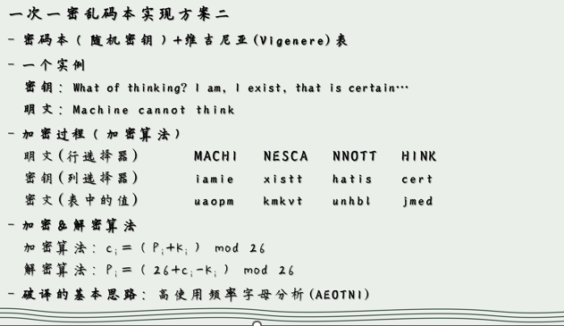
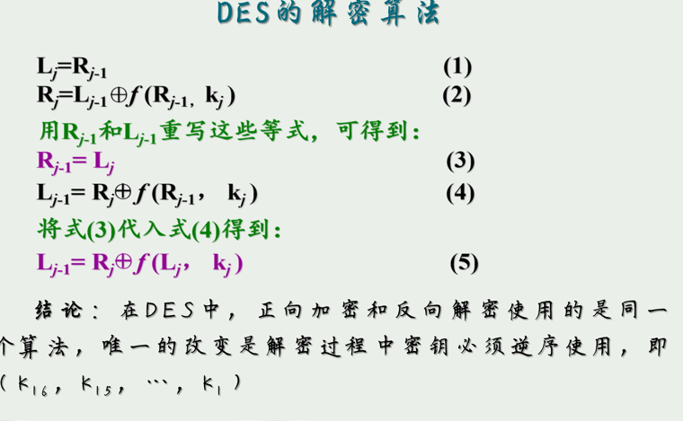
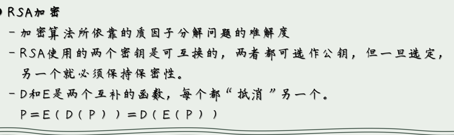
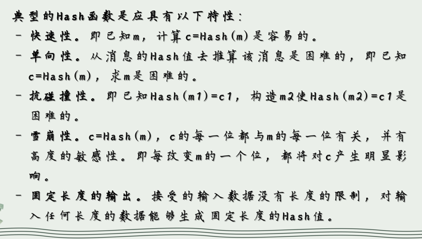
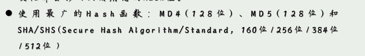

## 第1章

信息安全三要素：1、机密性、完整性、可用性

攻击遵循 ==脆弱点—威胁—控制== 的范式

计算机入侵的特点：`最易渗透原则(最薄弱环节原则)`

### **1、信息系统安全威胁有哪四种？用实例说明这几种威胁的含义与特点。**

* **截取（Interception）**：

  **含义**：截取是指攻击者未经授权地访问和捕获数据或通信的过程。这意味着攻击者可以获取敏感信息，如登录凭据、信用卡号码或敏感文件。

  **示例**：在一个公司的内部网络中，攻击者成功入侵了一个员工的计算机，并通过键盘记录软件记录了员工的用户名和密码。攻击者随后使用这些凭据访问公司的机密文件。

* **篡改（Tampering）**：

  **含义**：篡改是指攻击者修改或更改数据、文件或通信的内容，以使其变得不可信或有害。这可能导致数据损坏或错误的决策。

  **示例**：一个电子商务网站的支付页面遭受了攻击。攻击者成功地修改了交易金额，导致用户支付了比实际商品价格更高的金额。这种篡改可能会损害用户信任，并对公司的声誉产生负面影响。

* **伪造（Fabrication）**：

  **含义**：伪造是指攻击者创建虚假的数据、文件或通信，以冒充合法用户或设备，从而获得访问权限或执行欺骗性操作。

  **示例**：一家银行收到了一封伪造的电子邮件，声称来自一个合法客户，要求将大笔资金转账到攻击者控制的账户。银行员工因未能正确验证邮件的真实性而执行了该请求，导致巨额资金被盗取。

* **中断（Interruption）**：

  **含义**：中断是指攻击者试图破坏或中断系统的正常操作，通常通过拒绝服务攻击（DoS）或分布式拒绝服务攻击（DDoS）来实现。这可能导致系统不可用，影响正常业务流程。

  **示例**：一个在线游戏公司遭受了一次大规模DDoS攻击，导致其游戏服务器不可用数小时。在此期间，玩家无法访问游戏，这不仅损害了公司的声誉，还导致玩家流失。

### **2、计算机入侵的最易渗透原则（最薄弱环节原则）指的是什么？对安全管理工作有何指导意义？**

指的是攻击者通常会选择攻击目标中最薄弱的部分，即最容易渗透的部分

安全管理不是一劳永逸的事情，而是一个持续的过程，需要不断评估和改进，以保护组织免受潜在的计算机入侵和安全威胁的影响。通过关注最薄弱环节，可以更有针对性地提高整体安全性。

### 3、信息系统的基本安全目标体现在哪三个方面？与上述的四种安全威胁有何关系？

## 第2章 密码学基础

### 术语

- 加密 VS 解密

- 密码体制
- 明文VS 密文

S盒替换算法

### 4、本课程所涉及的几个古典加密算法的加密过程。(包括替换算法和置换算法)

1、替换算法

- 其中明文的每个字符都被替换成密文中的另一个字符。

以凯撒密码为例子，其中字符便按照固定的偏移量进行替换。

$ C_i = E(p_i) = (p_i + K )mod 26$

- 一种有密钥的替换密码 24！可能性

- 佛纳姆密码

- 

2、置换算法

- 简单列置换算法（加密：行入列出，解密：列入行出）

- 带密钥的置换算法

  

### 5、DES 加密算法的基本思路；DES 加密与解密算法的关系以及证明。

DES加密算法的基本思路是将明文分成固定大小的块（通常是64比特），并使用一个称为密钥的秘密值来对每个块进行一系列的置换、替换和混淆操作，以生成对应的密文块。

### 6、何为对称(秘钥)加密算法和非对称(公钥)加密算法？试说明各自的特点以及主要应用场合。

###### 非对称：（动机：密钥膨胀）

==RSA加密算法还没弄东==

### 7、密码哈希(Hash)函数的特点与作用。

Hash函数是把可变长的输入数据转换为固定长度输出数据的一种函数

### 8、基于Hash 函数实现消息认证的几种典型方案。

### 9、密钥交换的目的与实现。

密钥交换（Key Exchange）是一种加密通信中的关键过程，其主要目的是安全地协商双方通信的加密密钥，以确保通信的机密性。

### 10、数字签名的作用，数字签名与验证的过程。

 用于信息安全的身份认证、数据完整性、不可否认性等

### 11、证书的作用以及相关的实现机制。

### 12、加密技术综合应用实例（数字信封技术的作用与实现）

### 13、何为缓冲区溢出漏洞？它可能会产生哪些危害？

### 14、举例说明何为“检查时刻到使用时刻(TOCTTOU)”漏洞？简述其解决方案。