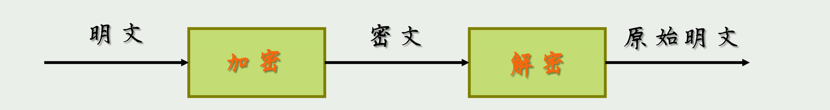

## 第1章

信息安全三要素：1、机密性、完整性、可用性

攻击遵循 ==脆弱点—威胁—控制== 的范式

计算机入侵的特点：`最易渗透原则(最薄弱环节原则)`

### **1、信息系统安全威胁有哪四种？用实例说明这几种威胁的含义与特点。**

* **截取（Interception）**：

  **含义**：截取是指攻击者未经授权地访问和捕获数据或通信的过程。这意味着攻击者可以获取敏感信息，如登录凭据、信用卡号码或敏感文件。

  **示例**：在一个公司的内部网络中，攻击者成功入侵了一个员工的计算机，并通过键盘记录软件记录了员工的用户名和密码。攻击者随后使用这些凭据访问公司的机密文件。
* **篡改（Tampering）**：

  **含义**：篡改是指攻击者修改或更改数据、文件或通信的内容，以使其变得不可信或有害。这可能导致数据损坏或错误的决策。

  **示例**：一个电子商务网站的支付页面遭受了攻击。攻击者成功地修改了交易金额，导致用户支付了比实际商品价格更高的金额。这种篡改可能会损害用户信任，并对公司的声誉产生负面影响。
* **伪造（Fabrication）**：

  **含义**：伪造是指攻击者创建虚假的数据、文件或通信，以冒充合法用户或设备，从而获得访问权限或执行欺骗性操作。

  **示例**：一家银行收到了一封伪造的电子邮件，声称来自一个合法客户，要求将大笔资金转账到攻击者控制的账户。银行员工因未能正确验证邮件的真实性而执行了该请求，导致巨额资金被盗取。
* **中断（Interruption）**：

  **含义**：中断是指攻击者试图破坏或中断系统的正常操作，通常通过拒绝服务攻击（DoS）或分布式拒绝服务攻击（DDoS）来实现。这可能导致系统不可用，影响正常业务流程。

  **示例**：一个在线游戏公司遭受了一次大规模DDoS攻击，导致其游戏服务器不可用数小时。在此期间，玩家无法访问游戏，这不仅损害了公司的声誉，还导致玩家流失。

### **2、计算机入侵的最易渗透原则（最薄弱环节原则）指的是什么？对安全管理工作有何指导意义？**

指的是攻击者通常会选择攻击目标中最薄弱的部分，即最容易渗透的部分

安全管理不是一劳永逸的事情，而是一个持续的过程，需要不断评估和改进，以保护组织免受潜在的计算机入侵和安全威胁的影响。通过关注最薄弱环节，可以更有针对性地提高整体安全性。

### 3、信息系统的基本安全目标体现在哪三个方面？与上述的四种安全威胁有何关系？

## 第2章 密码学基础

### 术语

- 加密 VS 解密
- 密码体制
- 明文VS 密文

S盒替换算法

### 4、本课程所涉及的几个古典加密算法的加密过程。(包括替换算法和置换算法)

1、替换算法

- 其中明文的每个字符都被替换成密文中的另一个字符。

以凯撒密码为例子，其中字符便按照固定的偏移量进行替换。

$ C_i = E(p_i) = (p_i + K )mod 26$

- 一种有密钥的替换密码 24！可能性
- 佛纳姆密码

- 

2、置换算法

- 简单列置换算法（加密：行入列出，解密：列入行出）
- 带密钥的置换算法

### 5、DES 加密算法的基本思路；DES 加密与解密算法的关系以及证明。

DES加密算法的基本思路是将明文分成固定大小的块（通常是64比特），并使用一个称为密钥的秘密值来对每个块进行一系列的置换、替换和混淆操作，以生成对应的密文块。

### 6、何为对称(秘钥)加密算法和非对称(公钥)加密算法？试说明各自的特点以及主要应用场合。

###### 非对称：（动机：密钥膨胀）

==RSA加密算法还没弄东==

### 7、密码哈希(Hash)函数的特点与作用。

Hash函数是把可变长的输入数据转换为固定长度输出数据的一种函数

### 8、基于Hash 函数实现消息认证的几种典型方案。

### 9、密钥交换的目的与实现。

密钥交换（Key Exchange）是一种加密通信中的关键过程，其主要目的是安全地协商双方通信的加密密钥，以确保通信的机密性。

### 10、数字签名的作用，数字签名与验证的过程。

 用于信息安全的身份认证、数据完整性、不可否认性等

### 11、证书的作用以及相关的实现机制。

证书是将公钥和拥有者身份绑定在一起，并由其签署者保证其绑定的真实性。

**证书链**：

* 证书通常是由一系列 CA 签名的，形成一个信任链。最终用户的证书由一个中间 CA 签名，该中间 CA 的证书又可能由另一个中间 CA 签名，以此类推，直到达到根 CA。

### 12、加密技术综合应用实例（数字信封技术的作用与实现）

## 第三章  程序安全

### 13、何为缓冲区溢出漏洞？它可能会产生哪些危害？

定义:当程序向缓冲区写入数据时，没有正确检查输入的大小，导致数据覆盖了邻近内存区域。

### 14、举例说明何为“检查时刻到使用时刻(TOCTTOU)”漏洞？简述其解决方案。

TOCTTOU 漏洞可能出现在，攻击者在检查和写入之间的短暂时刻内，用一个符号链接替换了原文件。这个符号链接指向一个攻击者想要破坏的文件。程序可能已经检查了原始文件的权限，但实际上写入的是符号链接指向的文件，攻击者因此可以修改他们原本没有权限修改的文件。

 **验证文件完整性** ：

* 在文件被检查权限之后，使用时再次验证其数字签名可以确保文件自检查之后没有被篡改。

### 15、

​                      

### 16、试简述宏病毒的特点以及运行机制。

### 17、试分析蠕虫病毒的特点以及运行机制。

蠕虫病毒通常利用==操作系统==或者==应用程序漏洞==主动进行攻击

蠕虫病毒的特点：

1. **自我复制和自我传播**：
   * 蠕虫病毒能够自动复制自己，并通过网络自我传播到其他计算机。
2. **不需要宿主文件**：
   * 与传统病毒不同，蠕虫不需要附着在程序或文件中，它们是独立的程序。
3. **网络利用**：
   * 蠕虫通常利用网络漏洞、电子邮件系统或其他传输协议来传播。
   * 
4. **快速传播**：
   * 由于其自我传播的能力，蠕虫可以在很短的时间内感染大量计算机。
5. **潜在的大规模破坏**：
   * 蠕虫可能导致广泛的网络拥堵，甚至可以破坏系统和网络的正常功能。
6. **隐蔽性**：
   * 很多蠕虫设计成难以被发现，以便在被检测和消除之前感染更多系统。
   运行机制：

1. **入侵阶段**：
   * 蠕虫利用网络漏洞或社交工程手段（如诱使用户点击链接）进入系统。
2. **复制阶段**：
   * 一旦入侵，蠕虫在本地系统上复制自己，并寻找下一个传播目标。
3. **传播阶段**：
   * 蠕虫通过网络连接（如电子邮件、文件共享、P2P网络或利用网络漏洞）自动传播到其他计算机。
4. **执行恶意行为**：
   * 许多蠕虫除了传播之外还会执行其他恶意行为，如删除文件、窃取数据或创建后门。
5. **避免检测**：
   *   蠕虫可能会采取措施隐藏其活动，以避免被安全软件检测。

为了防御蠕虫病毒，重要的措施包括保持操作系统和应用程序的更新、安装和更新防病毒软件、使用防火墙、避免打开未知来源的电子邮件附件或链接，以及定期备份重要数据。

### 18、木马程序的特点、功能以及运行机制。（从程序结构、植入方式、控制等几方面阐述） 

### 19、何为跳板入侵？分析其原理以及实现方法。

### 20、何为间谍程序？分析其特点以及危害。避免间谍程序侵入的对策。

### 21、何为陷门？何为 salami 攻击(腊肠攻击)？

### 22、何为隐蔽通道？试说明它通常有哪些实现方法？

隐蔽通道（Covert Channel）是一个特殊通信途径，指的是在计算机系统中未被设计的非正式、非授权地传输信息。

实现方法：

- 时间通道：利用进程处理操作时间差异来传递信息
- 存储通道：利用系统中的存储空间来传递信息。

### 23、分布式拒绝服务（DDOS）攻击的机制与实施过程

DoS攻击通过利用大量分布式源（通常是由恶意控制的计算机网络，即“僵尸网络”）来产生大量的流量或请求，从而淹没目标系统并使其超负荷运行。

通过恶意软件感染大量设备，建立僵尸网络。
