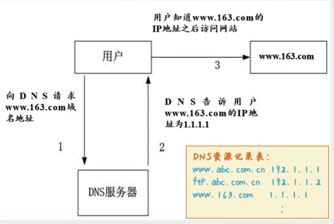
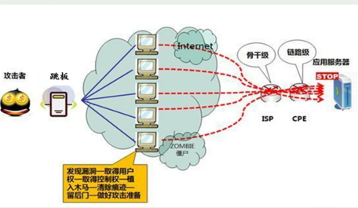
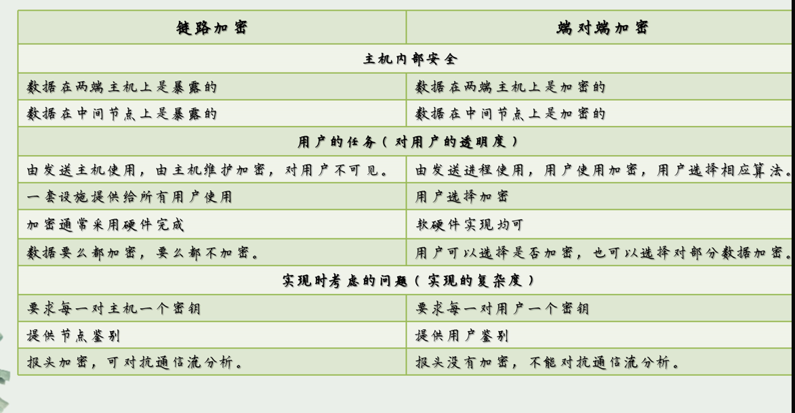

##  期末复习

p199

#### 21. 试简述操作系统对一般对象常用的访问控制方法，分析这些方法的特点并比较之。

- 访问目录

含义：为每个用户维护一个目录，含有文件名、访问权限以及文件指针的属性。

特点：效率不高

- 访问控制列表

含义：为每个对象（如文件或目录）维护一个列表，列出了可以进行何种操作的用户或用户组。

特点：和矩阵一样的缺点.可以精确指定不同用户对不同资源的权限

- 访问控制矩阵

含义：在一个矩阵中，行代表用户，列代表资源，矩阵中的元素表示相应的访问权限。（三元组）

特点：全局视图，随着用户增加，矩阵大小会迅速增加，不宜管理

#### 22. 试简述unix 系统中Suid 访问许可的特点以及应用。

Suid（Set User ID）是一种特殊的访问许可。

当一个可执行文件被设置为Suid，任何用户运行该文件时，程序将暂时以文件所有者的权限运行，而不是以运行它的用户的权限运行。但是，如果Suid设置在一个不安全的程序上，攻击者可能利用这个程序获得更高的系统访问权限。

应用：

1、Suid常用于需要root权限的系统管理任务，比如`passwd`程序，允许普通用户更改其密码，而更改密码通常需要root权限。（允许普通用户修改密码）

#### 23. 口令攻击一般有哪些方法？在选择口令时要注意什么？如何构造一个安全的鉴别系统？

口令攻击一般有：

- 穷举法攻击
- （基于用户的）可能口令攻击（撞库攻击）——通过A网站账户的密码泄露来尝试登陆B网站
- 基于明文口令文件的攻击
- 基于加密口令文件的攻击

选择口令（密码）应该要注意：

1.用所有的字符而不是只用A~Z

2.选择长口令

3.。。。。。。。

安全的鉴别系统：

1、延长鉴别执行时间

2、有限尝试

3、一次性口令

4、基于生物鉴别登录

5、防范加班登录界面

#### 24、何为salt 口令？其作用是什么？采用salt 口令时的用户鉴别过程。

salt口令是将一个随机字符串（即“盐”）添加到用户的原始密码中，然后一起进行哈希处理的安全机制。

作用：

1. 增加复杂度，
2. 防止彩虹表攻击
3. 阻止批量攻击

用户鉴别过程：

1. 用户登录时，服务器接受请求，会根据用户检索相关的salt值，系统会将用户输入的密码和盐值相结合，然后进行同样的哈希处理，并与存储的哈希值进行比对。如果哈希值匹配，用户验证成功；不匹配，则验证失败。

#### 25、试简述数据库的两阶段更新的实现方案。

1. **意向阶段**

​	检查数据库中的COMMIT_FLAG值用来决定是否可以执行意向阶段

​	锁定涉及的数据，防止其他事务访问正在修改的数据

​	检查数据库中的完整性约束以及是否符合业务规则

2. **永久更新**

​	事务提交的修改在数据库中实际执行，一旦被修改，释放所有原来锁定的资源，允许其他事务访问这些数据

​	

#### 26、举例说明数据库统计推理攻击的原理以及常用的对策。

如果攻击者能够操纵对象，则可以通过平均值或者中间值推算出某个特定对象的个别值。举例：医院

对策：

1、查询控制

对数据库查询进行限制，不允许或限制返回统计信息的查询

2、数据项控制

禁止或者隐藏显示计数低的单元

#### 27、TCP/IP 协议中各层的作用是什么？各层提供的服务有哪些？ 

应用层：提供网络与应用程序的接口。服务包含http，ftp，DNS，SMTP（邮件传输）等

传输层：端对端的数据传输，检错和控制。服务包括TCP和UDP

网络层：负责数据包从源到目的地的传输和路由选择。核心协议是IP

链路层：负责在物理网络硬件上发送和接收数据。提供与传输媒介的连接，例如以太网。

#### 28、DNS 域名解析的作用以及实现的过程

用户在浏览器中输入域名，用户的设备会向配置的DNS服务器发起查询请求，DNS服务器会将域名的对应的IP返回给用户设备。之后，用户的设备就可以通过IP地址访问网站。

#### 29、钓鱼网站(Phishing，网络钓鱼)攻击原理以及预防方法

钓鱼网站会通过仿冒真实网站的URL或者页面内容，或者利用真实网站服务器的漏洞来获得用户的隐私信息。

防范方法：

1. 不随意点开来路不明的连接
2. 核对网站域名
3. 查验网站备案和SSL证书
4.  比较网站内容

#### 30、典型中间人（MITM）攻击手段有哪些？试分析它们各自的 实现机制。(包括 ARP 攻击、DNS 欺骗、代理中间人攻击等)

中间人攻击就是通过拦截正常的的网络通信数据，并进行数据嗅探以及篡改，属于主动窃听

ARP攻击：

- 实现机制：向某一主机发送伪ARP应答报文，使其发送的信息无法到达预期的主机，将发送的流量重定向为自己的主机

DNS欺骗：

- 实现机制:攻击者篡改DNS响应，将域名解析指向恶意的IP地址，而非合法的服务器地址

代理中间人攻击：

- 实现机制：攻击者设置一个代理服务器，并诱导受害者的流量通过这个代理服务器，攻击者可以在代理服务器上截获和修改数据。

####  31、常见的拒绝服务(DoS)攻击有哪些？试分析各自的特点以及实现机制。 

#### 32、何为分布式拒绝服务(DDoS)攻击？试分析其特点以及实施过程。

含义：利用多个被攻陷的计算机（僵尸网络）同时请求到目标系统，使目标系统超载无法提供正常服务

特点：

- 采用一种两阶段的攻击方式
- 乘数效应
- 有更好的隐蔽性
- 每个僵尸可以使用各种合适的DOS攻击手段

####  33、分析 ARP 攻击、DNS 欺骗的原理以及实现机制。它们是如何实现中间人攻击和拒绝服务攻击的？

##### ARP攻击

中间人攻击：攻击者向客户端发送伪造的ARP应答数据包，从而将自己放在用户和网管之间，从而可以监听或修改经过的流量。

拒绝服务攻击：攻击通过发送错误的ARP应答数据包，使得网络流量被错误地发送到不存在的地址。导致两个设备之间无法建立通信。

##### DNS欺骗

中间人攻击：攻击者可以将将用户定向到恶意网站，攻击者从而可以获得用户发送的数据。

拒绝服务攻击：攻击者将域名解析到一个存在的IP地址，那么用户可能无法访问到该域名，实现了DoS攻击。（DNS缓存投毒）

#### 34、在网络结构设计中如何考虑信息系统安全的需求？

信息机密性、完整性

安全威胁分析

来自活动或者移动代码的威胁

#### 35、何为链路加密和端对端加密？试分析它们各自的特点以及利弊。 

他们是两种数据传输过程种保护数据的加密方式，在实施的范围和目标上有所不同。

##### 链路加密：

数据在进入传输链路之前进行加密，在到达下一节点后进行解密，然后再次加密传送到下一个链路中。适合用于确保点对点通信链路的安全

优点：防止链路传输被窃听

缺点：管理密钥相对复杂，每个节点都有可能泄露数据

##### 端对端加密：

数据从源端到目标端，整个传输过程中都始终处于加密状态，只在数据发送端进行加密，数据接收端进行解密。

优点：密钥管理简单，无需担心中间节点泄露

缺点：加密和解密过程可能需要更多的计算资源，尤其是在设备性能有限时。

#### 36、何为 VPN？有何作用？如何实现？

VPN为虚拟私有网络。它允许用户通过一个加密的通道在公共网络上进行安全通信。

1. 客户在VPN服务器上进行鉴别，建立安全连接

2. 防火墙以加密钥的形式进行相应
3. 客户与服务器在加密的隧道中进行通信

#### 37、SSL 建立安全通信通道的过程(包括服务器端和客户端的认证)。HTTPS 协议和 FTPS 协议的特点以及安全机制。

过程：

1. 客户请求一个SSL会话
2. 服务器用它的公钥证书响应，里面包含公钥和身份信息，以便客户可以确认服务器的真实性。
3. 客户验证证书，返回用服务器公钥加密的对程会话密钥
4. 双方用共享的会话密钥进行加密通信。

同特点：

1. 通过SSL/TLS来确认网站真实性以及数据传输的安全，客户端可以验证服务器的身份

2. 都工作于应用层，是典型的端对端加密。

#### 38、签名代码的机制以及实现过程。

通过对代码的数字签名技术对代码进行签名，保证代码在签名后不被篡改，通过第三方CA颁发的数字证书，包含签名者的公钥和身份信息。

#### 39、一次性口令（口令令牌）、质询响应系统（挑战响应系统）的实施方案（原理、用户鉴别过程）以及特点比较。

一次性口令就是想手机验证码，基于事件和时间生成唯一的，只能使用一次的口令。

质询响应系统：

1. 客户端向服务端发起鉴别请求
2. 服务器向客户端发送一个质询（随机生成）
3. 客户端将密码和质询用哈希函数结合，生成哈希值
4. 客户端将哈希值返回服务器
5. 服务器通过同样的哈希函数对质询进行哈希计算，如果哈希值匹配，则身份验证成功。

##### 比较

- **安全性**：两者都提供高安全性，但方式不同。OTP每次生成新的口令，而质询响应依赖于动态生成的质询和响应。
- **便携性与易用性**：OTP通常更易于用户理解和操作，特别是时间同步的OTP，用户只需查看并输入一串数字。质询响应系统可能需要用户进行更复杂的操作，如使用特定软件或硬件。
- **实施成本**：OTP的实施成本通常较低，尤其是软件基的解决方案。质询响应系统可能需要更复杂的后端逻辑和安全措施。
- **适应性**：质询响应系统在理论上可以更加灵活和适应不同的安全需求，而OTP通常围绕标准算法设计。

#### 40、以请求访问文件服务器中的一个文件F 为例，试从用户身份鉴别、访问请求授权、访问请求的实现三方面来阐述Kerberos 系统的运行机制以及特点。（看课程视频）

Kerberos是一个基于票据的认证系统，用于网络环境中的身份验证和授权。

1、用户身份鉴别

用户向kerberos服务器发送请求进行身份认证，通过验证后服务器会将会话密钥和鉴别票据通过用户密钥加密后发回给客户端。

2、访问请求授权

客户端会向票据授权服务器请求验证鉴别票据，生成针对文件服务器的服务票据，并由文件服务器的密钥加密，发回给客户端

3、访问请求的实现

客户端向文件服务器发送请求验证服务票据，确认后提供访问F文件的服务。

特点：

双向认证：不仅服务器验证客户端身份，客户端也能确认服务器身份，防止中间人攻击。

会话加密：用户与服务器之间会通过密钥加密的形式进行数据传递

#### 41、何为通信流推理威胁？简述对付通信流推理威胁的常用方法。 

通信流推理威胁（Traffic Analysis Attack）是指通过分析网络流量的模式、大小、时序和其他特性来获取敏感信息的一种威胁。

常用方法：

1. 使用匿名网络（Tor路由）
2. 加密通信协议（VPN）

#### 42、何为 Tor 路由（洋葱式路由）？试分析其作用以及实现过程。 

是一种为了实现匿名通信而设计的网络协议。

作用：

1. 帮助用户隐藏身份和位置，对通信流流量进行伪装

实现过程：

数据在发送前会被多层加密，每一层加密对应于路径上的一个节点，每个节点只能解密它负责的那一层加密，只知道它的直接前驱和后驱，不知道源和目的地。

#### 43、试从邮件（电子支票）的机密性、完整性、真实性、不可否认性（抗抵赖性）和加密密钥的交换等方面阐述安全邮件系统（电子支票系统）的实现方案。(即为数字信封技术) 

1. **发送电子支票**：当用户A想要发送一张电子支票给用户B时，用户A使用用户B的公钥对对称密钥进行加密，形成数字信封。
2. **签名和时间戳**：用户A对电子支票内容进行哈希处理，用自己的私钥对哈希值进行签名，并可能使用时间戳服务。
3. **接收和验证**：用户B收到电子支票后，首先用自己的私钥打开数字信封获取对称密钥，然后用对称密钥解密邮件内容。接着，使用用户A的公钥验证数字签名，并检查时间戳和消息摘要以验证完整性和真实性。
4. **存档和确认**：用户B存档加密的电子支票和数字签名作为交易证据，以便在未来证明交易的真实性和不可否认性。

#### 44、了解基于 Tor 路由技术的暗网实现（看课程视频）

#### 45、了解信息安全保障体系（看课程视频）