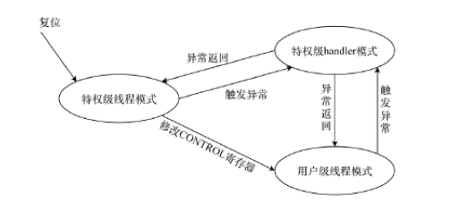

Cortex-M4的工作模式：

- 当系统上电或复位后，CPU默认进入线程模式，并在特权级下运行。
- 当发生异常（如中断）时，CPU会自动切换到处理器异常模式来处理异常，一旦异常处理完成，它将返回到之前的线程模式。
- 在线程模式下，可以通过设置CONTROL寄存器来切换特权级和堆栈指针。
- CPU在处理完异常（如中断）后，会根据异常返回逻辑回到线程模式，并恢复到异常发生前的状态。

SPI：串行外设接口，用于控制设备与外部设备通信（全双工通信）

UART（Universal Asynchronous Receiver/Transmitter）是一种广泛使用的串行、异步、全双工通信协议，用于设备间的异步数据传输。

嵌入式：非通用计算机系统，以特定应用为中心，对功能、成本体积有特别要求的非通用计算机集成系统

片上系统：将微处理器和某些特定应用外设集成的技术。

对齐访问（Aligned Access）和非对齐访问（Unaligned Access）是指计算机内存访问中数据地址与数据大小之间的关系。

1. **对齐访问**：数据的起始地址是其大小的整数倍。例如，4字节数据的地址是4的倍数。这种访问通常更高效。

2. **非对齐访问**：数据的起始地址不是其大小的整数倍。例如，4字节数据的地址不是4的倍数。这可能降低访问效率或在某些系统上不被支持。

   

**地址译码**是计算机中将CPU发出的地址信号转换为选择特定内存地址或I/O设备的过程

**代码的临界区**是指一个程序中访问共享资源（如共享内存、数据库等）的那部分代码

**RISC**（Reduced Instruction Set Computer）是一种计算机设计理念，主张使用更简单、更少的指令集，以提高处理器的效率。

**ROM（**Read-Only Memory）是一种只读存储器，用于永久性存储数据。一旦数据被写入ROM，就无法或难以修改。常用于存储固件或系统启动代码

RAM（Random Access Memory）是一种计算机存储形式，允许数据被随时读取和写入。易丢失的

Flash Memory是一种非易失性存储技术，即使在断电后也能保持数据。它允许数据的电子擦除和重写，广泛应用于USB闪存驱动器、SSD、手机和其他电子设备中作为数据存储和传输的介质。

MMU（Memory Management Unit）是计算机硬件的一部分，负责管理CPU和物理内存之间的数据交换，它处理虚拟内存和物理内存之间的映射

CAN（Controller Area Network）控制器局域网络，允许微控制器和设备在没有主机计算机的情况下相互通信的网络协议

Thumb-2 指令集是一种兼容 16 位和 32 位指令的指令集，应用于ARM v7 架构

BSP指板级支持包 ，是嵌入式系统的基础部分，也是实现系统可移植性的关键。它负责上电时的硬件 初始化、启动 RTOS 或应用程序模块、提供底层硬件驱动，为上层软件提供访问底层硬件的支持。 

互斥（Mutual Exclusion）是多任务或多线程编程中的一个概念，指的是确保在同一时间内只有一个线程或进程可以访问共享资源（如数据、文件或设备）的机制。

程序计数器（Program Counter，PC）是计算机处理器中的一个寄存器，用于指示正在执行的指令的位置。

ARM指令是用于ARM架构处理器的一组机器语言指令

伪指令是汇编语言中的一种特殊指令或命令，它并不对应处理器的机器指令。伪指令主要用于在编译过程中向汇编器提供指令

DMA（DirectMemoryAccess）方式是高速IO接口方式，其特点有两个：①不通过CPU直接完成输入/输出设备与存储器间的数据交换，在数据传送期间不会影响CPU的其他工作；②CPU带宽可以与总线带宽一样，延时仅依赖于硬件，从而提高系统中数据的传输速率。