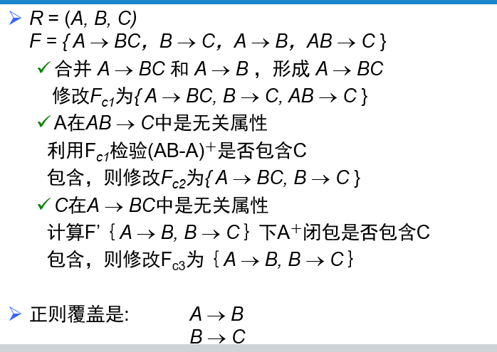
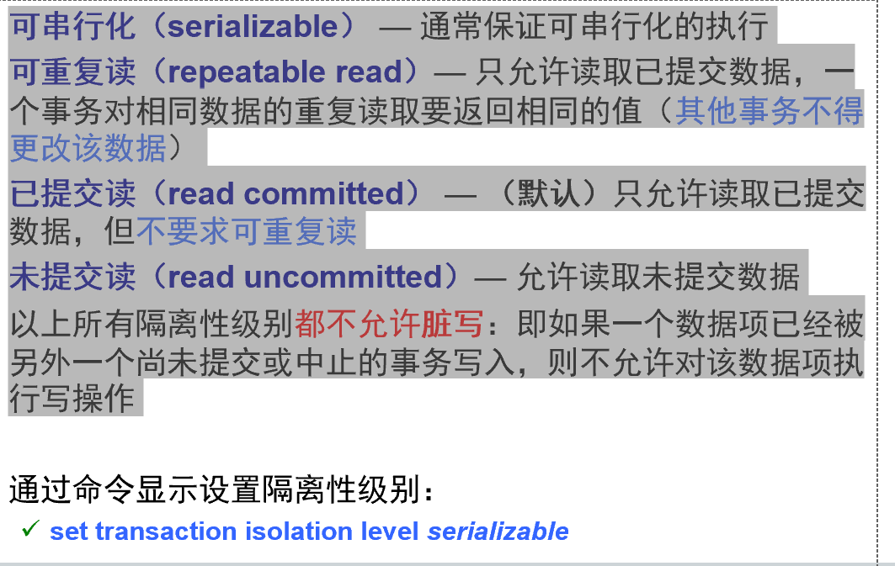
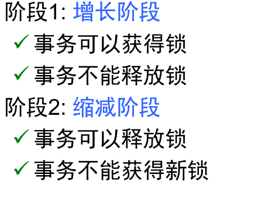

### 8 关系数据库设计

#### •函数依赖定义、和码的关系

函数依赖是一种约束，表明一个属性集的值能够决定另一个属性集的值。例如，在员工表中，员工ID决定了员工的姓名和部门，可以表示为员工ID → {姓名, 部门}。


#### •函数依赖理论（Armstrong公理和附加定理、函数依赖集闭包、属性集闭包）

#### •2NF、3NF、BCNF定义和判定准则

第一范式：所有属性都是原子的，不可再分的。

第二范式：若关系模式R∈1NF，且在F+中每一个**非主属性**完全函数依赖于候选码，则R∈2NF

```
Instructor 依赖于 CourseID，但不依赖于整个主键（StudentID, CourseID）。换句话说，教师是由课程决定的，而不是由学生和课程的组合决定。
```

BCNF范式:（第三范式的基础上）


第三范式：处于2NF，每个非主属性都不传递依赖于任何候选键。


#### •求取正则覆盖





#### •范式分解的无损分解和保持依赖的判定


#### •BCNF分解和3NF分解方法


### 10&11 存储管理和索引

- #### 稀疏索引

  - 只为搜索码的某些值建立索引记录（基于某些选择机制，比如间隔）

  - 找到小于等于K的索引项，然后在原表中沿着指针查找，直到找到

- #### 稠密索引

  - 为每一个搜索码值建立索引记录

- #### 多级索引

  > 具有两级或两级以上的索引成为多级索引

  - 如果主索引太大无法放入主存，会将主存顺序文件的形式放于磁盘，并为其建立一个稀疏索引

  - ü外层索引–主索引的稀疏索引

    ü内层索引–主索引文件


- #### 辅助索引

  非主索引的搜索码（稠密索引）


#### **对比**：

1. 稀疏索引插入和删除时所需的空间及维护开销较小

2. 稀疏索引定位一条记录的速度比较慢

折中：为每个块建一个索引项（块起始搜索码）的稀疏索引


#### 数据字典的定义


•数据缓冲区管理（替换策略）

•不同索引的概念（顺序索引、散列索引、聚集（主）索引、非聚集（辅助）索引、稠密索引、稀疏索引）

•B+树索引的定义、创建和查询


## 13&14 事务管理和并发控制与恢复

#### •事务的概念与ACID特性

Ø事务是访问并可能更新各种数据项的一个程序执行单元

##### ACID特性：

- 原子性：事务的所有操作在数据库中要么全部反映出来，要么完全不反应
- 一致性：事务隔离执行时（即在没有其他事务并发执行的情况下）保持数据库的一致性
- 隔离性：尽管多个事务可能并发执行，但是每个事务都感觉不到系统中有其他事务在并发的执行
- 持久性一个事务成功完成后，它对数据库的改变是永久的，即使系统出现故障时也是如此


#### •指令调度（事务的隔离性和高并发）、冲突可串行化


#### •可恢复调度、无级联调度

可恢复调度：如果*Tj*读取了之前由*Ti*所写的数据项，则*T**i***须先于Tj提交

无级联调度：比可恢复更加严格，强调读写操作顺序，因此不存在事务调度

l

#### •事务的隔离性级别（四个）




#### •基于锁的并发控制协议（死锁、饿死）

1. 排他锁（X）：对数据项即可写又可读。lock-X指令
2. 共享锁（S）：对数据项只能读。使用lock-S指令


#### •两阶段封锁、多粒度封锁（意向锁）协议

两阶段：



==封锁点==：在调度中该事务获得其最后加锁的位置


**多粒度封锁**：显式锁、隐式锁

Ø如果一个事务显式地对树中的某个节点加了锁，那么它也给所有同一模式下的该节点的子节点隐式地加了锁


#### •基于时间戳、有效性检查的协议


#### •日志系统（redo、undo）、检查点

那些输出更新到数据库的事务没必要redo

1.将当前位于主存的所有日志记录输出到稳定存储器上

2.**将所有修改了的缓冲块输出到磁盘上**

3.将一个日志记录< **checkpoint** *L*>输出到稳定存储器


执行检查点时，所有数据更新都停止


参照完整性指的是外键必须在另一个表有对应的候选键

