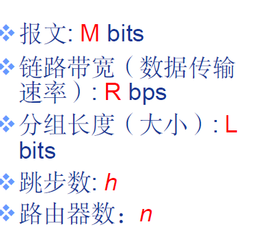

### 计网期中复习

#### 什么是分组交换和电路交换网络？

**分组交换网络（Packet-Switched Network）**:

* **定义**：在分组交换网络中，数据被分割成小块，称为“分组”。每个分组独立地通过网络从源头到目的地传输。这些分组在网络中的不同路径上传输，并在到达目的地时重新组装成原始数据。参考**互联网**

**电路交换网络（Circuit-Switched Network）**:

* **定义**：在电路交换网络中，通信双方在通信开始前建立一个专用的物理路径（电路）。这个电路在通信过程中一直被保持，直到通信结束。参考**传统的电话网络**

分别记住对应的优缺点

* 分组交换的报文交付时间

  $T=M/R+(h-1)L/R=M/R+nL/R$

分组交换绝对优于电路交换？
 适用于突发数据传输网络
 资源充分共享
 简单、无需呼叫建立
 可能产生拥塞（congestion）: 分组延迟和丢失
 需要协议处理可靠数据传输和拥塞控制
 Q: 如何提供电路级性能保障?
 例如，音/视频应用所需的带宽保障

#### 分组交换为什么会发生丢包和时延？

分组会在路由器缓存中排队，需要等到前面的分组处理完后，这个等待时间就是时延。

如果分组到达路由器，而路由可用缓存已满，则到达的分组就会被丢弃。

下面的图要记得理解

### OSI参考模型

·

## 

