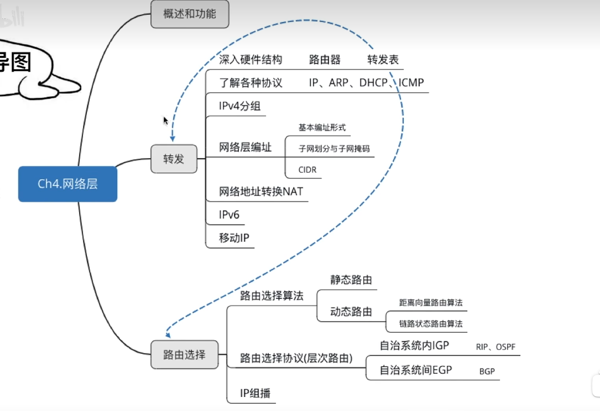
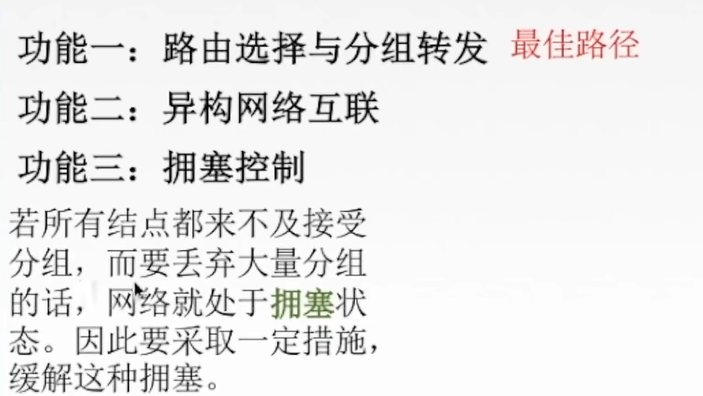
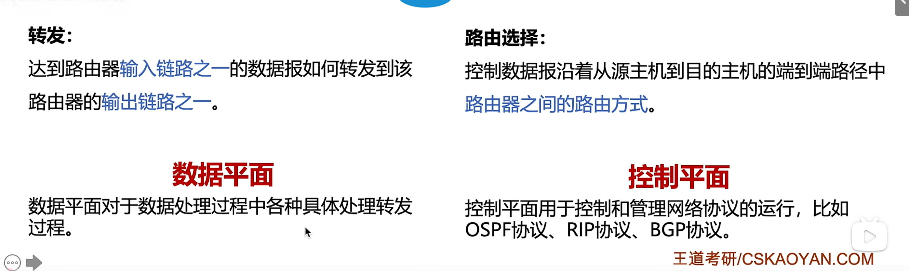
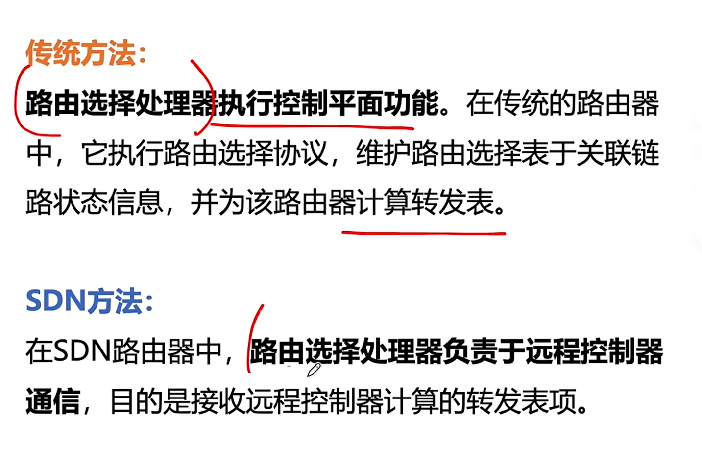
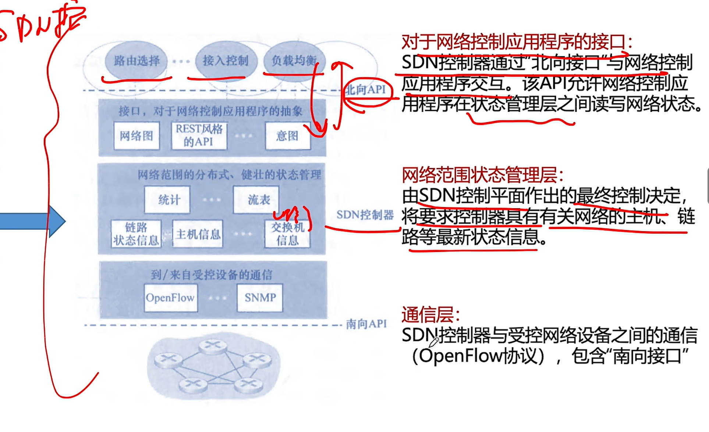
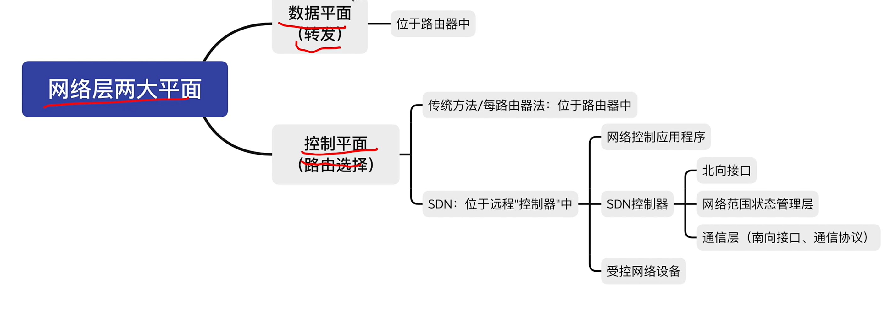

### 第四章 网络层

转发发生在路由器端口中。如何选择出入端口就用到了转发表

每个网络层上的设备分配一个IP（编址）

子网更方便增删改查

192.168是因为NAT

IPV6扩充IPV4的地址

移动IP通过一个IP来保证不变

静态路由和动态路由

如果网络规模庞大，使用层次路由划分自治系统，使得整个路由更加收敛

------

主要任务就是把分组从源端传到目的端，为分组交换网上的不同主机提供通信服务。

网络传输单位就是数据报。数据报和分组是父子关系，分组是数据包切割的一个片段。

开环控制（静）/闭环控制（动动）

### SDN控制器得三个层次

### 路由算法及路由协议

