### CH1 计网体系结构

### 性能指标

**速率**：比特率（1/0）或数据传输率

单位换算:

1 Byte(字节) = 8 bit

和存储容量记得区分

**带宽**

单位就是“比特每秒”

**吞吐量**

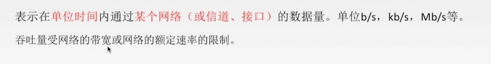

吞吐量 

**时延**

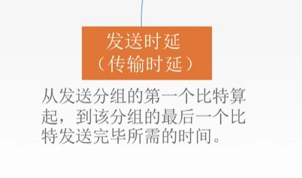

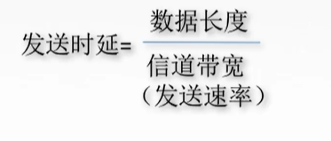

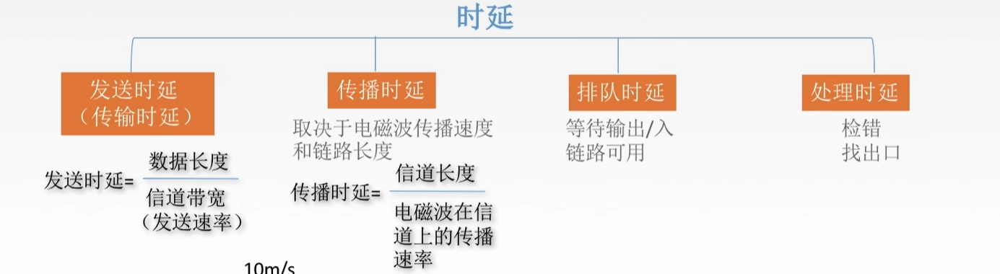

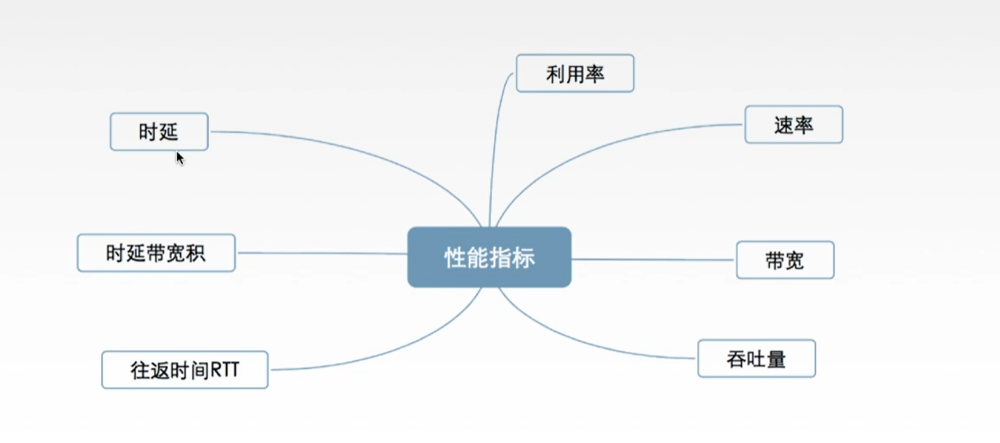

利用率:$ \frac{有数据通过的时间}{总时间} $

### 体系结构&参考模型

**为什么要分层？**

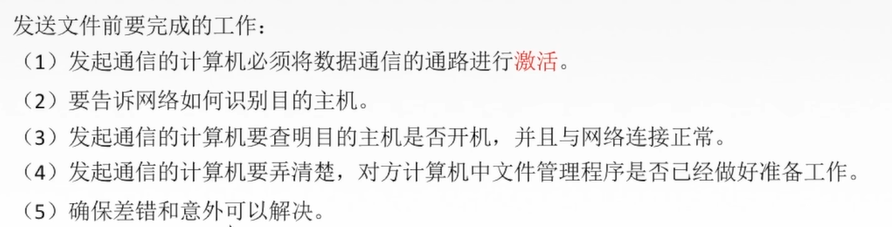

大问题分成小问题的思想

网络体系结构是从功能上描述计算机网络结构

**怎么分层**？

==实体==作为单位，同一层的实体叫对等实体

只有对等实体之间才会有==协议==，为对等实体交换数据而建立的规则、标准或者约定

两个不同层次之间会有==服务==

仅仅在相邻层间有接口，且所提供的服务细节对上一层完全屏蔽

###### 要保持下层对上层的独立性，上层单向使用下层提供的服务

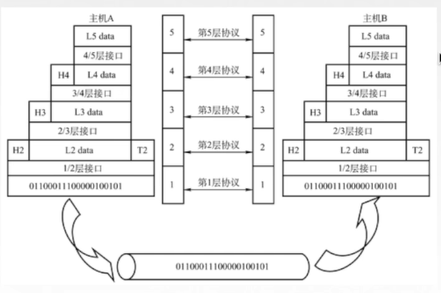

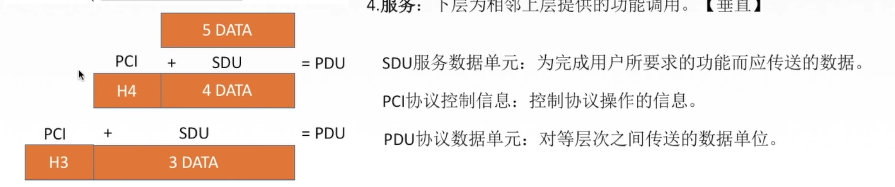

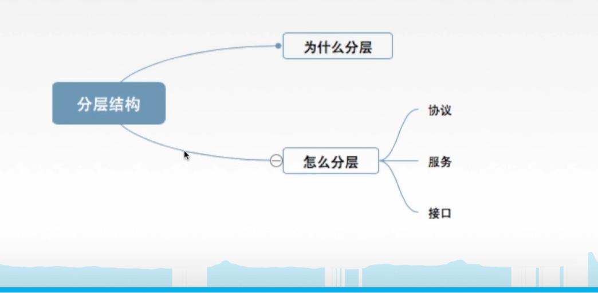

### OSI 参考模型

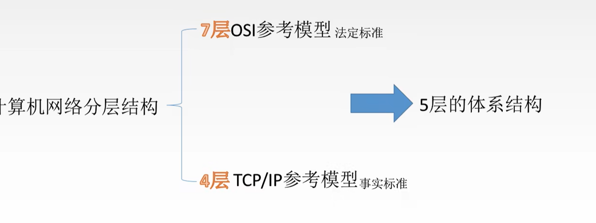

**怎么来的？**

IBM公司提出了第一个网络体系结构 SNA

###### 目的：支持异构网络系统的互联互通

但是！理论成功，市场失败

OSI 制定标准周期太长，层次划分不是很合理，不适用我们现在的市场

#### OSI 七层

7、应用层

6、表示层

5、会话层

###### （以上为资源子网，用作数据处理）

4、传输层

3、网络层

2、数据链路层

1、物理层

###### （3、2、1为通信子网，用作数据通信）

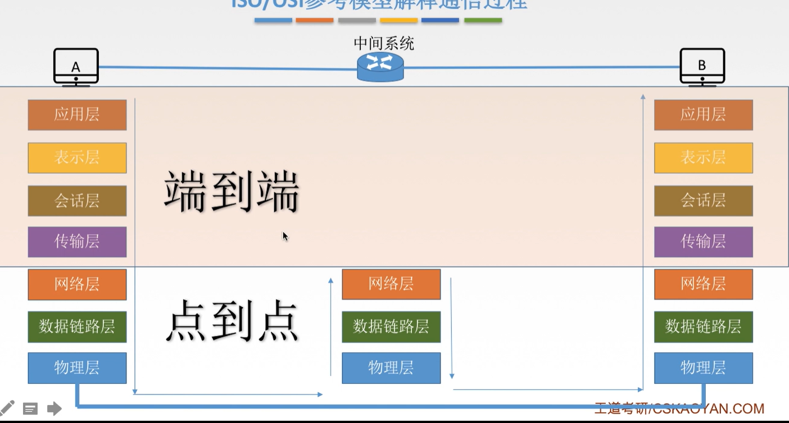

### TCP/IP模型

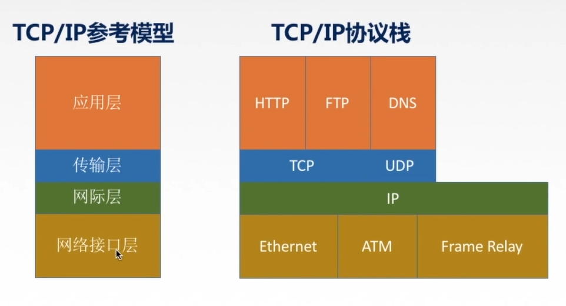

