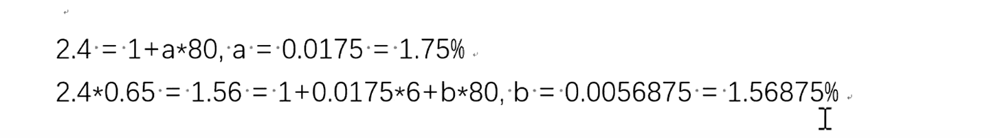

#### 假如有两个高速缓存，容量都是 4 个块(blocks)，每个块大小是1个字(oneword)，第一个缓存是直接映射(directmapped cache)，第二个缓存是全相联(fullyassociative cache)!假设有下面一组块地址访问序列: 0000，1000，0000，0110，1000，分别用 M0000).M(1000)，M(0000)，M(0110)，M(1000)表示存放在相应地址的数据;假设缓存最初是全空的状态，使用“最近最少使用(LRU)”的替换策略，请在下面的表格里填写或修改这两个缓存的最终信息;请问这两个缓存的缺失(cache miss)次数分别是多少次?

#### 假设有一个主存的容量是 128·Bytes·(例如，主存地址0001100)，一个直接映射的高速缓存(cache)由8个块组成，每个块的容量是1个字(word)，请列出所有映射到缓存索引地址 110的内存地址，请问有多少个内存地址映射到了相同的缓存地址?

7-（3  ）=4 所以为16个

2路组相联缓存是采用分每组2个块，8个块及四个组。每个内存地址可以映射到特定组的任何一个路上。冲突即为两个组都用完，所以索引变为2位（2^2）

**具有1级缓存的微处理器的平均内存访问时间为2.4个时钟周期。如果数据在缓存中读取时间为1个时钟周期;如果数据不在缓存中,从主内存中读取需要 80个时钟周期。工程师们试图把平均内存访问时间减少到目前时间的65%，并考虑在片上增加二级高速缓存。二级高速缓存可以在6个时钟周期内访问;增加这个缓存并不影响一级缓存的访问模式或命中率;访问主内存仍然需要 80个时钟周期。为了获得理想的速度，二级高速缓存的访问命中率是多少?**

**假设您需要设计一个32字节大小的32 kb 4路组相联cache数组，请回答以下问题:**

**(1)缓存中有多少个集合?**

**(2)多少个index bits,offset bits,tag bits?**

**(3)标签数组有多大?**

**(4)如果您将缓存的组织从:4-wayset-associative更改为direc mapped。标记数组有多大?比4-wayset-associative大还是小?**

(1) 计算块的数量，一个块为32字节大小，主存容量32Kb

所以一共2^8个集合

19Kb = 19×cache lines = 19Kb

****

**假设你知道一个程序将以以下模式执行一个指令流:**

**LWfromaddress0x800000**

**LW·fromaddress0x800004**

**LWfromaddress0x800008**

**LWfromaddress0x80000C**

**LWfromaddress0x900000**

**LWfromaddress0x900004**

**LWfromaddress0x900008**

**LWfromaddress0x90000C**

**LWfromaddress0xA00000**

**LW·fromaddress0xA00004**

**LWfromaddress·0 xa00008**

**LWfromaddress·0 xa0000c**

**…．**

**(1)执行这个程序的机器的最佳缓存块大小是多少?为什么?·假设·总缓存大小被限制为1kb .(2)如果缓存时间是2个周期，错误时间是50个周期，那么这个程序中lwinstructions的平均内存访问时间(AMAT)是多少?Showyour工作。**

2+0.25×50=14.5

跳转阶段ID就能完成计算，但是有forwarding也至少需要在MEM后才能执行

branch的判断可以按照prediction机制，如果prediction错误就要清空pipeline