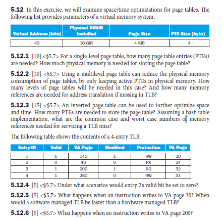

控制冒险

分支跳转的准确率

很多情况下，ID阶段就能得到branch结果

不同阶段造成的pipeline cycle的结果是不一样的

unconditional branch可能需要等待跳转地址

data dependency 数据依赖关系

dynamic scheduling不考

#### 第五章

#### 5.12.1

总页表项数量 = 虚拟内存总大小 / 每个页表项映射的内存量 = 2^43 字节 / 4 KiB

再乘以PTE Size

#### 5.12.2 通过在物理内存中只保留活动的pte，使用多级页表可以减少页表的物理内存消耗。在这种情况下需要多少层页表?如果TLB中缺少地址转换，需要多少内存引用?

