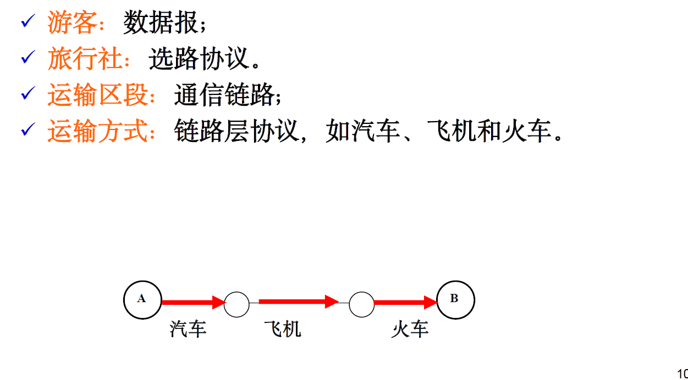

# 计算机网络期末复习

# 第三章 传输1层


# 第4章 网络层

#### 概念

###### 隧道技术

> 一种网络技术，用于在不同网络协议之间传输数据。通过这种技术可以将一种协议的数据包封装在另一种协议的数据包中，从而允许数据在不兼容的网络之间安全地传输。

NAT

> 网络地址转换，是是一种广泛使用的网络技术，用于在私有网络和公共网络（如互联网）之间转换IP地址

ICMP

> 英特网控制报文协议，被主机和路由器用来彼此沟通网络层的信息

> 

ISP:

> 互联网服务提供商

DHCP:

> 动态主机配置协议，用于自动为网络中的设备分配IP地址和其他相关信息。


- 转发：当一个分组到达某路由器的一条输入链路是，该路由器必须将其移动到合适的输出链路上


- #### 子网掩码

  子网掩码中的每个“1”对应IP地址中的网络地址部分

  子网掩码中的“0”对应IP地址中的主机地址部分.

  例子：

  - P地址 192.168.1.10 转换为二进制是 11000000.10101000.00000001.00001010
  - 子网掩码 255.255.255.0 转换为二进制是 11111111.11111111.11111111.00000000

​		192.168.1）是网络地址部分。（10）是主机地址部分。


- ### CIDR

是一种用来表示网络地址和子网掩码de方法，它允许对IP地址进行更加灵活的分配。网络部分和主机部分


****

#### 作业


**R13. 假设主机A向主机B发送一个封装在IP数据报中的TCP段。当主机B接收到数据报时，主机B中的网络层如何知道它应该将该段(即数据报的有效载荷)传递给TCP而不是UDP或其他东西?**

查看数据报的协议字段，根据其来决定数据部分交给哪个运输层协议


**R16. 假设一个应用程序每20毫秒生成40字节的数据块，每个数据块被封装在一个TCP段中，然后是一个IP数据报。每个数据报开销的百分比是多少，应用程序数据的百分比是多少?**                                        

由于 IP 数据报头部⻓度固定部分为 20 个字节，并且 TCP 报⽂段头部固定部分也为 20 个字节，
所以数据报负载为 50% 且应⽤程序数据负载为 50%。


**R20. 假设您购买了一个无线路由器并将其连接到电缆调制解调器上。还假设您的ISP动态地为您连接的设备(即您的无线路由器)分配一个IP地址。另外，假设你家里有五台pc使用802.11无线连接到你的无线路由器。五台pc如何分配IP地址?无线路由器是否使用NAT?为什么或者为什么不呢?**

由于 ISP 只分配给了⽆线路由器⼀个 IP 地址，⽽路由器需要分配 IP 地址给五台 PC，所以路由器需要使⽤ NAT 技术，使用各自的私有IP地址在内部网络中通信，同时通过路由器的公共IP地址与外部互联网通信。通常路由器内置的 DHCP 服务器分配 IP 地址给终端（即五台 PC）


**R22.比较和对比链路状态和距离矢量路由算法**

链路状态选路算法和距离向量选路算法都是⽤于解决源主机到⽬的主机之间选路问题的算法，都会输出源主机到⽬的主机之间代价最⼩的路径。它们的区别如下：
链路状态选路算法： 是⼀种全局的选路算法，需要在节点中存储⽹络中每条链路的费⽤（暴力）
距离向量选路算法： 是⼀种迭代的、异步的和分布式的选路算法，每个节点从⼀个或多个直接相连的邻居接收距离向量，更新⾃身的距离向量表，并在其变化时将新向量发送给⾃⼰的邻居。


**R24. 为什么在互联网上使用不同的as间和as内协议?**

 策略： AS 间选路协议重视选路策略⽽ AS 内不关⼼策略问题。
 规模： AS 间选路协议关⼼⼤量⽹络的选路的处理和适应能⼒，⽽ AS 内选路，由于总是可以将⼀个⼤ AS 拆成两个较⼩的 AS，所以 AS 内协议不关系规模问题。

性能： AS 间选路是⾯向策略的，并不关注性能，⽽ AS 内选路不关注策略，所以会注重性能


**最长前缀匹配**


**在这个问题中，我们将探讨NAT对P2P应用的影响。假设一个用户名为Arnold的对等体通过查询发现一个用户名**
**为Bernard的对等体有一个它想要下载的文件。 还假设Bernard和Arnold都在NAT后面。 试着设计一种技术，使**
**Arnold能够与Bernard建立TCP连接，而不需要特定的NAT配置。如果你很难设计出这样的技术，请讨论原因。**

⽆法实现这种需求，因为需要在 Arnold 和 Bernard 之间直接建⽴ TCP 连接，⽽ NAT 技术会将
Arnold 和 Bernard 的 IP 地址和端⼝都进⾏映射转换，这会导致 TCP 握⼿失败（因为⽬的 IP 与 NAT 中地址不⼀致


#### 考虑一个前缀为101.101.101.64/26的子网。 请举例说明可以分配给这个网络的一个IP地址（形式为xxx.xxx.xxx）。 假设一个ISP拥有形式为101.101.128/17的地址块。 假设它想从这个块中创建四个子网，每个块有相同数量的IP地址。这四个子网的前缀（形式为a.b.c.d/x）是什么？(CIIDR)

有一个子网前缀是 `101.101.101.64/26`。这个 `/26` 表示子网掩码的前26位是网络部分，剩下的6位是主机部分。

第一个地址 `101.101.101.64` 通常是网络地址，最后一个地址 `101.101.101.127` 通常是广播地址


# 第5章 链路层

> 实现相邻两节点的数据可达

#### 概念

**LAN(局域网)**：是一个地理范围小的计算机网络，计算机网络的一个分支。


****

**链路层可以为网络层提供以下服务，括号内意为 IP 或 TCP 也能提供同样的服务。**

1. 流量控制（TCP）
2. 差错检测（IP，TCP）
3.  差错纠正
4.  全双⼯（TCP）、半双⼯


**链路层传输数据包的过程：**

沿端到端路径上的每段独立的链路传输。
 发送节点先将数据报封装成链路层帧，发送到链路上；
 接收节点接收该帧，并提取出数据报。



**为什么ARP查询是在广播帧内发送的?为什么ARP响应是在一个帧内发送一个特定的目的MAC地址?**

ARP 协议请求是⽤于源节点已知⽬的 IP 地址⽽不知⽬的节点 MAC 地址时获取⽬的节点 MAC 地址，因此，ARP请求是以广播的形式发送的，即目的MAC地址为广播地址（FF:FF:FF:FF:FF:FF）这样网络上的所有设备都会收到这个请求。

⽽ ARP 协议响应时，⽬的节点通过请求已知了源节点的 MAC 地址，所以可以使⽤单播，节约⽹络资源。

** **


**假设节点A、B和C都连接到相同的广播LAN(通过它们的适配器)。如果A向B发送了数千个IP数据报，每个封装帧的地址都是B的MAC地址，C的适配器会处理这些帧吗?如果是这样，C的适配器会将这些帧中的IP数据报传递给网络层C吗?如果A发送带有MAC广播地址的帧，你的答案会有什么变化?**

C 的适配器会处理这个帧，但检测到 MAC 地址不是⾃身 MAC 地址与⼴播地址后，会直接丢弃该帧，不会递交给⽹络层。

由于 MAC 地址是⼴播地址，C 的适配器会递交给⽹络层。

****

**随机访问协议**

> 发生冲突时，冲突的每个节点分别等待一个随机时
> 间，再重发，直到帧(分组)发送成功

在CSMA/CD（载波侦听多路访问/碰撞检测）协议中，使用指数后退算法，来决定等待时间。

随机数范围 = [0,$2^i-1$],i是碰撞次数。

退避时间=随机数×基本时间单位


例题：

**在CSMA/CD中，在第五次碰撞后，节点选择K = 4的概率是多少?在10mbps的以太网上，结果K = 4对应的延迟是多少秒?**


"10Mbps"代表的是网络的数据传输速率，即每秒传输10兆比特（Megabits per second）

****


#### 曼彻斯特编码

每位信号的中间都有一个跳变

根据跳变方向判断数据“1”或“0”，如：
“1”--高电平跳到低电平
“0”--低电平变到高电平


例题：

**假设一个10mbps的适配器使用曼彻斯特编码向信道发送无限的1流。从适配器发出的信号每秒有多少次转换?**

每秒发送$10^7$bit，所以是$2×10^7$次跳变

#### a)假设数据包的信息内容是位模式1010 1010 1010 1011，并且使用偶数奇偶校验方案。对于二维奇偶校验方案，包含奇偶校验位的字段的值是多少?您的答案应该使用最小长度的校验和字段。


****

- #### CRC(循环冗余检验)：计算

  > 即多项式编码，把要发送的比特串看作为系数是0或1的一个多项式，对比特串的操作看作为多项式运算。比如：10111 = x^4+x ^2+x+1


特点：能检测小于r+1 位的突发差错、任何奇数个差错。（这个不明白）


- #### 一维和二维的奇偶校验

**一维度：**（d+1位）

使“1”的个数是奇数（奇校验）或偶数（偶校验）

不能发现偶数个错误


**二维度：**行列都错需要定位


二位奇偶校验本身的单个比特差错信息是可检测和纠正的


- #### 多路访问协议

  问题重点：如何协调各个发送和接收节点对共享广播信道的访问

  广播链路

  > 多个节点连接到一个共享的广播信道

​		点对点链路

> 链路两端各一个节点。一个发送和一个接收。


- #### ALOHA

  ###### 纯ALOHA

> ALOHA的最初形式。是一个非时隙、完全分散的协议。
>
> 节点有帧要发，就立即传输。
>  如果与其他帧产生冲突，在该冲突帧传完之后
>  以概率p立即重传该帧；
>  或等待一个帧的传输时间，再以概率p传输该帧，或
> 者以概率1-p等待另一个帧的时间。
> 62

###### 		时隙ALOHA

> 一个无线电广播通信网，所有节点同步传输，将时间分为等长的时隙，并且节点只在时隙的开始时刻发送数据

```
节点检测到冲突后，以概率p在后续的每一个时隙重传该帧，直到成功。

当有许多活动节点时，在发送的许多帧中，成功
时隙的份额。

最低效率：没有任何访问控制，每个节点都在冲
突之后立即重传，效率为零。
```


- #### CDMA(码分多址 code division multiple access)

> 一种信道划分协议，通过给每个节点分配一个不同的代码来共享统一通信通道。每个节点会用唯一的代码对要发送的数据进行编码，不同节点可以同时发送。

****

- #### 轮流协议

  多路访问协议理想特性：

  1. 只有一个节点活动时，吞吐量R b/ s；

  2. 有M个节点活动时，吞吐量R/M b/ s。

​		ALOHA和CSMA协议有第一个特性，但没有第二个特性


​	**轮询协议**：指定一个主节点，以循环的方式轮询每个节点。

​	**令牌传递协议**：设置一个令牌以固定顺序循环传递令牌，有令牌的节点才有传输机会。


- #### 各种延迟的计算：传输、传播L/波速、处理、端对端延迟


