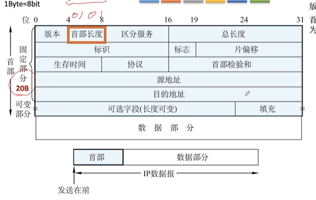

### 第四章 网络层

转发发生在路由器端口中。如何选择出入端口就用到了转发表

每个网络层上的设备分配一个IP（编址）

子网更方便增删改查

192.168是因为NAT

IPV6扩充IPV4的地址

移动IP通过一个IP来保证不变

静态路由和动态路由

如果网络规模庞大，使用层次路由划分自治系统，使得整个路由更加收敛

------

主要任务就是把分组从源端传到目的端，为分组交换网上的不同主机提供通信服务。

网络传输单位就是数据报。数据报和分组是父子关系，分组是数据包切割的一个片段。

开环控制（静）/闭环控制（动动）

### SDN控制器得三个层次

### 路由算法及路由协议

转发表结构：

- **静态路由算法（非自适应路由算法）**：管理员手工配置路由信息

> 简便，路由更新慢

- **动态路由算法（自适应路由算法）**：路由器间彼此交换信息，按照路由算法优化出路由表项

> 路由更新快，适用大型网络，及时响应链路费用或网络拓扑变化

**带来的问题：**

- 规模
- 管理自治

**层次选路**：按区域或自治系统的形式组织路由器。将一个大的系统划分成若干小系统（自治系统），自治系统之间再互连。

> 版本为IP协议版本号比如IPV6,IPV4
>
> **首部长度**的单位为4字节，首部长度至少为5，因为固定部分为20B，至少从0101开始表示。**填充字段**是为了让首部长度为4字节的整数倍(全0)。
>
> **总长度** = 首部长度+数据部分长度，单位是1B，由于分片并不会达到最大值
>
> **生存时间**（TTL）：IP分组的保质期，经过一个路由器-1，变成0则丢弃，防止循环消耗资源。
>
> **协议字段**：数据部分的协议，主要记忆TCP=6，UDP=17
>
> **首部检查和**：16位，检验首部，手段：通过2进制的求和。
>
> **源IP和目的IP地址**：32位
>
> **可选字段**：0-40B

### IP数据包分片

**最大传送单元MTU**

> 链路层数据帧可封装数据的上限

IP分片到达目的主机后进行”重组“

##### 用于标识分片以及确定分片的相对顺序

> 首部长度、16-bit标识符、标志、段偏移

- 标识字段标识一个IP分组

  - 利用一个计数器，每产生IP分组计数器加一，作为分组的标识

- 标志位字段占==3==位

  

  - DF=1 禁止分片；DF=0 允许分片
  - MF=1 非最后一片； MF=0 最后一片（或者未分片）

- 片偏移字段：某片在分组中的相对位置，以**8B**为单位（除了最后一分片，所有分片都是8字节的整数倍）

计算公式：

###### 王道计算机网络P47 4.3.2 例题

#### IPV4地址

长度为32比特，每一个字节分别十进制数来表示，用”.“分割

IPV6中IP地址扩展到了128位，

- 网络号：指明主机所在物理网络的编号
- 主机号：主机在物理网络中的编号

**网络地址转换（NAT）**：

> 至少有一个有效的外部全球IP地址和因特网进行通信的路由
